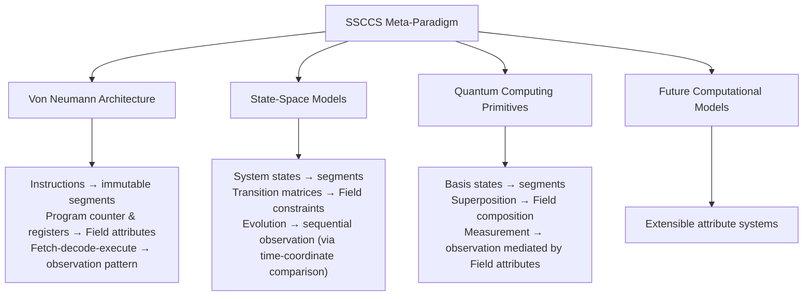
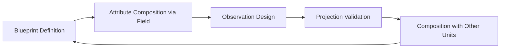

# SSCCS  
Schema Segment Composition Computing System  
*Where composition itself becomes the fundamental unit of computation: an observation-centered paradigm*

## 1. Project Declaration & Purpose

Conventional computing operates by inputting values and awaiting results.  For over half a century, this model—exchanging instructions and data, mutating state—has been the foundation of all computation.

SSCCS departs from this fundamental premise. There are no values, no data, and no predefined algorithms. Computation arises solely from the observation of structured constraints, and its outcome is not a value but a projection: a collapsed state of the constraint possibility space. 

SSCCS is a German non-profit research initiative (gUG) pursuing a dual-purpose vision:

- Immediate practicality: Fully implementable on contemporary hardware using memory-safe languages (Rust reference implementation in development, strict type enforcement).  
- Long-term transcendence: An abstract computational methodology designed to dissolve traditional dichotomies—data vs. program, software vs. hardware—through architectural redefinition rather than incremental optimization.

Core Flow  
`SchemaSegment + current Field state → Observation → Projection`

SSCCS provides a computationally universal substrate upon which both current and future execution models can be expressed. It enables migration toward a paradigm where composition replaces instruction sequencing and observation replaces state mutation.


## 2. Philosophical Foundation: Five Immutable Principles

| Principle | Essence | Technical Implication |
|----------|--------|----------------------|
| Schema Segment Immutability | Repository of computational potential | Immutable after creation; cryptographically hashed identity; all dimensions (including time) treated equivalently |
| Field Dynamicity | Field is a mutable container of structured constraints; constraint sets and relational topology are updated via explicit mutation operations | Field mutations are independent of observation; they induce new observations or reconfigure the scope of observable projections. Time is treated with the same parity as any other coordinate dimension |
| Observation Uniqueness | Sole active event | The only mechanism that converts potential into actual state (projection) |
| Projection Mutability | Sole mutable output | Exists only post‑observation; original blueprints and Field remain immutable |
| Deterministic Reproducibility | Foundation of reliability | Identical Schema Segment, identical Field state, identical observation parameters → always identical projection |

### 2.1 Computational Unification Thesis

```
Traditional:  Data + Program → Execution → Result
SSCCS:        SchemaSegment + current Field state → Observation → Projection
```

- Primacy of Composition: Computation emerges from the combination of immutable blueprints and observation; blueprints serve dual roles as representation and execution specification.  
- Deferred Semantics: Meaning and execution remain suspended until observation; blueprints contain only potential.  
- Recursive Homogeneity: Identical composition logic applies consistently across all scales—from single process to distributed swarm.

### 2.2 Universal Abstraction Framework



> Mapping Verification:
> - Von Neumann: Instructions → immutable segments; program counter & registers → Field attributes; fetch‑decode‑execute → observation pattern. Semantics are encoded structurally, not as primitive integers; time is expressed as a coordinate dimension, not as instruction order.
> - State-Space: System states → segments; transition matrices → Field constraints; temporal ordering is identified through comparison of time‑coordinate values.
> - Quantum: Basis states → segments; superposition → Field composition; measurement → probabilistic observation via Field attributes. Time is treated with the same parity as other dimensions.
> - Invariant: Only Observation generates mutable state (projection); everything else remains immutable.


## 3. Core Definitions

### 3.1 Schema Segment (SS)

* Immutable; contains no values or states.
* Attributes:
  * `coordinates`: Identifiers treating all dimensions equivalently
  * `adjacency`: Transition possibilities to neighboring states
  * `dimensionality`: Extensible axes
  * `identity`: Cryptographic hash derived from intrinsic properties
* Immutability Principle: Change occurs only via creation of new segments, not modification.


### 3.2 Field (Dynamic Constraint Framework)

#### Definition

The Field is the mutable, observable substrate of SSCCS.  
Structurally analogous to the electromagnetic field in classical physics, the Field does not store values; its local state is revealed as a projection only through observation. The Field persists independently of the presence of Schema Segments, yet without SS, observation has no meaning.

#### Essence

The Field is a living specification of what can be observed.  
Its set of structured constraints and relational topology are updated through explicit mutation operations. Such updates induce new observations or reconfigure the range of observable projections.

#### Meaning of Mutation

- The Field does not change by itself. Mutation is an explicit manipulation driven by external agents, system policies, or the projection feedback from prior observations.
- Mutation targets: addition/removal/modification of constraints, reconfiguration of the relational topology among constraints, resetting of the observation frontier, etc.
- Consequence of mutation: the same Schema Segment, when observed, may yield a different projection—a new local context is established.

#### Explicit Principle on the Time Dimension  

In SSCCS, time is treated with the same parity as every other coordinate dimension.  
- The Field state does not “evolve along a time axis”; rather, it exists as a distribution of constraints over points in a multi‑dimensional coordinate space.
- Temporal precedence, when needed, can be identified by comparing coordinate values on the time dimension—a comparison no different in essence from comparing values on any other dimension (e.g., spatial coordinates, temperature, energy level).
- Therefore, phrasing Field mutation as “evolution over time” is inaccurate. Mutation is a structural update that may occur at arbitrary points in any coordinate system; time is merely one such axis.

#### Role

The Field is the object of observation. Every observation event evaluates the current state of the Field (the constraint distribution at a specific coordinate point) together with one or more immutable Schema Segments, and produces a Projection—a collapsed cross‑section of the constraint space.

#### Conceptual Contents  

- A set of structured constraints (logical/relational formulas, energy potentials, admissible intervals, etc.)
- A relational topology capturing interdependencies among constraints (e.g., variable sharing, hierarchical nesting)
- An optional observation frontier that records which regions of the constraint space have already been collapsed (to support incremental refinement)

#### Characteristic  
The Field performs no active computation; in that sense it is a passive structure. Yet it is actively mutable and actively observed, giving it a contextually active nature.

> Analogy: The Field is like a constraint graph that can be rewired and reparameterized at runtime. Observation takes a local snapshot of this graph at a particular coordinate point and collapses it into a projection—not a stored value, but a transient resolution of constraints.


### 3.3 Observation (Sole Active Event)

- Converts potential into actual state (Projection).
- Deterministic reproducibility: identical SS, identical Field state, identical observation parameters → always identical projection.
- Observation points are not random; they are determined by the Field’s structural instability, bifurcation points, or constraint conflicts.
- Observation is an internal system event; no external observer is required.

### 3.4 Projection (Sole Mutable Output)

- Exists only as a transient result of observation.
- Original blueprints and the Field remain immutable.
- Not a value, not data—it is the collapsed cross‑section of observable degrees of freedom.
- Not stored; if needed again, it must be regenerated through re‑observation.


## 4. System Lifecycle and Execution Model

### 4.1 Bootstrapping: Program Booting

1. Blueprint Definition: Immutable Schema Segment is created and assigned a cryptographic identity.  
2. Field Initialization: Initial constraint set and relational topology are established. From this point, the Field is in a mutable state.  
3. Entering Observation‑Enabled State: The system activates the projector; the potential for observation events becomes open, though no observation has yet occurred.

> With the projector on, the system is ‘computing’. Observation has not necessarily happened, but observability is live.

### 4.2 Operational Loop

```
[Field Mutation] [Observation] → [Projection Generation] → [Projection Consumption/Feedback]
```

- Field Mutation:  
  - Explicit addition, removal, or modification of constraints and relational topology, driven by external factors, system policies, or projection feedback from prior observations.  
  - Mutations are independent of observation and do not necessarily follow a temporal order.  
  - Purpose: to induce new observations or to reconfigure the scope of observable projections.

- Observation:  
  - At an arbitrary point (determined by structural instability, bifurcation, or constraint conflicts), the system evaluates a snapshot of the current Field state against one or more Schema Segments, producing a Projection.

- Projection Generation:  
  - A deterministic process: identical SS, identical Field state snapshot, identical observation parameters → always identical projection.

- Projection Consumption & Feedback:  
  - The projection may be emitted to external systems or used as feedback to drive further Field mutations.  
  - Projections are not stored; they are ephemeral and must be regenerated if needed again.

### 4.3 Termination

- Operational loop ceases when the projector is deactivated or system resources are reclaimed.  
- After termination, the definitions of SS and Field may persist, but the observation‑enabled state is lost.

### 4.4 Recursive Execution Architecture

```
Single Process → Multi-Process → Distributed Swarm
     │               │                │
     └─── Identical Observation Dynamics ────┘
```

- Scale Invariance: The same observation semantics apply at all scales—single process, multiple processes, distributed swarms.


## 5. Differentiation from Traditional Computing

| Dimension | Traditional (Von Neumann) | SSCCS |
|----------|---------------------------|-------|
| Programming | Procedural / OOP | Declarative composition |
| State | In‑place mutation | No persistent state; observation yields ephemeral projection |
| Field Mutability | Data structures are mutable by default | Field is explicitly mutable; Schema Segments are immutable |
| Concurrency | Explicit locks / semaphores | Emergent via segment independence |
| Error Handling | Exceptions & stack unwinding | Isolation at attribute boundaries |
| Verification | Runtime testing | Composition‑time validation |
| Type System | Static / dynamic | Attribute‑based interpretation |
| Dependencies | Modules / packages | Adjacency relationships |
| Fundamental Unit | Memory cell | Immutable segment |
| Execution Trigger | Instruction cycle | Observation event |
| Data Movement | Copy semantics | Zero‑copy interpretation |
| Time Concept | Clock cycles / instruction order | One coordinate dimension among equals; order identified via coordinate comparison |
| Energy | Fixed per instruction | Concentrated at observation |
| Cache | Locality‑based | Deterministic via hash |
| Parallelism | Multi‑core | Natural via independence |
| Hardware Mapping | Instruction → machine code | Blueprint → potential physical layout |

> Core Distinction: Traditional systems focus on *how to execute*; SSCCS focuses on *what to compose*.


## 6. Unit‑Driven Development (UDD)

Development centers on Schema Segments as primitives.

### 6.1 UDD Cycle



### 6.2 Methodology Comparison

| Aspect | TDD | DDD | UDD |
|--------|-----|-----|-----|
| Fundamental Unit | Test case | Domain entity | Schema Segment |
| Focus | Behavior verification | Business logic | Relational composition |
| Execution | Procedural | Object interactions | Observation‑based |
| Correctness | Test pass/fail | Domain consistency | Structural isomorphism |
| Scalability | Refactoring | Bounded contexts | Recursive composition |


## 7. Implementation Conformance

Implementations must adhere to the following principles:

- Schema Segments are immutable after creation; identity is cryptographically verifiable.
- The Field is a mutable structure; all mutations are explicit and follow deterministic rules.
- Observation is the sole mechanism that produces a projection; no computation occurs outside observation.
- Deterministic reproducibility: identical Field state + identical SS + identical observation parameters → identical projection.
- All coordinate dimensions are treated equivalently; no privileged “time” axis.
- Recursive and distributed execution preserve the same observation semantics.
- Projection results may influence Field mutations, but Schema Segments are never modified.
- Composition‑time validation must be possible.


## 8. Validation Cases

| Domain | Segment | Field | Observation Advantage |
|--------|---------|-------|----------------------|
| Climate | Atmospheric/oceanic blueprints | Physical constraints | Error isolation; energy efficiency |
| Spacecraft | Mission/terrain blueprints | Sensor interpreters | Autonomous operation; radiation resilience |
| Biomedical | Protein folding | Chemical/thermodynamic constraints | Parallel observation; feasible on consumer hardware |
| Swarm Robotics | Hardware topology | Execution rules | Natural scaling via recursive composition |


## 9. Implementation & Roadmap

All implementations use Rust—a language choice, not a constitutional requirement of SSCCS.

### 9.1 Proof of Concept (PoC)
- Minimal skeleton implementation: `SchemaSegment` trait + `ObservationEngine`
- Macro code file format: `.ss` immutable containers
- Verification: Unit tests for immutability and deterministic reproducibility
- Goal: Validate core concepts with minimal complexity

### 9.2 Core Reference Implementation
- First open‑source release: complete `SchemaSegment`, `Field`, `ObservationEngine` (skeletal structure)
- Macro code file format: `.ss` immutable containers
- Verification: Full unit test suite for immutability, determinism, and projection semantics
- Goal: Provide a verified baseline for community feedback

> Rust Macro Analogy (informative)  
> The reference implementation may use Rust’s macro system to expand `.ss` definitions into compile‑time constraint structures—mirroring the deferred semantics principle of SSCCS. This is an implementation strategy, not a constitutional mandate.

### 9.3 Production Implementation
- Swarm Runtime Communication: Distributed multi‑instance execution; synchronized observation events and projection propagation
- Field Sandboxing: Each Field as an isolated, policy‑enforced, binary‑secure sandbox
- Data Compilation Layer: Transform legacy datasets into `.ss` immutable containers; compose Schema Segments and Fields ready for observation
- Verification: Full‑scale tests for deterministic reproducibility, binding consistency, and composition‑time validation

### 9.4 Transcendence Pathway

```
Phase 1: Software Emulation
└─ Rust PoC and Core Reference Implementation

Phase 2: Hardware Optimization
└─ PIM/FPGA (preserving blueprint semantics)

Phase 3: Native Execution
└─ Observation‑Centric Processors (OCP)
```

> Note: Performance is not a short‑term goal. Ultimate performance will be achieved through novel hardware architectures.


## 10. Future Vision

* Dynamic attribute generation at observation points
* Direct blueprint‑to‑hardware mapping
* Observation‑Centric Processors (OCP)
* Universal computational substrate with verified semantic fidelity
* Language‑less execution: composable requirements → direct machine execution


> Final Declaration: SSCCS establishes composition—not instruction sequencing—as the primitive of computation.  
> Immutable blueprints serve dual roles as representation and execution specification, with Observation as the singular mechanism that converts potential into actuality.  
> Immediate practical benefits exist on current hardware while enabling migration toward architectures that transcend traditional computational dichotomies.

---

Research Entity: SSCCS gUG (i.G.), German non‑profit research initiative

Human Oversight Statement: This README was developed in collaboration with LLMs (Gemini and ChatGPT-Free) to guarantee the structural integrity and logical alignment of the project's philosophical foundations and technical implementation details in real-time.

---
