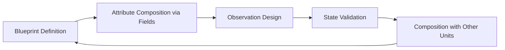

# SSCCS 
**Schema Segment Composition Computing System**  
*Where composition itself becomes the fundamental unit of computation: an observation-centered paradigm*


## 1. Project Declaration & Purpose

SSCCS is a German non-profit research initiative (**gUG**) advancing a dual-purpose vision:

- **Immediate practicality**: Fully implementable on contemporary hardware using memory-safe languages (Rust reference implementation in development with strict type enforcement).  
- **Long-term transcendence**: Abstract computational methodology designed to dissolve traditional dichotomies—data vs. program, software vs. hardware—through architectural redefinition rather than incremental optimization.

> **Core Flow**: `SchemaSegment + Field → Observation → ResultingState`

SSCCS provides a *computationally universal substrate* upon which both current and future execution models can be expressed—enabling migration toward paradigms where composition replaces instruction sequencing, and observation replaces state mutation.


## 2. Philosophical Foundation: Five Immutable Principles

| Principle | Essence | Technical Implication |
|-----------|---------|----------------------|
| **Schema Segment Immutability** | Repository of computational potential | Immutable after creation; cryptographically hashed identity; all dimensions (including time) treated equivalently |
| **Field as Relational & Interpretive Framework** | Encodes interaction, constraints, and observation semantics | Passive in computation; provides structural and relational context enabling Observation |
| **Observation Uniqueness** | Sole active event | The only mechanism converting potential into actual state |
| **Resulting State Mutability** | Sole mutable output | Exists exclusively post-observation; original blueprint and fields remain immutable |
| **Deterministic Reproducibility** | Foundation of reliability | Identical input composition → identical output guaranteed |

### 2.1 Computational Unification Thesis

```

Traditional:  Data + Program → Execution → Result
SSCCS:        SchemaSegment + Field → Observation → ResultingState

````

- **Primacy of Composition**: Computation emerges from immutable blueprint combination and observation; blueprints serve dual roles as representation and execution specification.  
- **Deferred Semantics**: Meaning and execution remain suspended until observation; blueprints contain only potential.  
- **Recursive Homogeneity**: Identical composition logic applies consistently across all scales—from single process to distributed swarm.


### 2.2 Universal Abstraction Framework

SSCCS subsumes diverse computational models via precise structural mappings:

```mermaid
flowchart TD
    A[SSCCS Meta-Paradigm] --> B[Von Neumann Architecture]
    A --> C[State-Space Models]
    A --> D[Quantum Computing Primitives]
    A --> E[Future Computational Models]
    
    B --> F["Instructions → immutable segments<br>Program counter & registers → field attributes<br>Fetch-decode-execute → observation pattern"]
    C --> G["System states → segments<br>Transition matrices → field constraints<br>Evolution → sequential observation"]
    D --> H["Basis states → segments<br>Superposition → field composition<br>Measurement → probabilistic observation"]
    E --> I["Extensible attribute systems"]
````

> **Mapping Verification**:
>
> * **Von Neumann**: Instructions → immutable segments; program counter & registers → field attributes; fetch-decode-execute → specialized observation. Semantics encoded structurally, not as primitive integers.
> * **State-Space**: System states → segments; transitions → field constraints; temporal evolution → sequential observation.
> * **Quantum**: Basis states → segments; superposition → field composition; measurement → probabilistic observation via field attributes.
> * **Invariant**: Only Observation generates mutable state; all else remains immutable.


## 3. Core Definitions

### 3.1 Schema Segment (SS)

* Immutable container holding computational potential—contains no values or states.
* **Attributes**:

  * `coordinates`: Identifiers treating all dimensions equivalently
  * `adjacency`: Transition possibilities to neighboring states
  * `dimensionality`: Extensible axes
  * `identity`: Cryptographic hash from intrinsic properties
* **Immutability Principle**: Change occurs only via creation of new segments, not modification.

### 3.2 Field (Relational & Interpretive Framework)

In SSCCS, a Field is not mere data—it encodes the operational logic, constraints, and observer rules, effectively functioning as the program that drives Observation.

* **Essence**: Immutable structure defining relational context, constraints, and observer rules for SchemaSegment.
* **Role**: Provides the semantic and relational scaffolding enabling Observation to convert potential into actual state.
* **Components**:

  * `ProjectionRegistry`: Blueprint projection mappings
  * `ConstraintSet`: Boundary conditions for valid observation
  * `ObserverRegistry`: Interpretation rules applied during Observation
  * `TransitionGraph`: Defines segment interactions and potential state transitions
* **Characteristic**: Passive in computation; active only in defining context, constraints, and interpretive semantics.

### 3.3 Observation (Sole Active Event)

* Converts potential into actual state.
* Deterministic reproducibility: identical inputs → identical outputs.

### 3.4 Resulting State (Sole Mutable Output)

* Exists exclusively post-observation.
* Original blueprints and fields remain immutable.


## 4. Execution Model

```mermaid
flowchart LR
    A[Blueprint Definition] --> B[Attribute Composition via Fields]
    B --> C{Observation Execution}
    C --> D[Resulting State Generation]
```

1. **Definition**: Immutable blueprint creation
2. **Composition**: Assemble attributes with relational & interpretive fields
3. **Observation**: Sole active interpretive event
4. **Generation**: Deterministic state production; original blueprint preserved

### 4.1 Recursive Execution Architecture

```
Single Process → Multi-Process → Distributed Swarm
     │               │                │
     └── Identical Observation Dynamics ──┘
```

* **Scale Invariance**: Mechanism identical across in-memory, IPC, and networked execution.


## 5. Differentiation from Traditional Computing

| Dimension         | Traditional (Von Neumann)    | SSCCS                                 |
| ----------------- | ---------------------------- | ------------------------------------- |
| Programming       | Procedural/OOP               | Declarative composition               |
| State             | In-place mutation            | New state per observation             |
| Concurrency       | Explicit locks/semaphores    | Emergent via blueprint independence   |
| Error Handling    | Exceptions & stack unwinding | Isolation at attribute boundaries     |
| Verification      | Runtime testing              | Composition-time validation           |
| Type System       | Static/dynamic               | Attribute-based interpretation        |
| Dependencies      | Modules/packages             | Adjacency relationships               |
| Fundamental Unit  | Memory cell                  | Immutable segment                     |
| Execution Trigger | Instruction cycle            | Observation event                     |
| Data Movement     | Copy semantics               | Zero-copy interpretation              |
| Temporal Concept  | Clock cycles                 | Observer-dependent projection         |
| Energy            | Fixed per instruction        | Concentrated at observation           |
| Cache             | Locality-based               | Deterministic via hash                |
| Parallelism       | Multi-core                   | Natural via independence              |
| Hardware Mapping  | Instruction → machine code   | Blueprint → physical layout potential |

> **Distinction**: Traditional systems focus on *how to execute*, SSCCS on *what to compose*.


## 6. Unit-Driven Development (UDD)

Development centers around Schema Segments as primitives.

### 6.1 UDD Cycle



### 6.2 Methodology Comparison

| Aspect           | TDD                   | DDD                 | UDD                    |
| ---------------- | --------------------- | ------------------- | ---------------------- |
| Fundamental Unit | Test case             | Domain entity       | Schema Segment         |
| Focus            | Behavior verification | Business logic      | Relational composition |
| Execution        | Procedural            | Object interactions | Observation-based      |
| Correctness      | Test pass/fail        | Domain consistency  | Structural isomorphism |
| Scalability      | Refactoring           | Bounded contexts    | Recursive composition  |


## 7. Implementation Conformance

* Enforce Schema Segment immutability
* Fields remain relational & interpretive frameworks, passive in computation
* Active computation restricted to Observation
* Deterministic reproducibility guaranteed
* Treat all coordinate dimensions equivalently
* Support recursive and distributed execution
* Preserve binding consistency during observation
* Enable composition-time validation


## 8. Validation Cases

| Domain     | Segment                        | Field                              | Observation Advantage                             |
| ---------- | ------------------------------ | ---------------------------------- | ------------------------------------------------- |
| Climate    | Atmospheric/oceanic blueprints | Physical constraints               | Error isolation; energy efficiency                |
| Spacecraft | Mission/terrain blueprints     | Sensor interpreters                | Autonomous, radiation-resilient                   |
| Biomedical | Protein folding                | Chemical/thermodynamic constraints | Parallel observations; consumer hardware feasible |
| Swarms     | Hardware topology              | Execution rules                    | Natural scale-out via recursive composition       |


## 9. Implementation & Roadmap

All implementations use **Rust**, chosen for its strong type system and memory safety, ensuring reliability from PoC through Production.

### 9.1 PoC

Core skeleton implementation for concept validation  

* **Components**: Minimal `SchemaSegment` trait + `ObservationEngine`  
* **Macro code file format**: `.ss` immutable containers  
* **Verification**: Immutability & determinism unit tests  
> Focuses only on the Core; no Swarm Runtime, Field Sandbox, or Data Compilation Layer.

### 9.2 Core Reference Implementation

The first open-source target for validation and integration  

* **Core**: Complete `SchemaSegment`, `Field`, `ObservationEngine` (skeletal structure for Reference)  
* **Macro code file format**: `.ss` immutable containers  
* **Verification**: Full unit tests for immutability and deterministic reproducibility  
> Serves as the baseline for further Production integration.

### 9.3 Production Implementation

Full-scale deployment-ready implementation including infrastructure layers  

* **Swarm Runtime Communication**: Distributed multi-instance execution; synchronized Observation events and Resulting State propagation  
* **Field Sandbox**: Each Field as isolated, policy-enforced, binary-secured sandbox  
* **Data Compilation Layer**: Transforms legacy datasets into `.ss` immutable containers; composes SchemaSegments and Fields ready for Observation  
* **Verification**: Full-scale tests including deterministic reproducibility, binding consistency, and composition-time validation

### 9.4 Transcendence Pathway

```

Phase 1: Software Emulation
└─ Rust PoC and Core Reference Implementation

Phase 2: Hardware Optimization
└─ PIM/FPGA preserving blueprint semantics (Production)

Phase 3: Native Execution
└─ Observation-centric processors

```

> **Note**: All stages are Rust-based. PoC validates only the Core skeleton; Core Reference Implementation provides an open-source baseline; Production integrates Swarm, Field Sandbox, and Data Compilation Layer for practical deployment and scaling.
 


## 10. Future Vision

* Dynamic attribute generation at observation points
* Blueprint - hardware direct mapping
* Observation-centric processors (OCP)
* Universal computational substrate with verified semantic fidelity
* Language-less execution: Composable requirements - direct machine execution.


> **Final Declaration**: SSCCS establishes composition—not instruction sequencing—as computation’s primitive. Immutable blueprints serve dual roles as representation and execution specification, with Observation as the singular mechanism converting potential into reality. Immediate practical benefits exist on current hardware while enabling migration toward architectures that transcend traditional computational dichotomies.

> **Research Entity**: SSCCS gUG, German non-profit research initiative
 