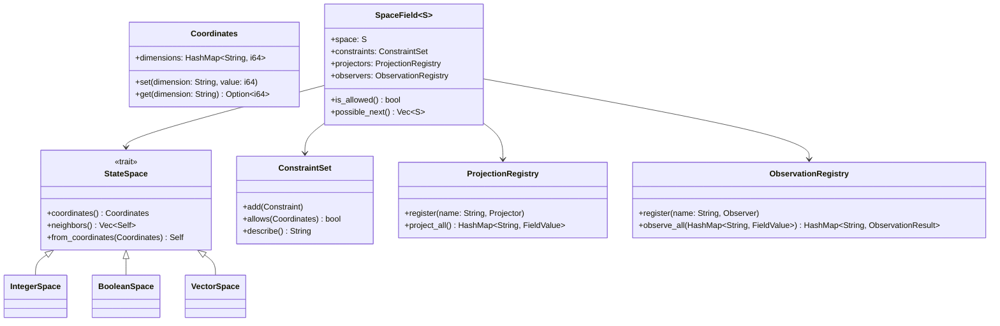

# State-Space Composition Computing System (SSCCS)
## A Computational Model Based on Immutable State Structures and Dynamic Field Composition

### 1. Project Declaration

SSCCS (State-Space Composition Computing System) is a non-profit research initiative established under German legal form *gUG (gemeinnützige Unternehmensgesellschaft)* to advance a fundamental rethinking of computation. The project develops an energy-efficient computing paradigm that replaces sequential instruction execution with structural composition of immutable possibility spaces, offering an alternative to the conventional von Neumann architecture.

### 2. Core Definitions

#### 2.1 StateSpace
An immutable structural entity representing a domain of possibilities, defined by:
- **Coordinates**: Structural identifiers (non-semantic axes, including time as equal dimension)
- **Adjacency**: Possible transitions to neighboring structural states
- **Dimensionality**: Number of independent structural axes (infinite extensibility)
- **Identity**: Derived from structural properties only

StateSpaces are invariant under transformation; apparent change generates new StateSpaces.

#### 2.2 SpaceField
A mutable configuration layer that operates upon StateSpaces, comprising:
- **Constraint Fields**: Boundary conditions defining valid coordinate regions
- **Transition Fields**: Permitted navigational steps between coordinates
- **Projection Fields**: Interpretation functions mapping structures to observable values
- **Observation Fields**: Measurement configurations inducing state collapse

Fields transform StateSpaces through application, not mutation.

#### 2.3 Observation and Collapse
Observation is the deterministic projection from a composed StateSpace under specific Field configurations. Collapse occurs when observation resolves structural superposition into concrete values through constraint satisfaction:
- **Projection**: Mapping coordinates to dimensional subspaces
- **Transition Realization**: Adjacency navigation triggered by observation
- **Collapse**: Constraint-driven resolution of superposed possibilities
- **Result**: Projected values in classical data types (integers, booleans, etc.)

### 3. Computational Model

#### 3.1 Execution Cycle
Computation proceeds through four phases:
1. **StateSpace Definition**: Immutable possibility structures established
2. **SpaceField Composition**: Dynamic fields applied to define relational constraints
3. **Observation**: Field-configured projection induces structural collapse
4. **Result Projection**: Collapsed state mapped to classical data types

#### 3.2 Canonical Principles
- **StateSpace Immutability**: StateSpaces are invariant; change creates new spaces
- **Field Mutability**: All dynamism resides exclusively in Fields
- **Execution as Observation**: Computation is observational projection, not state mutation
- **Primitive as Projection**: All data types are 1-dimensional projections of composed spaces
- **Collapse as Constraint Resolution**: Outcome selection resolves through structural constraints
- **Temporal Artifact**: Time is an observer-dependent projection, not computational primitive

### 4. Technical Specifications

#### 4.1 Core Implementation Architecture
**Current PoC Status** (Implemented in Rust):

```rust
// StateSpace: Immutable structural foundation
pub trait StateSpace: Debug + Clone {
    fn coordinates(&self) -> Coordinates;     // Infinite-dimensional coordinates
    fn neighbors(&self) -> Vec<Self>;        // Structural adjacency
    fn from_coordinates(coords: Coordinates) -> Self;
}

// Coordinates: Dimensionally-neutral structural identifiers
pub struct Coordinates {
    pub dimensions: HashMap<String, i64>,    // All dimensions equal, time included
}

// SpaceField: Dynamic operational layer over StateSpace
pub struct SpaceField<S: StateSpace> {
    pub space: S,                            // Immutable StateSpace
    pub constraints: ConstraintSet,          // Boundary definitions
    pub projectors: ProjectionRegistry,      // Interpretation mappings
    pub observers: ObservationRegistry,      // Collapse triggers
}

// Composition Operations
- Tensor Composition (⨂): S₁ ⨂ S₂ with D = D₁ + D₂
- Direct Sum (⊕): Alternative possibilities per context
- Field Application: SpaceField → StateSpace transformation
```



#### 4.2 Draft: Composition Algebra
- **Commutativity**: S₁ ⨂ S₂ = S₂ ⨂ S₁ (coordinate axes reordering)
- **Associativity**: (S₁ ⨂ S₂) ⨂ S₃ = S₁ ⨂ (S₂ ⨂ S₃)
- **Idempotency**: S ⨂ S = S (self-composition yields same structure)
- **Dimensional Neutrality**: Time and spatial axes treated identically

#### 4.3 Current Capabilities
- **Implemented**: StateSpace trait, Coordinates with infinite dimensions, SpaceField composition, Projector/Observer systems, Integer/Boolean/Vector StateSpaces
- **Verified**: Deterministic reproducibility, Coordinate relativity (time as equal dimension), Structural immutability
- **Scalability**: O(1) field addition complexity, zero-copy coordinate transformation

#### 4.4 Pending Implementation
- **Phase 1**: Complete collapse mechanics, explicit transition systems
- **Phase 2**: Topological network coordination, distributed execution
- **Phase 3**: Cryptographic boundaries, fault isolation, storage optimization
- **Phase 4**: Meta-programming interface, debugging tools

#### 4.5 Performance Targets
- **Energy Efficiency**: Reduction through structural reuse and zero-copy transfers
- **Scalability**: Linear O(n) scaling with StateSpace dimensionality
- **Determinism**: Integer-based coordinates eliminate floating-point non-determinism
- **Fault Isolation**: Process-level isolation between SpaceField executions

### 5. Validation Use Cases

#### 5.1 Sustainable High-Performance Computing
Climate modeling with atmospheric physics fields composed over spatial StateSpaces. Energy reduction through zero-copy data movement between simulation components and fault isolation at field boundaries.

#### 5.2 Autonomous Space Systems
Immutable mission StateSpaces with adaptive navigation fields. Rovers observe terrain through composed sensor fields, making autonomous decisions without Earth contact. Radiation-induced errors isolated to specific fields and automatically bypassed.

#### 5.3 Democratic AI Systems
AI as field compositions over knowledge StateSpaces. Each field represents a perspective or expertise. Decisions emerge from transparent field compositions, explainable through observation traces.  

#### 5.4 Post-Quantum Cryptography
Cryptographic protocols as constraint fields over key space StateSpaces. Security emerges from computational difficulty of composing incompatible fields. Immune to quantum attacks as it relies on structural composition rather than mathematical complexity.

#### 5.5 Biomedical Simulation
Molecular StateSpaces with chemical interaction fields. Multiple folding pathways observed simultaneously through different thermodynamic projections. Enables personal drug simulation on consumer hardware.

#### 5.6 Distributed Energy Grids
Grid StateSpaces with distributed optimization fields. Each node operates autonomously within global constraints. Emergent stability without central control; faults isolated to specific fields preventing cascading failures.

### 6. Implementation Framework

#### 6.1 Current Status
- **Language**: Rust (memory safety, zero-cost abstractions)
- **Core Complete**: StateSpace, Coordinates, SpaceField, Projector/Observer systems
- **Validation**: Unit tests for composition properties and deterministic reproducibility
- **Open Source**: Available for research and collaboration

#### 6.2 Research Roadmap
- **Short-term**: Formal verification of composition algebra, reference runtime completion
- **Medium-term**: SSCCS-to-hardware compilation, 10x energy efficiency demonstration
- **Long-term**: Production deployment for climate modeling, edge computing applications

### 7. Conformance Requirements

A conforming SSCCS implementation MUST:
- Enforce immutability of StateSpaces
- Isolate Field mutation from StateSpace identity
- Ensure deterministic observation given identical inputs
- Implement commutative and associative composition operations
- Treat all coordinate dimensions (including time) as structurally equal
- Provide O(1) scaling for field addition operations

---

*Document Version: 1.0  
Research Framework: SSCCS gUG (haftungsbeschränkt)  
Status: Active Research - Reference Implementation Available*