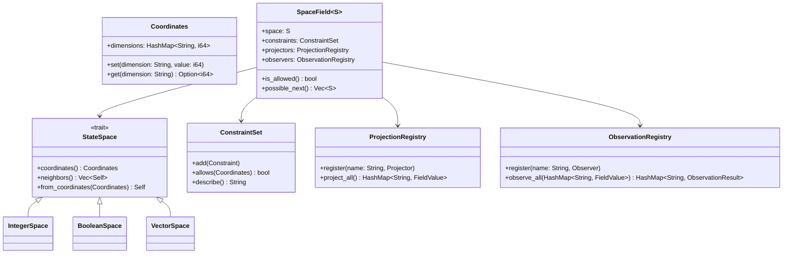

# State-Space Composition Computing System (SSCCS)
## A Computational Model Based on Immutable State Structures and Dynamic Field Composition

### 1. Project Declaration

SSCCS (State-Space Composition Computing System) is a non-profit research initiative established under German legal form *gUG (gemeinnützige Unternehmensgesellschaft)* to advance a fundamental rethinking of computation. The project aims to establish a computing standard suitable for modern processors and the big data era, characterized by energy efficiency, scalability with minimized error and complexity growth, and superior data interpretation capabilities.

### 2. Philosophical Foundation

#### 2.1 Core Tenets
The SSCCS paradigm rests on these fundamental principles:

1. **State Spaces are immutable possibility structures** - Containers of what *could be*, not what *is*
2. **Composition (⨂) is the fundamental operation** - Not instruction execution, but space combination
3. **Computation emerges from composed space projections** - Results are observer-dependent views
4. **Non-determinism arises structurally without randomness** - Multiple valid outcomes from superposition
5. **Execution is field reconfiguration and observation** - Action through configuration, not mutation

#### 2.2 Departure from Von Neumann Architecture
SSCCS fundamentally diverges from the von Neumann model through:

- **No program–data dichotomy**: StateSpaces and Fields replace separate code and data
- **No mutable global state**: Only Field reconfiguration, StateSpace immutability
- **No sequential instruction execution**: Composition and observation replace fetch-decode-execute
- **No randomness for non-determinism**: Structural superposition replaces probabilistic choice
- **No intrinsic time dimension**: Time is observational projection, equal to spatial axes

#### 2.3 Musical Analogy
The SSCCS model can be understood through musical performance:

- **State-space** = instrument & score (immutable structure)
- **Field** = performance rules & harmony theory (interpretive layer)
- **Composition** = arranging multiple scores into concert program (space combination)
- **Observation** = conductor selecting specific piece (projection choice)
- **Execution** = actual performance (result realization)

### 3. Core Definitions

#### 3.1 StateSpace
An immutable structural entity representing a domain of possibilities, defined by:
- **Coordinates**: Structural identifiers (non-semantic axes, including time as equal dimension)
- **Adjacency**: Possible transitions to neighboring structural states
- **Dimensionality**: Number of independent structural axes (infinite extensibility)
- **Identity**: Derived from structural properties only

StateSpaces are invariant under transformation; apparent change generates new StateSpaces.

#### 3.2 SpaceField
A mutable configuration layer that operates upon StateSpaces, comprising:
- **Constraint Fields**: Boundary conditions defining valid coordinate regions
- **Transition Fields**: Permitted navigational steps between coordinates
- **Projection Fields**: Interpretation functions mapping structures to observable values
- **Observation Fields**: Measurement configurations inducing state collapse

Fields transform StateSpaces through application, not mutation.

#### 3.3 Observation and Collapse
Observation is the deterministic projection from a composed StateSpace under specific Field configurations. Collapse occurs when observation resolves structural superposition into concrete values through constraint satisfaction:
- **Projection**: Mapping coordinates to dimensional subspaces
- **Transition Realization**: Adjacency navigation triggered by observation
- **Collapse**: Constraint-driven resolution of superposed possibilities
- **Result**: Projected values in classical data types (integers, booleans, etc.)

### 4. Computational Model

#### 4.1 Execution Cycle
Computation proceeds through four phases:
1. **StateSpace Definition**: Immutable possibility structures established
2. **SpaceField Composition**: Dynamic fields applied to define relational constraints
3. **Observation**: Field-configured projection induces structural collapse
4. **Result Projection**: Collapsed state mapped to classical data types

#### 4.2 Canonical Principles
- **StateSpace Immutability**: StateSpaces are invariant; change creates new spaces
- **Field Mutability**: All dynamism resides exclusively in Fields
- **Execution as Observation**: Computation is observational projection, not state mutation
- **Primitive as Projection**: All data types are 1-dimensional projections of composed spaces
- **Collapse as Constraint Resolution**: Outcome selection resolves through structural constraints
- **Temporal Artifact**: Time is an observer-dependent projection, not computational primitive
- **Structural Non-determinism**: Multiple outcomes emerge geometrically, not probabilistically
- **Parallelism as Revelation**: Concurrency is revealed from structure, not added as feature

### 5. Comparative Analysis

| Aspect | Traditional Computing (Von Neumann) | SSCCS (State-Space Composition) |
|--------|-----------------------------------|--------------------------------|
| **Fundamental Unit** | Bit (value representation) | StateSpace (structural possibility) |
| **State Management** | Mutable memory locations | Immutable StateSpaces, recomposition creates new structures |
| **Execution Model** | Sequential instruction execution (fetch-decode-execute) | Field-mediated structural composition and observation |
| **Parallelism** | Explicit concurrency control (threads, locks) | Inherent from structural independence (natural parallelism) |
| **Non-determinism** | Random/probabilistic (external entropy source) | Structural superposition (geometric non-determinism) |
| **Time Handling** | Sequential clock cycles (intrinsic to execution) | Observer-dependent projection (equal dimension to space) |
| **Energy Efficiency** | Optimized post-hoc (power gating, DVFS) | Architecturally enforced through composition rules |
| **Fault Handling** | Exception propagation, try-catch blocks | Field isolation, automatic bypass (error containment) |
| **Scalability** | Complex coordination (Amdahl's Law limitations) | Linear O(n) with dimensionality (O(1) field addition) |
| **Semantics** | Value-based, operational semantics | Projection-based, observational semantics |
| **Data Movement** | Copy-based transfers (memory bandwidth bound) | Zero-copy coordinate transformation (in-place relay) |
| **Program Structure** | Monolithic executable with mutable state | Field compositions over immutable StateSpaces |
| **Verification** | Runtime testing, formal verification complex | Structural properties verifiable at composition time |

### 6. Technical Specifications

#### 6.1 Core Implementation Architecture
**Current PoC Status** (Implemented in Rust):

```rust
// StateSpace: Immutable structural foundation
pub trait StateSpace: Debug + Clone {
    fn coordinates(&self) -> Coordinates;     // Infinite-dimensional coordinates
    fn neighbors(&self) -> Vec<Self>;        // Structural adjacency
    fn from_coordinates(coords: Coordinates) -> Self;
}

// Coordinates: Dimensionally-neutral structural identifiers
pub struct Coordinates {
    pub dimensions: HashMap<String, i64>,    // All dimensions equal, time included
}

// SpaceField: Dynamic operational layer over StateSpace
pub struct SpaceField<S: StateSpace> {
    pub space: S,                            // Immutable StateSpace
    pub constraints: ConstraintSet,          // Boundary definitions
    pub projectors: ProjectionRegistry,      // Interpretation mappings
    pub observers: ObservationRegistry,      // Collapse triggers
}

// Composition Operations
- Tensor Composition (⨂): S₁ ⨂ S₂ with D = D₁ + D₂
- Direct Sum (⊕): Alternative possibilities per context
- Field Application: SpaceField → StateSpace transformation
```



#### 6.2 Composition Algebra
- **Commutativity**: S₁ ⨂ S₂ = S₂ ⨂ S₁ (coordinate axes reordering)
- **Associativity**: (S₁ ⨂ S₂) ⨂ S₃ = S₁ ⨂ (S₂ ⨂ S₃)
- **Idempotency**: S ⨂ S = S (self-composition yields same structure)
- **Dimensional Neutrality**: Time and spatial axes treated identically

#### 6.3 Energy and Scaling Properties
- **Linear Scalability**: Field addition maintains O(1) transition complexity
- **Zero-Copy Architecture**: State transfer via topological exchange, not data movement
- **Precision-per-Watt Optimization**: Energy efficiency proportional to data locality
- **Overhead Limitation**: Management operations limited to <5% total energy

#### 6.4 Current Capabilities
- **Implemented**: StateSpace trait, Coordinates with infinite dimensions, SpaceField composition, Projector/Observer systems
- **Verified**: Deterministic reproducibility, Coordinate relativity, Structural immutability
- **Scalability**: O(1) field addition complexity, zero-copy coordinate transformation

### 7. Validation Use Cases

#### 7.1 Sustainable High-Performance Computing
Climate modeling with atmospheric physics fields composed over spatial StateSpaces. Energy reduction through zero-copy data movement between simulation components and fault isolation at field boundaries.

#### 7.2 Autonomous Space Systems
Immutable mission StateSpaces with adaptive navigation fields. Rovers observe terrain through composed sensor fields, making autonomous decisions without Earth contact. Radiation-induced errors isolated to specific fields and automatically bypassed.

#### 7.3 Biomedical Simulation
Molecular StateSpaces with chemical interaction fields. Multiple folding pathways observed simultaneously through different thermodynamic projections. Enables personal drug simulation on consumer hardware.

#### 7.4 Distributed Energy Grids
Grid StateSpaces with distributed optimization fields. Each node operates autonomously within global constraints. Emergent stability without central control; faults isolated to specific fields preventing cascading failures.

#### 7.5 Control-Soverign AI Systems
AI as field compositions over knowledge StateSpaces. Each field represents a perspective or expertise. Decisions emerge from transparent field compositions, explainable through observation traces.  

### 8. Implementation Framework

#### 8.1 Current Status
- **Language**: Rust (memory safety, zero-cost abstractions)
- **Core Complete**: StateSpace, Coordinates, SpaceField, Projector/Observer systems
- **Validation**: Unit tests for composition properties and deterministic reproducibility
- **Open Source**: Available for research and collaboration

#### 8.2 Research Roadmap
- **Short-term**: Formal verification of composition algebra, reference runtime completion
- **Medium-term**: SSCCS-to-hardware compilation, 10x energy efficiency demonstration
- **Long-term**: Production deployment for climate modeling, edge computing applications

#### 8.3 Recursive Execution Architecture
A foundational insight of SSCCS is the **recursive symmetry between logical fields in memory space and binary-level execution units**. This elegant structure enables uniform execution patterns at multiple scales:

- **Field-Level Recursion**: Each SpaceField contains within it the complete machinery for StateSpace observation and projection. Fields operate identically whether they represent primitive operations or complex composed computations.

- **Binary Execution Units**: The fundamental building blocks of SSCCS execution are themselves StateSpaces with Fields. A binary executable in SSCCS is simply a specialized StateSpace file (`.ss` format) that contains both its data structures and operational logic in a unified, immutable package.

- **Execution Space Agnosticism**: The same compositional logic operates identically across different execution contexts:
  - **In-Memory Execution**: Fields compose within a single process's address space
  - **Inter-Process Communication**: Fields communicate via shared memory or message passing
  - **Network Distribution**: Fields compose across network boundaries via RPC or streaming protocols
  - **Swarm Execution**: Fields distribute across multiple nodes with automatic coordination

- **Swarm Runtime Vision**: The primary research challenge and ultimate goal is the implementation of a **distributed swarm runtime** where:
  1. Individual computational units (StateSpaces with Fields) operate autonomously
  2. Composition occurs dynamically across network boundaries
  3. Observation can be performed collectively by multiple synchronized observers
  4. Fault tolerance emerges naturally from field isolation and redundancy
  5. Scaling becomes a matter of adding identical computational units without central coordination

This recursive architecture means that **a single machine running SSCCS is already a microcosm of the distributed swarm**, differing only in scale, not in fundamental operation. The implementation challenge is extending this elegant local symmetry to distributed contexts while preserving the zero-copy, energy-efficient properties of the model.

### 9. Conformance Requirements

A conforming SSCCS implementation MUST:
- Enforce immutability of StateSpaces
- Isolate Field mutation from StateSpace identity
- Ensure deterministic observation given identical inputs
- Implement commutative and associative composition operations
- Treat all coordinate dimensions (including time) as structurally equal
- Provide O(1) scaling for field addition operations
- Maintain zero-copy data movement between composition phases
- Guarantee fault isolation at Field boundaries
- Support recursive field composition from single process to distributed swarm
- Provide transparent execution across memory, IPC, and network boundaries

---

*Document Version: 1.0
Research Framework: SSCCS gUG (haftungsbeschränkt)  
Status: Active Research - Reference Implementation Available*