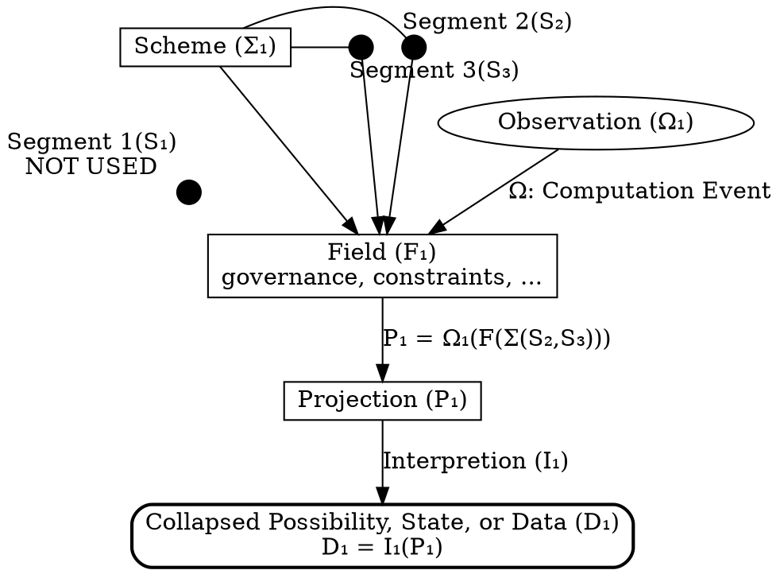
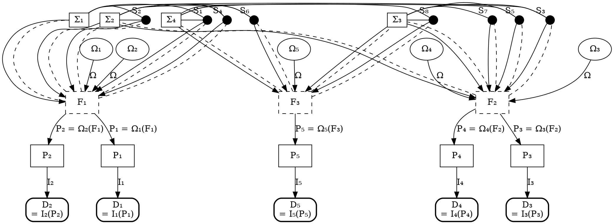
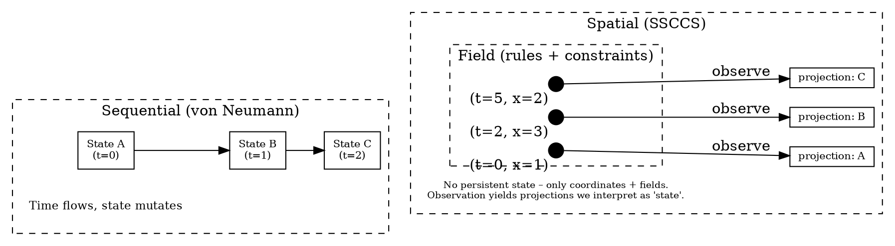
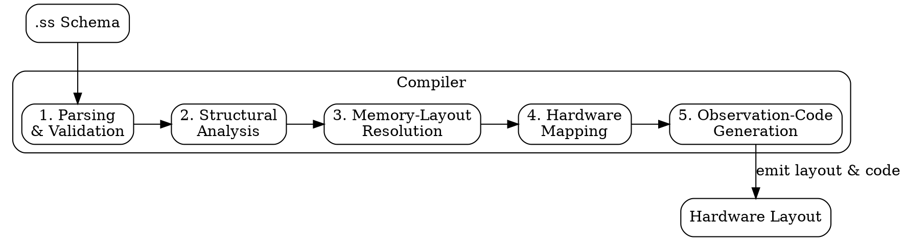
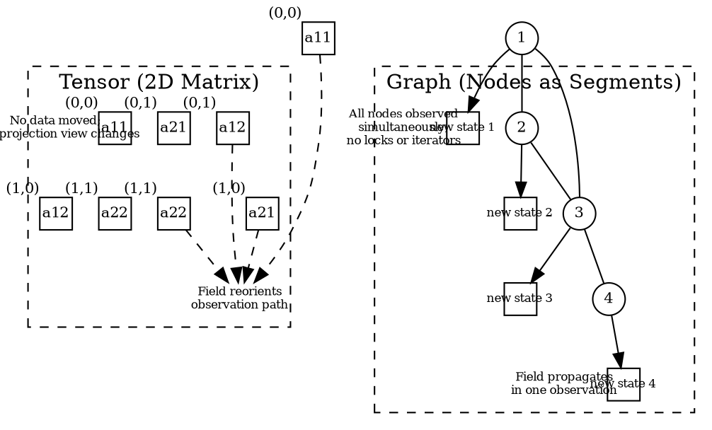
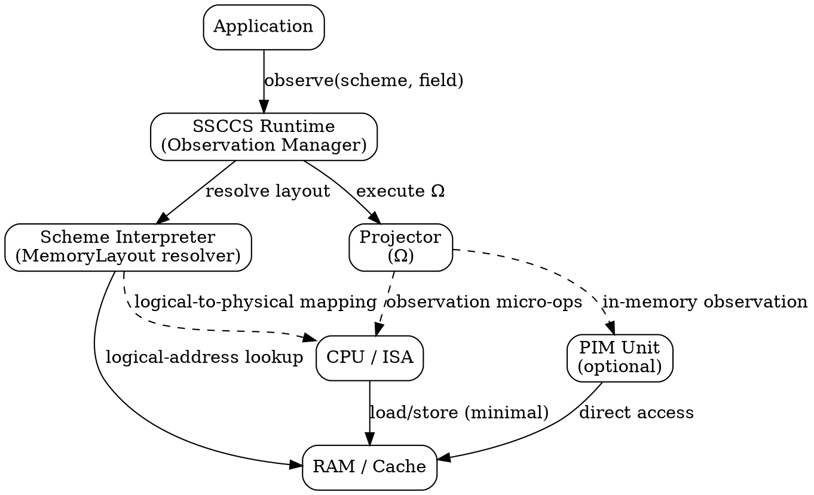
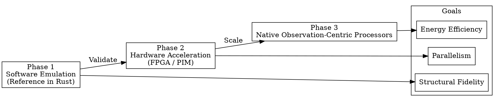

# Schema–Segment Composition Computing System


[](https://doi.org/10.5281/zenodo.18787286)

## Abstract

**SSCCS (Schema–Segment Composition Computing System)** is an
infrastructure specification that redefines computation as the traceable
projection of immutable Segments within a structured Scheme. While
contemporary innovation focuses on material hardware shifts, SSCCS
addresses fundamental inefficiencies of the Von Neumann bottleneck at
the logical layer. By formalizing computation as the simultaneous
resolution of static potential under dynamic constraints rather than a
sequence of state mutations, the architecture reframes data movement,
concurrency, and verifiability.

SSCCS enforces three core values: **Immutability** (data cannot be
altered after creation), **Structural Integrity** (computation must
respect declared schemas), and **Traceability** (every projection is
cryptographically verifiable). These values are realized through a
distinct computational ontology: Segments serve as immutable carriers of
information, Schemes define structural boundaries and constraints, and
Observation deterministically resolves these elements into a Projection
without altering underlying data. This structure-defined approach
eliminates hidden manipulation, minimizes data movement, and establishes
an auditable infrastructure.

Driven by a software‑first philosophy, this architecture ensures
deterministic reproducibility by completely decoupling execution logic
from mutable state through structural and cryptographic isolation. This
open specification, intended for validation across diverse domains,
provides a roadmap where logical design dictates physical
implementation, spanning from software emulation to hardware‑level
support. By integrating intrinsic energy efficiency with high
interpretability, SSCCS establishes a foundation for sustainable,
accountable computational infrastructures, ultimately transitioning
logic into a transparent, verifiable, and accessible Intellectual Public
Commons.

## 1. Introduction

For decades, computation has been defined by the von Neumann model:

    Data + Program → Execution → Result

This formulation rests on several assumptions:

- Data exists as intrinsic values stored in memory.
- Programs are sequences of instructions that operate on data.
- Execution involves moving data between memory and processor.
- State mutation produces results.
- Time orders execution sequentially.

These assumptions, while deeply embedded, are not fundamental laws of
computation but consequences of a particular architectural choice. SSCCS
rejects this entire structure. In practice, the majority of energy and
time in conventional systems is spent on moving data rather than on the
actual arithmetic or logic operations \[1, 2\]—a symptom that reveals
the underlying inefficiency of the von Neumann model. This imbalance,
often called the “data‑movement wall” \[3\], has motivated research into
alternative models.

SSCCS proposes a different set of primitives. Computation is not the
transformation of values but the observation of structured potential.
There are no mutable values, no instruction streams, and no privileged
timeline. Instead, the system consists of:

- Segments: immutable points in a multi‑dimensional coordinate space.
- Schemes: immutable blueprints defining the geometry and relations
  among Segments.
- Fields: mutable containers of dynamic constraints.
- Observation: the sole active event that reveals a Projection—a
  specific configuration from the space of possibilities.

This redefinition has substantive consequences that extend far beyond
data movement. The system’s structure determines what can be known;
observation determines what becomes known. Data movement reduction is
one consequence among many—a derivative benefit of a shift from
procedural execution to structural observation. More fundamentally, this
shift yields deterministic reproducibility: because structure is fixed
and observation is deterministic, every computation produces a
verifiable trace from blueprint to projection.

The paper describes the formal components of SSCCS, their properties,
the engineering implications (including but not limited to data movement
reduction), the open specification format, the planned validation across
multiple domains, and the project’s commitment to computational
infrastructure.

## 2. Background and Motivation

### 2.1 The Von Neumann Inheritance

The von Neumann architecture, developed in the 1940s, embedded certain
philosophical assumptions into the fabric of computing: that computation
is a process of change over time, that data and program are separate
categories, and that meaning emerges from sequences of operations. These
assumptions have proven remarkably durable, but they are not inevitable.

### 2.2 Symptoms of Architectural Assumptions

The data movement problem is a symptom, not the disease. It arises
because the von Neumann model requires data to be transported to a
central processing unit, operated upon, and then returned to storage.
This pattern repeats at every scale: from register files to caches to
main memory to distributed systems. The energy and latency costs of this
movement are well documented \[1, 2, 4\], but addressing them through
incremental optimization—better caches, wider buses, smarter
prefetching—treats the symptom while preserving the underlying model.

### 2.3 Concurrency as Afterthought

Shared mutable state, the source of most concurrency complexity, is
another consequence of the von Neumann model. Locks, atomic operations,
cache coherence protocols, and the entire edifice of concurrent
programming exist to manage the conflicts that arise when multiple
agents can modify the same storage location. These mechanisms add
further data movement and energy consumption, while also creating
opacity: the behavior of concurrent systems becomes notoriously
difficult to predict or verify.

### 2.4 The Black Box Problem

Traditional computing treats the internal logic of execution as a black
box. Programs accept inputs and produce outputs, but the path between
them—the sequence of state mutations—is hidden unless explicitly traced.
This opacity has profound consequences: software can contain undetected
bugs, hidden backdoors, or inefficient pathways that remain invisible to
users and auditors. Verification becomes a post-hoc activity rather than
an intrinsic property of the system.

SSCCS addresses these issues not by optimizing them but by rendering
them unnecessary. By making all persistent data immutable and replacing
execution with observation, the model eliminates the root causes of data
movement, synchronization overhead, and computational opacity.

## 3. The SSCCS Model

SSCCS comprises three ontologically distinct layers, each irreducible to
the others:



<div id="fig-ontology">

<div>

</div>

Figure 1: SSCCS Ontology: Three irreducible layers

</div>

Simply the Field governs the observation of the Scheme and its Segments,
producing a Projection that can be interpreted as data. Each layer has
defined properties and relationships; together they constitute the
complete computational ontology.

- Immutable Segments & Schemes allow any number of observers to apply Ω
  concurrently – no locks or synchronization needed.
- Structural mapping eliminates data movement: the von Neumann
  bottleneck disappears by design.
- Consistency is guaranteed by the single mutable layer (Field), which
  governs all observations.
- Deterministic results arise from cryptographic identities and
  reproducible hardware mappings.
- Parallelism is emergent: concurrency flows from structure, not from
  explicit programming.



<div id="fig-ssccs-multifield">

<div>

</div>

Figure 2: SSCCS multi-field, multi-observation parallel model with rich
segment set

</div>

This integrated view illustrates the full SSCCS model: The observation
events ($Ω_1$, $Ω_2$, etc.) can occur concurrently without any temporal
ordering, and the resulting projections ($P_1$, $P_2$, etc.) are
independent of each other. The data ($D_1$, $D_2$, $D_3$, etc.) derived
from these projections can also be interpreted independently. So **time
is not a fundamental dimension that governs state changes**; instead,
the structure of Schemes and the constraints of Fields govern what can
be observed and when.

A more complexier structural composition can be defined like:

``` dot
digraph SSCCS_MultiField {
    rankdir=TB;
    node [shape=rect];
    
    ranksep=0.1;
    nodesep=0.13;
    
    // === Row 1: Segments 1–6 + invisible (to make 7 columns) ===
    { rank=1;
        node [shape=point, width=0.2, height=0.2];
        s1 [xlabel="S₁"]; s2 [xlabel="S₂"]; s3 [xlabel="S₃"]; s4 [xlabel="S₄"]; s5 [xlabel="S₅"]; s6 [xlabel="S₆"];
        node [style=invis, shape=point, label="", width=0, height=0];
        invis_s1;
    }
    // === Row 2: Segments 7–12 + invisible ===
    { rank=2;
        node [shape=point, width=0.2, height=0.2];
        s7 [xlabel="S₇"]; s8 [xlabel="S₈"]; s9 [xlabel="S₉"]; s10 [xlabel="S₁₀"]; s11 [xlabel="S₁₁"]; s12 [xlabel="S₁₂"];
        node [style=invis, shape=point, label="", width=0, height=0];
        invis_s2;
    }
    // === Row 3: Segments 13–18 + invisible ===
    { rank=3;
        node [shape=point, width=0.2, height=0.2];
        s13 [xlabel="S₁₃"]; s14 [xlabel="S₁₄"]; s15 [xlabel="S₁₅"]; s16 [xlabel="S₁₆"]; s17 [xlabel="S₁₇"]; s18 [xlabel="S₁₈"];
        node [style=invis, shape=point, label="", width=0, height=0];
        invis_s3;
    }
    // === Row 4: Segments 19–24 + invisible ===
    { rank=4;
        node [shape=point, width=0.2, height=0.2];
        s19 [xlabel="S₁₉"]; s20 [xlabel="S₂₀"]; s21 [xlabel="S₂₁"]; s22 [xlabel="S₂₂"]; s23 [xlabel="S₂₃"]; s24 [xlabel="S₂₄"];
        node [style=invis, shape=point, label="", width=0, height=0];
        invis_s4;
    }
    
    // === Row 5: Schemes (structural blueprints) – widened to 7 columns ===
    { rank=5;
        node [shape=box, style=solid];
        sch1 [label="Σ₁"]; sch2 [label="Σ₂"]; sch3 [label="Σ₃"]; sch4 [label="Σ₄"];
        node [style=invis, shape=point, label=""];
        invis_sch1; invis_sch2; invis_sch3;
    }
    
    // === Row 6: Fields (dynamic governance) – widened to 7 columns ===
    { rank=6;
        node [shape=rect, style=dashed];
        f1 [label="F₁"]; f2 [label="F₂"]; f3 [label="F₃"]; f4 [label="F₄"];
        node [style=invis, shape=point, label=""];
        invis_f1; invis_f2; invis_f3;
    }
    
    // === Row 7: Observation events ===
    { rank=7;
        node [shape=ellipse];
        o1 [label="Ω₁"]; o2 [label="Ω₂"]; o3 [label="Ω₃"]; o4 [label="Ω₄"]; o5 [label="Ω₅"]; o6 [label="Ω₆"]; o7 [label="Ω₇"];
    }
    
    // === Row 8: Projections (manifested states) ===
    { rank=8;
        node [shape=box];
        p1 [label="P₁"]; p2 [label="P₂"]; p3 [label="P₃"]; p4 [label="P₄"]; p5 [label="P₅"]; p6 [label="P₆"]; p7 [label="P₇"];
    }
    
    // === Row 9: Interpreted Data (final deterministic values) ===
    { rank=9;
        node [shape=rect, style=rounded, penwidth=2];
        d1 [label="D₁\n= I₁(P₁)"]; 
        d2 [label="D₂\n= I₂(P₂)"]; 
        d3 [label="D₃\n= I₃(P₃)"];
        d4 [label="D₄\n= I₄(P₄)"]; 
        d5 [label="D₅\n= I₅(P₅)"]; 
        d6 [label="D₆\n= I₆(P₆)"];
        d7 [label="D₇\n= I₇(P₇)"];
    }
    
    // === Scheme–Segment structural relations (undirected lines) ===
    edge [arrowhead=none, style=solid];
    sch1 -> s1; sch1 -> s2; sch1 -> s3; sch1 -> s4; sch1 -> s5; sch1 -> s6;
    sch2 -> s5; sch2 -> s6; sch2 -> s7; sch2 -> s8; sch2 -> s9; sch2 -> s10; sch2 -> s11; sch2 -> s12;
    sch3 -> s10; sch3 -> s11; sch3 -> s12; sch3 -> s13; sch3 -> s14; sch3 -> s15; sch3 -> s16; sch3 -> s17; sch3 -> s18;
    sch4 -> s15; sch4 -> s16; sch4 -> s17; sch4 -> s18; sch4 -> s19; sch4 -> s20; sch4 -> s21; sch4 -> s22; sch4 -> s23; sch4 -> s24;
    
    // === Field influences on Schemes and Segments (dashed) ===
    edge [arrowhead=none, style=dashed];
    f1 -> sch1; f1 -> sch2;
    f1 -> s1; f1 -> s2; f1 -> s3; f1 -> s4; f1 -> s5; f1 -> s6; f1 -> s7; f1 -> s8; f1 -> s9; f1 -> s10; f1 -> s11; f1 -> s12;
    f2 -> sch2; f2 -> sch3;
    f2 -> s8; f2 -> s9; f2 -> s10; f2 -> s11; f2 -> s12; f2 -> s13; f2 -> s14; f2 -> s15; f2 -> s16; f2 -> s17; f2 -> s18;
    f3 -> sch3; f3 -> sch4;
    f3 -> s14; f3 -> s15; f3 -> s16; f3 -> s17; f3 -> s18; f3 -> s19; f3 -> s20; f3 -> s21; f3 -> s22; f3 -> s23; f3 -> s24;
    f4 -> sch1; f4 -> sch4;
    f4 -> s1; f4 -> s3; f4 -> s5; f4 -> s18; f4 -> s20; f4 -> s22;
    
    // === Structural input: Schemes and Segments define Field boundaries (solid) ===
    edge [arrowhead=normal, style=solid];
    sch1 -> f1; sch1 -> f4;
    sch2 -> f1; sch2 -> f2;
    sch3 -> f2; sch3 -> f3;
    sch4 -> f3; sch4 -> f4;
    s1 -> f1; s2 -> f1; s3 -> f1; s4 -> f1; s5 -> f1; s6 -> f1; s7 -> f1; s8 -> f1; s9 -> f1; s10 -> f1; s11 -> f1; s12 -> f1;
    s8 -> f2; s9 -> f2; s10 -> f2; s11 -> f2; s12 -> f2; s13 -> f2; s14 -> f2; s15 -> f2; s16 -> f2; s17 -> f2; s18 -> f2;
    s14 -> f3; s15 -> f3; s16 -> f3; s17 -> f3; s18 -> f3; s19 -> f3; s20 -> f3; s21 -> f3; s22 -> f3; s23 -> f3; s24 -> f3;
    s1 -> f4; s3 -> f4; s5 -> f4; s18 -> f4; s20 -> f4; s22 -> f4;
    
    // === Trigger mechanism: Each Observation applies to one or more Fields ===
    edge [arrowhead=normal, style=solid];
    o1 -> {f1, f2};
    o2 -> {f1, f4};
    o3 -> {f2, f3};
    o4 -> {f3, f4};
    o5 -> f1;
    o6 -> f2;
    o7 -> {f1, f2, f3};

    edge [arrowhead=normal, style=solid];
    {f1, f2} -> p1 [label="Ω₁"];
    {f1, f4} -> p2 [label="Ω₂"];
    {f2, f3} -> p3 [label="Ω₃"];
    {f3, f4} -> p4 [label="Ω₄"];
    f1 -> p5 [label="Ω₅"];
    f2 -> p6 [label="Ω₆"];
    {f1, f2, f3} -> p7 [label="Ω₇"];
    
    // === Interpretation: Projection yields deterministic Data ===
    edge [arrowhead=normal, style=solid];
    p1 -> d1 [label="I₁"];
    p2 -> d2 [label="I₂"];
    p3 -> d3 [label="I₃"];
    p4 -> d4 [label="I₄"];
    p5 -> d5 [label="I₅"];
    p6 -> d6 [label="I₆"];
    p7 -> d7 [label="I₇"];
}
```



<div id="fig-ssccs-multifield">

<div>

</div>

Figure 3: The large-scale mass-segment and multi-field scenario

</div>

### 3.1 Segment: Atomic Coordinate Existence

A Segment is the minimal unit of potential—the fundamental building
block of the SSCCS universe. Formally, a Segment $s$ is a tuple
$(c, id)$ where $c \in \mathbb{R}^d$ (or a discrete lattice) represents
coordinates in a $d$-dimensional possibility space, and $id = H(c)$ is a
cryptographic hash providing a unique identifier.

Its properties are:

- Immutability: once created, a Segment cannot be modified; it can only
  be referenced.
- Statelessness: it contains no values, strings, or data structures—only
  coordinates and identity.

Formally, a Segment $s$ is defined as a tuple $(c, id)$ where
$c \in \mathbb{R}^d$ (or a discrete lattice) represents coordinates in a
$d$-dimensional possibility space, and $id = H(c)$ is a cryptographic
hash providing a unique identifier.

A Segment does not define meaning, dimensionality, or adjacency. It
merely exists as a coordinate point. Because Segments contain no mutable
state, they can be observed concurrently by any number of observers
without synchronization. The cryptographic identity ensures that every
Segment is uniquely and verifiably identifiable.

### 3.2 Scheme: Structural Blueprint

If Segment is existence, Scheme is structure.

A Scheme is an immutable blueprint that defines:

- Dimensional axes: specification of coordinate systems.
- Internal structural constraints: rules governing Segment relations.
- Adjacency relations: which Segments are neighbors in possibility
  space.
- Memory layout semantics: how structural relations map to physical
  storage.
- Observation rules: how observation resolves constraints into
  projections.

A Scheme defines a geometric arrangement of Segments, not a sequence of
operations. Segment relationships are spatial rather than temporal.
During compilation, the compiler maps these spatial relationships
directly to hardware addresses, ensuring that Segments which are
structurally adjacent become physically adjacent. This design makes
locality an inherent property of the specification, eliminating the need
for runtime optimizations.

### 3.3 Field: Dynamic Constraint Substrate

The Field $F$ is the only mutable layer, but it does not store values.
Instead, it stores admissibility conditions that dynamically constrain
which configurations of Segments are possible at any given time. The
Field can be thought of as a mutable set of rules or conditions that
interact with the immutable structure defined by the Scheme.

It contains:

- External constraints: rules and conditions that are not part of the
  immutable Scheme but affect observation.
- Relational topology: the dynamic structure of how constraints relate
  to one another.
- Observation frontier: regions of the constraint space that have
  already been observed and collapsed.

Formally, $F$ is a set of admissibility predicates over the
configuration space defined by $\Sigma$. Mutating $F$ changes which
configurations are possible, but does not modify any Segment.

### 3.4 Observation and Projection

Observation is the single active event. It is defined as:

$$ P = \Omega(\Sigma, F) $$

where  
- $\Sigma$ is the set of Segments and their Scheme,  
- $F$ is the current Field state,  
- $\Omega$ is the observation operator,  
- $P$ is the resulting Projection.

Observation occurs when the structure and Field together create an
instability—i.e., multiple admissible configurations. $\Omega$
deterministically selects one configuration and returns it as $P$. No
data is moved during observation; Segments remain in place. The
Projection is ephemeral; if needed again, it is recomputed.

### 3.5 Secure Isolation and Cryptographic Boundaries

SSCCS provides natural isolation through:

- Identity-based boundaries: Every Segment and Scheme has a unique
  cryptographic hash. A computation can only access Segments for which
  it holds valid references.
- Isolation through immutability: Since Segments cannot be modified,
  concurrent observations are naturally isolated.
- Cryptographically enforced scoping: Schemes can define boundaries
  limiting visibility, enforced by observation rules and identity
  verification.

This architecture enables complex computations within cryptographically
enforced boundaries without requiring trust between components.

### 3.6 Relationship with Traditional Concepts

| Traditional Concept | SSCCS Counterpart | Shift |
|----|----|----|
| Instruction fetch | Not applicable | No imperative control flow |
| Operand load | Segment coordinates | Data never moves; only observed |
| Result store | Projection (ephemeral) | Results are events, not states |
| Cache line fill | Structural layout | Locality from geometry |
| Lock acquisition | Immutability | No shared mutable state |
| Program counter | Coordinate dimension | Time as coordinate |
| Algorithm | Geometry | Structure determines observation |
| Black box execution | Transparent projection | Computation is auditable |

## 4. Formal Properties

### 4.1 Immutability and Concurrency

Because Segments are immutable, any number of observations can be
performed simultaneously without interference. Formally, if $S_1$ and
$S_2$ are disjoint sets of Segments, then:

$$ \Omega(S_1 \cup S_2, F) = \Omega(S_1, F) \times \Omega(S_2, F) $$

where $\times$ denotes independent composition of projections. This
property enables implicit parallelism without any programmer effort or
runtime synchronisation—a consequence of immutability, not a feature
added to address performance.

### 4.2 Determinism and Auditability

Observation is deterministic: for identical $\Sigma$ and $F$, $\Omega$
always yields the same $P$. Determinism follows from the fact that
selection among admissible configurations is a function of structure and
constraints only. This enables auditability: every projection is a
verifiable trace from blueprint to output.

### 4.3 Time as a Coordinate

Time is treated as one coordinate axis among many. Temporal ordering is
expressed by comparing coordinates along that axis. Observations do not
have a global temporal order unless explicitly defined. This eliminates
the notion of a “program counter” and the associated assumption that
computation must proceed in sequence.



<div id="fig-time-coordinate">

<div>

</div>

Figure 4: Time as a coordinate axis

</div>

### 4.4 Energy Model

A simplified energy model for SSCCS is:

$$
E_{\text{total}} = E_{\text{observation}} \times N_{\text{obs}} + E_{\text{field-update}} \times N_{\text{update}}
$$

where $E_{\text{observation}}$ is the energy to perform one observation,
and $E_{\text{field-update}}$ is the energy to modify the Field. There
is no term for moving data between memory and processor, because
Segments are stationary.

## 5. Compilation and Structural Mapping

A key engineering contribution of SSCCS is that the compiler, rather
than generating a sequence of instructions, performs structural mapping
of the Schema onto the target hardware. The compiler analyses the
adjacency relations and memory layout semantics declared in the Schema
(written in the open `.ss` format) and produces a physical placement of
Segments that maximises locality.

For example, if a Schema defines a two‑dimensional grid of Segments with
nearest‑neighbour adjacency, the compiler can lay out those Segments in
memory in row‑major or column‑major order such that adjacent Segments
occupy adjacent cache lines or even the same cache line. This is
analogous to data layout optimisations performed manually in
high‑performance computing, but here it is automated and guaranteed by
the Schema’s specification.

Furthermore, because the Schema encodes parallelism implicitly
(independent subgraphs can be observed concurrently), the compiler can
automatically generate code for vector units, multiple cores, or even
custom hardware without explicit parallel annotations.



<div id="fig-compilation-process">

<div>

</div>

Figure 5: Compiler pipeline: from Schema to hardware layout

</div>

### 5.1 Compiler Pipeline

The SSCCS compiler transforms a high‑level `.ss` schema into a
hardware‑specific layout through a deterministic pipeline.

1.  Parsing and Validation: The `.ss` file is parsed into an
    intermediate representation (IR) that captures the Schema’s axes,
    Segments, structural relations, constraints, memory‑layout
    declarations, and observation rules. Cryptographic identities
    (SchemaId, SegmentId) are computed and verified.

2.  Structural Analysis: The compiler extracts adjacency, hierarchy,
    dependency, and equivalence relations from the Schema’s relation
    graph. It identifies independent sub‑graphs that can be observed
    concurrently and detects any structural conflicts (e.g., cycles that
    would prevent deterministic observation).

3.  Memory‑Layout Resolution: Using the Schema’s `MemoryLayout`
    specification, the compiler resolves the mapping from coordinate
    space to logical addresses. The `MemoryLayout` struct contains a
    `layout_type` (Linear, RowMajor, ColumnMajor, SpaceFillingCurve,
    etc.) and a mapping function that implements the
    coordinate‑to‑address transformation. This stage produces a logical
    address map that preserves locality as defined by the adjacency
    relations.

4.  Hardware Mapping: The logical address map is projected onto the
    target hardware’s physical memory hierarchy. The compiler considers
    cache‑line boundaries, bank interleaving, and (where available)
    processing‑in‑memory (PIM) capabilities to place Segments such that
    structurally adjacent Segments reside in physically proximate
    storage locations (e.g., same cache line, adjacent memory banks).
    This step guarantees that observation can proceed with minimal data
    movement.

5.  Observation‑Code Generation: For each independent sub‑graph, the
    compiler emits native code (or configures a reconfigurable fabric)
    that implements the observation operator `Ω`. The generated code
    respects the resolution strategy, triggers, and priority defined in
    the Schema’s `ObservationRules`.

The entire pipeline is deterministic and reproducible: given the same
`.ss` specification and target hardware profile, the compiler always
produces the same layout and observation code.

#### Concrete Example: Compiling a Grid2DTemplate

Consider a simple 3×3 grid defined by a `Grid2DTemplate` (expressed here
in a language‑neutral pseudocode):

    grid = Grid2DTemplate(
        axes: ["x": 0..2, "y": 0..2],
        topology: FourConnected,
        memory_layout: RowMajor
    )

The compiler processes this Schema as follows:

- Parsing: The schema is parsed into an internal representation with two
  discrete axes, nine Segments (coordinates (0,0) … (2,2)), adjacency
  relations for four‑connected neighbors, and a row‑major memory layout.

- Structural Analysis: The relation graph reveals that each interior
  cell has four neighbors; the graph is regular and contains no cycles
  that would create observational dependencies. All nine cells are
  mutually independent and can be observed in parallel.

- Memory‑Layout Resolution: The row‑major mapping function computes
  logical offsets: `offset = y * 3 + x`. The compiler evaluates this for
  all nine coordinates, producing a logical‑address map:

      (0,0)→0, (1,0)→1, (2,0)→2,
      (0,1)→3, … , (2,2)→8.

- Hardware Mapping: On a CPU with 64‑byte cache lines, the compiler
  packs the logical addresses into physical cache lines. Offsets 0‑7 fit
  into a single cache line; offset 8 spills into a second line. The
  compiler may decide to pad the layout to keep the entire grid in one
  cache line, or it may accept the spill because adjacent rows are still
  in adjacent lines.

- Observation‑Code Generation: For a trivial observation that reads each
  Segment’s value, the compiler emits a loop that iterates over the nine
  logical addresses and loads the corresponding data. Because the
  addresses are consecutive, the loop can be vectorized (SIMD). If the
  observation is a reduction (e.g., sum of values), the compiler may
  generate a parallel reduction using multiple cores.

This example illustrates how the pipeline turns a declarative geometric
description into efficient, hardware‑aware executable code without any
manual optimization.

## 5.2 Memory Mapping Logic

The compiler’s ability to eliminate data movement hinges on the
MemoryLayout abstraction. A `MemoryLayout` consists of:

- layout_type – a classification (`Linear`, `RowMajor`, `ColumnMajor`,
  `SpaceFillingCurve`, `Hierarchical`, `GraphBased`, `Custom`)
  describing the high‑level organisation.
- mapping – a function that, given a coordinate tuple (e.g.,
  `(x, y, z)`), returns an optional logical address. This function is
  defined declaratively in the Schema and is independent of any
  programming language.
- metadata – a set of key‑value pairs providing implementation‑specific
  hints (e.g., curve parameters, stride lengths).

A logical address is an intermediate representation consisting of a
segment identifier and an offset within that segment’s conceptual
address space. It is not a physical memory address; rather, it serves as
an intermediate coordinate that the hardware mapper later translates to
concrete physical locations (cache lines, memory banks, etc.).

Example: For a two‑dimensional grid with row‑major layout, the mapping
function can be expressed mathematically as:

    f(x, y) = (grid_id, y·width + x)

where `width` is the grid’s extent in the x‑direction. The compiler
evaluates this function for every coordinate in the Schema, producing a
complete logical‑address map.

By decoupling the logical layout from the physical implementation, the
same Schema can be projected onto vastly different hardware topologies:

- CPU caches – Adjacent logical addresses are placed into the same cache
  line or neighbouring lines.
- FPGA block RAM – The logical‑to‑physical mapping can be realised as a
  simple address decoder.
- HBM (High‑Bandwidth Memory) stacks – Segments with high adjacency can
  be distributed across multiple memory channels to exploit parallelism.
- Emerging non‑volatile memories (e.g., resistive RAM) – The stationary
  data model of SSCCS aligns naturally with processing‑in‑memory (PIM)
  architectures, where computation is performed directly inside the
  memory arrays.

In all cases, the mapping is deterministic and reproducible: given the
same Schema and hardware profile, the compiler always produces the same
physical layout, ensuring that observation proceeds with minimal data
movement.

### 5.3 Automating Manual Optimizations

The following table summarises how traditional manual optimisations
become automatic consequences of structural specification in SSCCS:

| Manual Optimization | SSCCS Mechanism |
|----|----|
| Data layout orchestration | Schema defines geometry; compiler maps to hardware |
| Cache alignment | Adjacency relations determine physical proximity |
| SIMD vectorization | Independent subgraphs imply vectorizable operations |
| Thread scheduling | Parallel structure maps to independent cores |
| Lock management | Immutability eliminates need for locks |
| Execution strategy selection | Observation rules and structural independence guide parallel execution |

### 5.4 Example: Vector Addition with Rust Example

Consider the addition of two vectors of length $N$. This example
demonstrates the transition from procedural execution to structural
observation.

#### Traditional Approach (von Neumann)

In a traditional architecture, a loop iterates over indices, loading
each element $a[i]$ and $b[i]$ from memory into registers, performing
the addition, and storing the result back to memory.

``` rust
// Rust-like pseudocode
fn add_vectors(a: &[f64], b: &[f64]) -> Vec<f64> {
    assert_eq!(a.len(), b.len());
    let mut result = Vec::with_capacity(a.len());
    for i in 0..a.len() {
        result.push(a[i] + b[i]); // loads a[i], b[i]; stores result[i]
    }
    result
}
```

- **Data Movement**: $2N$ loads + $N$ stores = $3N$ total memory
  transfers.
- **Sequential Dependency**: Loop-carried dependencies limit
  parallelisation unless explicitly vectorised (SIMD).
- **Cache Behaviour**: Performance is highly dependent on memory layout;
  random access or misalignment causes cache misses.
- **Auditability**: Requires external tracing tools to reconstruct the
  execution path post-mortem.

#### SSCCS Approach

A Scheme defines a set of Segments representing the vectors and an
“adder” structure. The compiler, guided by adjacency relations, lays out
the Segments consecutively in memory. An observation of the entire
structure under a Field that enables addition yields a projection that
is the sum vector. This model assumes a hardware environment capable of
Near-Data Processing (NDP) or Processing-In-Memory (PIM), where logic is
co-located with the data Segments.

``` rust
// Rust-like pseudocode
let a = Segment::vector(1..N, initial_value);
let b = Segment::vector(1..N, initial_value);
let scheme = Scheme::add_vectors(a, b);
let field = Field::new();
// Computation is an emergent property of the observation
let sum = observe(scheme, field); 
```

- **Data Movement**: Zero input movement. Segments remain stationary
  (“Logic-at-Rest”). Only the resulting projection (a single vector of
  length $N$) is transmitted to the observer.
- **Parallelism**: Structural independence allows all element pairs to
  be observed concurrently without explicit synchronisation or
  partitioning.
- **Locality**: Enforced by the compiler’s topological mapping, treating
  memory as an active topology rather than passive storage.
- **Auditability**: The Scheme serves as an immutable specification of
  the computational intent; the projection is a deterministic and
  verifiable consequence.

| Aspect | Traditional (Procedural) | SSCCS (Structural) |
|----|----|----|
| Input Data Movement | $2N$ loads | Zero (Stationary Segments) |
| Output Data Movement | $N$ stores | $N$ (Projection) |
| Concurrency | Requires explicit parallelisation | Implicit (Structural independence) |
| Synchronisation | Locks/atomics for shared state | None (Immutability guaranteed) |
| Memory Role | Passive storage | Active topology |
| Auditability | Requires external tracing | Intrinsic to Specification |

This example illustrates the fundamental ontological shift: computation
becomes an observation of stationary structure rather than a sequence of
data movements. The reduction in data movement is a consequence of this
shift, not the primary goal. The deeper benefit lies in the absolute
transparency and verifiability that emerge from treating computation as
a structural specification.

### 5.5 Scaling to N-Dimensional Tensors and Graphs

The structural principles of SSCCS extend beyond linear vectors to
higher-dimensional and non-linear data structures. As dimensionality
increases, the inefficiency of the von Neumann bottleneck grows
exponentially; SSCCS provides a constant-time logical alternative for
structural reorientation.



<div id="fig-scaling">

<div>

</div>

Figure 6: Scaling SSCCS to N-dimensional tensors and complex graphs

</div>

#### 5.5.1 N-Dimensional Tensors

In SSCCS, an $N$-dimensional tensor is represented as a set of Segments
where adjacency relations are defined across multiple axes within the
Scheme.

- **Zero-Copy Reshaping**: Traditional systems require physical data
  movement ($O(N)$ or $O(N^2)$) to perform operations like transposition
  or reshaping. In SSCCS, reshaping is a metadata-only operation. By
  reorienting the Field’s observation path over stationary Segments, the
  dimensionality of the Projection changes without moving a single bit
  in memory ($O(1)$).
- **Logical Adjacency**: For operations like matrix multiplication, the
  compiler maps Segments to ensure that the required operands for a
  specific Field are physically co-located. This transforms what would
  be complex indexing logic in a CPU into a direct physical property of
  the memory topology.

#### 5.5.2 Complex Graph Processing

Graph algorithms (e.g., PageRank, GNNs) are traditionally bottlenecked
by “Pointer Chasing,” which causes severe cache thrashing and memory
latency.

- **Segment-as-Node**: Each node and its properties are encapsulated in
  a Segment.
- **Adjacency-as-Structure**: Edges are defined as structural
  constraints within the Scheme, not as memory pointers to be followed
  sequentially.
- **Field-based Traversal**: A Field propagates across the entire Scheme
  in a single observation cycle. Instead of “visiting” nodes, the
  observer captures the emergent state of the entire graph
  simultaneously.
- **Concurrency**: This eliminates vertex-centric synchronization
  (locks/mutexes). All nodes update their state in parallel as a
  deterministic consequence of the Field’s interaction with the Scheme’s
  topology.

### Comparison: Computational Density at Scale

| Computational Task | Traditional Bottleneck | SSCCS Solution |
|----|----|----|
| Tensor Reshaping | Physical data reshuffling ($O(N^d)$) | Metadata-level Field reorientation ($O(1)$) |
| Matrix Contraction | Memory bandwidth & indexing overhead | Hardwired adjacency in the Scheme |
| Graph Traversal | High latency due to random access | Distributed parallel observation |
| Sparse Operations | Complex indexing & storage overhead | Non-linear Scheme mapping (skipping null-space) |

The scaling of SSCCS addresses the Curse of Dimensionality by decoupling
the logical structure of data from the physical cost of its traversal.
While traditional architectures expend energy moving data to accommodate
logic, SSCCS modifies the Field to accommodate the stationary structure.
This positions SSCCS as a foundational methodology for future
AI-hardware co-design, where computational density and energy efficiency
are the primary constraints.

## 6. The Open Format

A central goal of SSCCS is the definition of an open `.ss` format—a
human‑readable, machine‑processable representation of Segments and
Schemes. The format is designed to be language‑agnostic and
platform‑independent. (If desired: “The specification is currently under
development; once the Segment‑Scheme structure is finalized, a
translation layer may convert existing data representations into
`.ss`.”)

Characteristics: - Human‑readable, machine‑processable. - Immutable by
default; evolution creates new versions. - Cryptographically
identifiable (hash‑based). - Compositional: Schemes can include other
Schemes. - Platform‑independent.

### 6.1 Binary Serialization and Memory Layout

The binary encoding of a Scheme includes: - Header (SchemeId, version) -
Axes list (definitions of each axis) - Segment table (IDs, coordinate
ranges, and associated data) - Relation graph (encoding of adjacency,
hierarchy, and dependencies) - Serialized `MemoryLayout` (layout type,
encoded mapping function, metadata) - Observation rules and constraints

This binary format ensures interoperability across implementations and
enables deterministic reconstruction of the Scheme’s structure.

## 7. System Stack and Instruction‑Set Interaction

SSCCS inserts a runtime layer between application and hardware that
translates observation requests into hardware‑specific memory mappings
and observation primitives. The runtime coordinates the Scheme
interpreter and projector to realise observation without moving data
unnecessarily.



<div id="fig-system-stack">

<div>

</div>

Figure 7: SSCCS system stack

</div>

In environments without direct hardware support, a lightweight software
runtime emulates the observation process by interpreting the binary
`.ss` format.

### 7.1. Hardware Considerations

While SSCCS can be implemented in software, its benefits are most
pronounced with hardware support:

- No instruction fetch unit; observation triggered structurally.
- Processing‑in‑memory (PIM) for direct observation.
- Spatial computation mapping adjacency to wiring.
- Cryptographic primitives in hardware.

## 8. Theoretical Performance & Scalability

The SSCCS architecture derives its efficiency not from incremental
hardware acceleration, but from a fundamental shift in computational
complexity. By redefining execution as the Structural Observation of a
stationary Scheme, the framework bypasses the sequential bottlenecks
inherent in the von Neumann architecture.

### 8.1 Architectural Expectations of Time-Space Complexity

Traditional procedural models are constrained by the linear relationship
between data volume ($N$) and execution cycles. SSCCS decouples this
relationship by utilizing the concurrent propagation of a Field across a
pre-defined Topology.

<div id="fig-complexity">

``` python
import matplotlib.pyplot as plt
import numpy as np

# Define Data Scale (N)
N = np.geomspace(1, 1024, 100)

# 1. Temporal Complexity (Latency)
# Procedural: O(N)
# SSCCS: O(log N) - Field Propagation
latency_procedural = N * 1.2 + 5
latency_ssccs = np.log2(N) + 2

# 2. Data Movement Complexity (Energy/Space)
# Procedural: O(N*D)
# SSCCS: O(Output) - Logic-at-Rest
movement_procedural = N**1.15
movement_ssccs = np.ones_like(N) * 10 + (N * 0.1)

# Plotting with Fixes for Matplotlib 3.x+
fig, (ax1, ax2) = plt.subplots(1, 2, figsize=(12, 5))

# Latency Plot - Using Raw Strings for LaTeX labels
ax1.plot(N, latency_procedural, color='gray', linestyle='--', label=r'Procedural: $O(N)$')
ax1.plot(N, latency_ssccs, color='gray', linewidth=2, label=r'SSCCS: $O(\log N)$')
ax1.set_xscale('log')
ax1.set_yscale('log')
ax1.set_title('Execution Latency (Time)', fontweight='bold')
ax1.set_xlabel(r'Scale of Data ($N$)')
ax1.set_ylabel('Cycles (Log Scale)')
ax1.legend()

# Data Movement Plot
ax2.plot(N, movement_procedural, color='gray', linestyle='--', label=r'Procedural: $O(N \cdot D)$')
ax2.plot(N, movement_ssccs, color='black', linewidth=2, label=r'SSCCS: $O(Projection)$')
ax2.set_xscale('log')
ax2.set_yscale('log')
ax2.set_title('Data Movement (Energy/Space)', fontweight='bold')
ax2.set_xlabel(r'Scale of Data ($N$)')
ax2.set_ylabel('Transfer Volume (Log Scale)')
ax2.legend()

plt.tight_layout()
plt.show()
```

Figure 8

</div>

#### 8.1.1 Temporal Complexity (Latency)

In a von Neumann environment, even with SIMD/MIMD parallelism, latency
scales at $O(N)$ or $O(N/k)$ due to instruction dispatch,
synchronization, and memory-wall stalls.

- **SSCCS Latency**: Defined by the physical propagation delay of the
  Field across the Scheme. Because structural constraints are resolved
  at the mapping phase, the observation of the result—the
  Projection—approaches $O(\log N)$ or even $O(1)$ in specialized
  hardware environments such as Processing-In-Memory (PIM).

#### 8.1.2 Data Movement Complexity (Spatial/Energy Cost)

The primary energy sink in modern computing is the movement of operands
from memory to logic units.

- **Procedural Cost**: $O(N \cdot D)$, where $D$ represents the
  dimensionality of the data required for each operation.
- **SSCCS Cost (Logic-at-Rest)**: $O(Projection)$. Since the input
  Segments remain stationary within the Scheme, the energy expenditure
  is strictly limited to the transmission of the resulting Projection.
  This creates a widening efficiency gap as the scale of $N$ increases.

### 8.2 Comparative Complexity Matrix

The following table summarizes the asymptotic behavior of SSCCS compared
to traditional sequential and parallel (SIMD) architectures.

| Metric | Sequential | Parallel (SIMD/GPU) | SSCCS (Structural) |
|----|----|----|----|
| Instruction Overhead | High ($O(N)$) | Moderate ($O(N/k)$) | Minimal (Field-based) |
| Data Locality | Managed (Cache) | Explicit (SRAM/Tiling) | Intrinsic (Scheme-defined) |
| Execution Latency | $O(N)$ | $O(N/k) + \text{sync}$ | $O(\log N)$ or $O(1)$ |
| Data Movement | $O(N)$ | $O(N)$ | $O(\text{Output Only})$ |
| Scalability Limit | Amdahl’s Law | Memory Bandwidth | Physical Propagation Delay |

### 8.3 Scalability in High-Dimensional AI Workloads

As demonstrated in the emergence of State-Space Models (SSMs) $[6]$ and
manifold-constrained learning $[5]$, the ability to process
high-dimensional representations without exhaustive data shuffling is
critical.

1.  Stationary Topology: By fixing the Segments in a k-dimensional
    `MemoryLayout`, SSCCS allows the hardware to perform “Observation”
    as a near-instantaneous mapping.
2.  Implicit Parallelism: Unlike threads or warps that require explicit
    management, SSCCS parallelism is implicit—it is a property of the
    structure itself. The scalability is limited only by the fidelity of
    the Field and the resolution of the Projector ($\Omega$).

## 9. Implementation Roadmap



<div id="fig-roadmap">

<div>

</div>

Figure 9: Implementation roadmap: three research phases

</div>

### Phase 1: Software Emulation (Proof of Concept)

- Rust reference implementation reading `.ss` specifications.
- Validate model on small benchmarks (matrix multiplication, graph
  algorithms).
- Measure determinism, implicit parallelism, data movement reduction.
- Establish toolchain and community.

### Phase 2: Hardware Acceleration

- Map Schemes to FPGA fabrics.
- Explore PIM architectures (UPMEM, Samsung FIM).
- Develop compiler targeting CPUs (via SIMD) and FPGA/PIM.
- Begin formal verification.

### Phase 3: Native Observation‑Centric Processors (Long‑Term Research)

- Design processor directly instantiating Schemes.
- Integrate memory and logic in unified substrate (e.g., memristor
  arrays).
- Evaluate energy efficiency for target domains.
- Establish SSCCS as foundational infrastructure.

Throughout, the `.ss` blueprint remains unchanged, preserving
investment.

## 10. Planned Validation Domains

SSCCS is intended for validation across multiple domains. The following
table outlines traditional challenges and expected advantages:

| Domain | Traditional Challenge | Expected Advantages |
|----|----|----|
| Climate modelling | Massive state space, grid data movement | Constraint isolation, deterministic observation, minimal data transfer |
| Space systems | Radiation-induced errors, power constraints | Structural reproducibility, error detectability, verifiable execution |
| Protein folding | Combinatorial explosion, long time scales | Massive parallel observation, structure-guided exploration |
| Swarm robotics | Coordination overhead, limited communication | Recursive composition, emergent coordination from shared structure |
| Financial modelling | Real‑time constraints, complex dependencies | Deterministic projections, no race conditions, auditable processing |
| Cryptographic systems | Side‑channel attacks, verification complexity | Immutable structure enables formal verification, no intermediate state |
| Autonomous vehicles | Sensor fusion, real‑time decision making | Constraint‑based observation, deterministic response, auditable decisions |

## 11. Related Work

SSCCS is presented alongside several established research domains,
providing a unified theoretical foundation:

- Dataflow architectures (e.g., Dennis’s dataflow graphs) treat programs
  as graphs where nodes fire when inputs are available.
- Functional programming emphasises immutability and referential
  transparency.
- Processing‑in‑memory (PIM) research directly addresses the data
  movement problem.
- Declarative languages (SQL, Datalog) describe *what* to compute rather
  than how.
- Intentional programming and memoisation share conceptual ground with
  observation‑based computation.

Recent work in AI demonstrates the growing relevance of structural
constraints:

- **Geometric Constraints**: Research such as *Manifold-Constrained
  Hyper-Connections* by DeepSeek $[5]$ highlights the efficacy of
  applying geometric inductive biases in high-dimensional
  representations. This validates the SSCCS approach of defining
  computational processes through topological constraints rather than
  procedural instructions.

- **SSCCS as a Structural Superset**: SSCCS serves as a formal
  ontological superset for State-Space Models (SSMs) like Mamba $[6]$
  and hardware-aware frameworks such as Modular AI’s MAX/Mojo $[7, 8]$.
  While these systems achieve high-performance linear recurrences
  through ad-hoc kernel tuning, SSCCS redefines the SSM recurrence not
  as a procedural loop, but as a one-dimensional Scheme of adjacent
  Segments where state transitions emerge as Projections of a sequential
  Field. By shifting from execution-based optimization to the
  deterministic observation of stationary topological constraints, SSCCS
  inherently encompasses the efficiency gains of modern AI execution
  engines within a universal, structure-defined architecture.

These references contextualize SSCCS within the broader intellectual
landscape. In each domain, the shift from execution to observation is
expected to offer advantages that incremental optimization cannot
provide. These advantages—determinism, parallelism, fault isolation,
reduced communication, and above all verifiability—are expected
consequences of the ontological redefinition, not features added to
address specific problems.

## 12. Conclusion and Future Work

This paper has presented SSCCS, a computational model that redefines
computation as the observation of structured potential under dynamic
constraints. The model’s core components—immutable Segments, geometric
Schemes, mutable Fields, and the Observation/Projection
mechanism—constitute a new computational ontology. From this ontology,
multiple consequences follow: elimination of most data transfers,
removal of synchronization overhead, implicit parallelism, deterministic
reproducibility, and secure isolation within cryptographically enforced
boundaries.

Observation deterministically resolves admissible configurations from
the combination of Scheme and Field into a Projection, without altering
underlying Segments. The compiler performs structural mapping, and the
open `.ss` format ensures platform‑independent, verifiable
specifications.

Planned validation across multiple domains—climate modeling, space
systems, protein folding, swarm robotics, financial modeling,
cryptographic systems, and autonomous vehicles—will assess the model’s
advantages: determinism, parallelism, fault isolation, reduced
communication, and verifiability.

In summary, SSCCS establishes several foundational principles:

- Computation concerns revelation rather than change.
- Structure is more fundamental than process.
- Time is a coordinate rather than a flow.
- Value is projected rather than intrinsic.
- Programs are blueprints rather than recipes.
- Results are configurations revealed by Observation.
- Composition is the primitive of computation.
- Structure serves as executable law.
- Observation is the sole active event.
- Projection is the deterministic outcome of Observation.
- Immutability provides the foundation for concurrency and security.

The model is not presented as a complete replacement for all computing,
but as a promising direction for data-intensive, parallel workloads
where the limitations of the von Neumann model are most apparent. More
importantly, it offers a way of thinking about computation that may
prove fruitful beyond its immediate engineering applications—a framework
that prioritizes verifiability and accessibility over opaque procedural
execution.

## References

- \[1\] W. A. Wulf and S. A. McKee, “Hitting the memory wall:
  implications of the obvious,” *ACM SIGARCH Computer Architecture
  News*, vol. 23, no. 1, pp. 20–24, 1995.
- \[2\] S. Borkar and A. A. Chien, “The future of microprocessors,”
  *Communications of the ACM*, vol. 54, no. 5, pp. 67–77, 2011.
- \[3\] R. Lucas et al., “Top ten exascale research challenges,” US
  Department of Energy, 2014.
- \[4\] M. Horowitz, “Computing’s energy problem (and what we can do
  about it),” in *IEEE International Solid‑State Circuits Conference*,
  2014.
- \[5\] DeepSeek-AI, “Manifold-Constrained Hyper-Connections: Geometric
  Inductive Biases in High-Dimensional Representations,” *arXiv preprint
  arXiv:2512.24880*, 2025.
- \[6\] A. Gu and T. Dao, “Mamba: Linear-Time Sequence Modeling with
  Selective State Spaces,” *arXiv preprint arXiv:2312.00752*, 2023.
- \[7\] Modular AI, “MAX: A Unified AI Execution Engine,” \[Online\].
  Available: https://www.modular.com/max. Accessed Feb. 2026.
- \[8\] C. Lattner et al., “Mojo: Programming Language for All of AI,”
  \[Online\]. Available: https://www.modular.com/mojo. Accessed
  Feb. 2026.

------------------------------------------------------------------------

© 2026 SSCCS gUG (i.G.) — A non‑profit research initiative, formalized
through global standards and its authenticity substantiated by immutable
scientific records and cryptographic proofs.

- Source code under Apache 2.0: [Github](https://github.com/ssccsorg) \|
  GPG ID:
  [BCCB196BADF50C99](https://keys.openpgp.org/search?q=BCCB196BADF50C99)
- Whitepaper under CC BY-NC-ND 4.0: [PDF](https://ssccs.org/wp)
  [HTML](https://ssccsorg.github.io/ssccs) \| Registered DOI:
  [10.5281/zenodo.18787286](https://doi.org/10.5281/zenodo.18787286) by
  CERN,
  [OpenAIRE](https://explore.openaire.eu/search/result?pid=10.5281%2Fzenodo.18787286)
