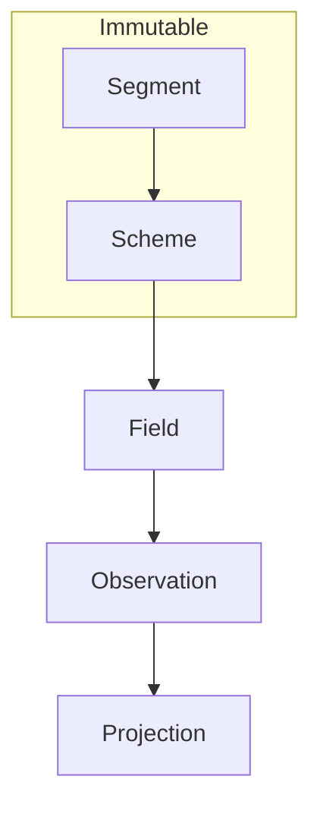
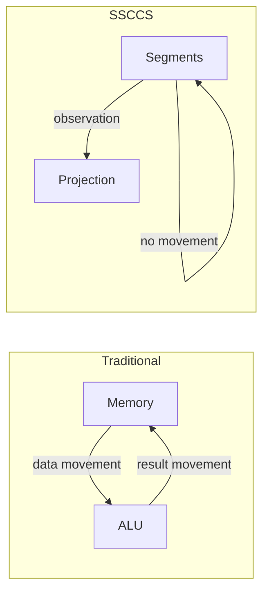

# SSCCS: Schema–Segment Composition Computing System  
## A Structure-Defined, Constraint-Conditioned, and Observation-Centric Computational System Architecture

### Abstract

SSCCS is a research initiative that redefines the ontological foundation of computation, modeling it as the traceable Projection of immutable Segments within a structured Scheme. While contemporary innovation focuses predominantly on material hardware shifts, SSCCS challenges and addresses the fundamental inefficiencies of the Von Neumann bottleneck at the logical layer. By formalizing computation as the simultaneous resolution of static potential under dynamic constraints rather than a sequence of state mutations, the architecture reframes data movement, concurrency, and verifiability.

The framework operates through a distinct ontology: Segments serve as immutable carriers of structured information, while Schemes define bounded structural contexts. Fields constitute relational topologies governed by dynamic constraints that dictate admissible configurations. Within this layer, computation is executed through Observation, which deterministically resolves these configurations into a Projection without altering underlying Segments. This structural approach inherently minimizes data movement, eliminates synchronization overhead, and enables implicit parallelism.

Driven by a software-first philosophy, this architecture ensures deterministic reproducibility by completely decoupling execution logic from mutable state through structural and cryptographic isolation. This open specification, validated across diverse domains, provides a roadmap where logical design dictates physical implementation, spanning from software emulation to hardware-level support. By integrating intrinsic energy efficiency with high interpretability, SSCCS establishes a foundation for sustainable, accountable computational infrastructures, ultimately transitioning logic into a transparent, verifiable, and accessible Intellectual Public Commons.


## 1. Introduction  

For decades, computation has been defined by the von Neumann model:

```
Data + Program → Execution → Result
```

This formulation rests on several assumptions:

- Data exists as intrinsic values stored in memory.
- Programs are sequences of instructions that operate on data.
- Execution involves moving data between memory and processor.
- State mutation produces results.
- Time orders execution sequentially.

These assumptions, while deeply embedded, are not fundamental laws of computation but consequences of a particular architectural choice. SSCCS rejects this entire structure. In practice, the majority of energy and time in conventional systems is spent on moving data rather than on the actual arithmetic or logic operations [1, 2]—a symptom that reveals the underlying inefficiency of the von Neumann model. This imbalance, often called the "data‑movement wall" [3], has motivated research into alternative models.

SSCCS proposes a different set of primitives. Computation is not the transformation of values but the observation of structured potential. There are no mutable values, no instruction streams, and no privileged timeline. Instead, the system consists of:

- Segments: immutable points in a multi‑dimensional coordinate space.
- Schemes: immutable blueprints defining the geometry and relations among Segments.
- Fields: mutable containers of dynamic constraints.
- Observation: the sole active event that reveals a Projection—a specific configuration from the space of possibilities.

This redefinition has substantive consequences that extend far beyond data movement. The system's structure determines what can be known; observation determines what becomes known. Data movement reduction is one consequence among many—a derivative benefit of a deeper philosophical shift from process ontology to structure ontology. More fundamentally, this shift renders computation transparent: because structure is fixed and observation is deterministic, every computation becomes an auditable trace from blueprint to projection.

The paper describes the formal components of SSCCS, their properties, the engineering implications (including but not limited to data movement reduction), the open specification format, validation across multiple domains, and the project's commitment to public-interest computational infrastructure.

## 2. Background and Motivation  

### 2.1 The Von Neumann Inheritance  

The von Neumann architecture, developed in the 1940s, embedded certain philosophical assumptions into the fabric of computing: that computation is a process of change over time, that data and program are separate categories, and that meaning emerges from sequences of operations. These assumptions have proven remarkably durable, but they are not inevitable.

### 2.2 Symptoms of Architectural Assumptions  

The data movement problem is a symptom, not the disease. It arises because the von Neumann model requires data to be transported to a central processing unit, operated upon, and then returned to storage. This pattern repeats at every scale: from register files to caches to main memory to distributed systems. The energy and latency costs of this movement are well documented [1, 2, 4], but addressing them through incremental optimization—better caches, wider buses, smarter prefetching—treats the symptom while preserving the underlying model.

### 2.3 Concurrency as Afterthought  

Shared mutable state, the source of most concurrency complexity, is another consequence of the von Neumann model. Locks, atomic operations, cache coherence protocols, and the entire edifice of concurrent programming exist to manage the conflicts that arise when multiple agents can modify the same storage location. These mechanisms add further data movement and energy consumption, while also creating opacity: the behavior of concurrent systems becomes notoriously difficult to predict or verify.

### 2.4 The Black Box Problem  

Traditional computing treats the internal logic of execution as a black box. Programs accept inputs and produce outputs, but the path between them—the sequence of state mutations—is hidden unless explicitly traced. This opacity has profound consequences: software can contain undetected bugs, hidden backdoors, or inefficient pathways that remain invisible to users and auditors. Verification becomes a post-hoc activity rather than an intrinsic property of the system.

SSCCS addresses these issues not by optimizing them but by rendering them unnecessary. By making all persistent data immutable and replacing execution with observation, the model eliminates the root causes of data movement, synchronization overhead, and computational opacity.

## 3. The SSCCS Model  

SSCCS comprises three ontologically distinct layers, each irreducible to the others:



Each layer has defined properties and relationships; together they constitute the complete computational ontology.

### 3.1 Segment: Atomic Coordinate Existence  

A Segment is the minimal unit of potential—the fundamental building block of the SSCCS universe.

Its properties are:

- Immutability: once created, a Segment cannot be modified; it can only be referenced.
- Statelessness: it contains no values, strings, or data structures.
- Content: only two elements—  
  - Coordinates: positions in a multi‑dimensional possibility space, with all dimensions treated equivalently.  
  - Identity: a cryptographic hash derived from its intrinsic properties, providing verifiable uniqueness.

A Segment does not define meaning, dimensionality, or adjacency. It merely exists as a coordinate point in possibility space. Because Segments contain no mutable state, they can be observed concurrently by any number of observers without synchronisation. This eliminates data races and the need for locks—a consequence of ontological choice, not an optimization.

The cryptographic identity ensures that every Segment is uniquely and verifiably identifiable. This property underpins both the security model and the transparency of the system: any reference to a Segment can be validated against its hash, making substitution or forgery detectable.

### 3.2 Scheme: Structural Blueprint  

If Segment is existence, Scheme is structure.

A Scheme is characterised by:

- Immutability: fixed once defined.
- Dimensional axes: specification of coordinate systems within which Segments exist.
- Internal structural constraints: rules governing how Segments may relate to one another.
- Adjacency relations: specification of which Segments are neighbours in possibility space.
- Memory layout semantics: determination of how structural relations map to physical storage.
- Observation rules: specification of how observation resolves constraints into projections.

A Scheme describes a geometry, not a sequence of operations. The relationship between Segments is spatial, not temporal. When a Scheme is compiled, the compiler maps these spatial relations onto concrete hardware addresses, ensuring that structurally close Segments are physically close—thereby enabling locality as a consequence of specification, not as a runtime optimization.

Because Schemes are immutable and cryptographically identified, they serve as verifiable blueprints. The entire computational structure is open to inspection; nothing is hidden behind procedural abstraction.

### 3.3 Field: Dynamic Constraint Substrate  

The Field is the only mutable layer in SSCCS.

It contains:

- External constraints: rules and conditions that are not part of the immutable Scheme but affect observation.
- Relational topology: the dynamic structure of how constraints relate to one another.
- Observation frontier: regions of the constraint space that have already been observed and collapsed.

The Field does not store values; it stores admissibility conditions. Mutating the Field changes which configurations are possible, but does not modify any Segment. Because the Field is typically orders of magnitude smaller than the static structure, updates involve far less data movement than would be required to move all relevant Segments—another consequence, not a design goal.

The separation of mutable Field from immutable Segments and Schemes creates a natural boundary: dynamic context is explicitly tracked and contained, while the core computational structure remains fixed and auditable.

### 3.4 Observation and Projection  

Observation is the single active event in SSCCS. It is formally defined as:

$$ P = \Omega(\Sigma, F) $$

where  
- $\Sigma$ is the set of Segments and their Scheme,  
- $F$ is the current Field state,  
- $\Omega$ is the observation operator,  
- $P$ is the resulting Projection.

Observation occurs when the structure (as defined by the Scheme) and the Field together create an instability—i.e., a situation where multiple configurations are admissible and a choice must be resolved. The observation operator deterministically selects one admissible configuration and returns it as the Projection.

Crucially, no data is moved during observation. The Segments remain in place; only the Projection (typically a small set of coordinates or a reference) is delivered to the observer. If the same Projection is needed again, it is recomputed by re‑observing the same $\Sigma$ and $F$—there is no persistent state to cache or invalidate.

The process can be understood as lithographic-style projection: just as a lithographic mask defines patterns that are revealed under illumination, a Scheme defines possible configurations that are revealed through observation. The computation is not constructed step by step but emerges as a whole when observed.

> Note: While the term "collapse" accurately describes what happens to the constraint space during observation—the reduction of multiple possibilities to a single configuration—the active agent is observation itself. Collapse is the result, not the process.

### 3.5 Secure Isolation and Cryptographic Boundaries  

SSCCS provides natural mechanisms for secure isolation through its cryptographic foundations and immutability:

- Identity-based boundaries: Because every Segment and Scheme has a unique cryptographic hash, references to them can be verified. A computation can only access Segments for which it holds valid references; there is no mechanism for arbitrary memory access.

- Isolation through immutability: Since Segments cannot be modified, there is no risk of one observation corrupting the state visible to another. Concurrent observations are naturally isolated.

- Cryptographically enforced scoping: Schemes can define boundaries that limit which Segments are visible to which observers. These boundaries are enforced by the observation rules and the identity system.

- Auditable access: Every observation is a deterministic function of its inputs. The complete dependency graph of any projection can, in principle, be reconstructed, enabling full auditability.

This architecture enables complex computations to occur independently within cryptographically enforced boundaries, without requiring trust between components.

### 3.6 Relationship with Traditional Concepts  

The following table contrasts the traditional view with the SSCCS view, illustrating how each traditional concept is either eliminated or transformed:

| Traditional Concept   | SSCCS Counterpart          | Philosophical Shift                          |
|-----------------------|----------------------------|-----------------------------------------------|
| Instruction fetch     | Not applicable             | No imperative control flow                    |
| Operand load          | Segment coordinates        | Data never moves; only observed               |
| Result store          | Projection (ephemeral)     | Results are events, not states                |
| Cache line fill       | Structural layout          | Locality emerges from geometry                |
| Lock acquisition      | Immutability               | No shared mutable state to protect            |
| Program counter       | Coordinate dimension       | Time as coordinate, not driver                 |
| Algorithm             | Geometry                   | Structure determines possible observations    |
| Black box execution   | Transparent projection     | Computation is auditable by design            |
| Security through obscurity | Cryptographic identity | Verifiability replaces secrecy                |



The diagram illustrates that in SSCCS, data (Segments) remains stationary, and only the observation result (Projection) is communicated.

## 4. Formal Properties  

### 4.1 Immutability and Concurrency  

Because Segments are immutable, any number of observations can be performed simultaneously without interference. This is a direct consequence of the absence of mutable state. Formally, if $S_1$ and $S_2$ are disjoint sets of Segments (or even overlapping, as observation is read‑only), then:

$$ \Omega(S_1 \cup S_2, F) = \Omega(S_1, F) \times \Omega(S_2, F) $$

where $\times$ denotes independent composition of projections. This property enables implicit parallelism without any programmer effort or runtime synchronisation—a consequence of immutability, not a feature added to address performance.

### 4.2 Determinism and Auditability  

Observation is deterministic: for identical $\Sigma$ and $F$, $\Omega$ always yields the same $P$. Determinism follows from the fact that the selection among admissible configurations is a function of the structure and constraints only, and does not depend on external factors such as timing or scheduling order. 

This determinism has profound implications for auditability. Because every projection is a deterministic function of its inputs, the entire computational history can, in principle, be reconstructed. There are no hidden nondeterministic choices, no race conditions, and no timing-dependent behavior. A projection is not just a result but a verifiable trace from blueprint to output.

### 4.3 Time as a Coordinate  

In SSCCS, time is not a privileged dimension that drives computation. Instead, it is treated as one coordinate axis among many in the Segment space. Temporal ordering is expressed by comparing coordinates along that axis. Observations do not have a global temporal order unless the Scheme explicitly defines such an ordering. This eliminates the notion of a "program counter" and the associated assumption that computation must proceed in sequence.

### 4.4 Derived Operational Characteristics: Energy and Data Movement

A simplified energy model for SSCCS can be expressed as:

$$
E_{\text{total}} = E_{\text{observation}} \times N_{\text{obs}} + E_{\text{field-update}} \times N_{\text{update}}
$$

where $E_{\text{observation}}$ is the energy required to perform one observation (primarily the cost of resolving constraints and producing a projection), and $E_{\text{field-update}}$ is the energy to modify the Field.

Notably, there is no term for moving data between memory and processor, because Segments are stationary. In a conventional system, the dominant term would be the product of data movement volume and per‑bit transport energy. For typical workloads, $N_{\text{obs}}$ is expected to be much smaller than the number of instruction fetches and data loads in a conventional program, leading to substantial energy savings—a derivative benefit of the stationary data model that contributes to the sustainability of computational infrastructure.

## 5. Compilation and Structural Mapping  

A key engineering contribution of SSCCS is that the compiler, rather than generating a sequence of instructions, performs structural mapping of the Scheme onto the target hardware. The compiler analyses the adjacency relations and memory layout semantics declared in the Scheme, and produces a physical placement of Segments that maximises locality.

For example, if a Scheme defines a two‑dimensional grid of Segments with nearest‑neighbour adjacency, the compiler can lay out those Segments in memory in row‑major or column‑major order such that adjacent Segments occupy adjacent cache lines or even the same cache line. This is analogous to data layout optimisations performed manually in high‑performance computing, but here it is automated and guaranteed by the Scheme's specification.

Furthermore, because the Scheme encodes parallelism implicitly (independent subgraphs can be observed concurrently), the compiler can automatically generate code for vector units, multiple cores, or even custom hardware without the need for explicit parallel annotations.

### 5.1 Automating Manual Optimizations  

The following table summarises how traditional manual optimisations become automatic consequences of structural specification in SSCCS:

| Manual Optimization     | SSCCS Mechanism                                      |
|-------------------------|------------------------------------------------------|
| Data layout orchestration | Scheme defines geometry; compiler maps to hardware |
| Cache alignment         | Adjacency relations determine physical proximity     |
| SIMD vectorization      | Parallel structure implies vector operations         |
| Thread scheduling       | Independent subgraphs map to independent cores       |
| Lock management         | Immutability eliminates need for locks               |
| Algorithm selection     | Observation rules determine resolution strategy      |

### 5.2 Example: Vector Addition  

Consider the addition of two vectors of length \(N\).  

Traditional approach (von Neumann):  
A loop iterates over indices, loading each element \(a[i]\) and \(b[i]\) from memory into registers, performing the addition, and storing the result back to memory.  

```rust
fn add_vectors(a: &[f64], b: &[f64]) -> Vec<f64> {
    assert_eq!(a.len(), b.len());
    let mut result = Vec::with_capacity(a.len());
    for i in 0..a.len() {
        result.push(a[i] + b[i]);  // loads a[i], b[i]; stores result[i]
    }
    result
}
```

- Data movement: \(2N\) loads + \(N\) stores = \(3N\) memory transfers.  
- Sequential dependency: loop‑carried dependencies limit parallelisation unless explicitly vectorised.  
- Cache behaviour: depends on layout; random access may cause cache misses.  
- Auditability: requires tracing tools to reconstruct execution path.  

SSCCS approach:  
A Scheme defines a set of Segments representing the vectors and an "adder" structure. The compiler, guided by adjacency relations, lays out the Segments consecutively in memory. An observation of the entire structure under a Field that enables addition yields a projection that is the sum vector.  

```rust
let a = Segment::vector(1..N, initial_value);
let b = Segment::vector(1..N, initial_value);
let scheme = Scheme::add_vectors(a, b);
let field = Field::new();
let sum = observe(scheme, field);  // only result moves
```

- Data movement: zero movement of input vectors—they are stationary. Only the resulting projection (a single vector of length \(N\)) is transmitted.  
- Parallelism: independent element pairs are observed concurrently without any synchronisation.  
- Locality: guaranteed by compile‑time layout, eliminating cache misses for inputs.  
- Auditability: the Scheme itself documents the entire computational structure; the projection is a deterministic consequence.  

| Aspect                | Traditional                          | SSCCS                               |
|-----------------------|--------------------------------------|-------------------------------------|
| Input data movement   | \(2N\) loads                         | None (stationary Segments)          |
| Output data movement  | \(N\) stores                         | \(N\) (projection)                  |
| Concurrency           | Requires explicit parallelisation    | Implicit, from structural independence |
| Synchronisation       | Locks/atomics for shared state       | None—immutability guarantees        |
| Cache locality        | Layout‑dependent, may miss           | Enforced by compiler mapping        |
| Auditability          | Requires external tracing            | Intrinsic to structure              |

This example illustrates the fundamental shift: computation becomes an observation of stationary structure rather than a sequence of data movements. The reduction in data movement is a consequence, not the goal; the deeper benefit is the transparency and verifiability that emerge from structural specification.

## 6. The Open Format  

Central to SSCCS is the `.ss` open format—a human‑readable, machine‑processable representation of Segments and Schemes. Inspired by Markdown's success, `.ss` files are designed with the following characteristics:

- Human‑readable: intended to be written and understood by people without specialised tooling.
- Machine‑processable: structured for efficient parsing and compilation.
- Immutable by default: once defined, a `.ss` blueprint does not change; evolution creates new versions with distinct identities.
- Cryptographically identifiable: each Segment and Scheme has a hash‑based identity ensuring verifiability and referential integrity.
- Compositional: Schemes can include other Schemes; Segments can reference other Segments.
- Platform‑independent: the format outlives any particular implementation, ensuring long‑term usability.

The open format embodies the project's commitment to the Intellectual Public Commons. By making computational blueprints human-readable and cryptographically verifiable, SSCCS ensures that logic is not trapped in proprietary black boxes but remains accessible to all. Anyone can inspect a `.ss` file, verify its contents, and understand the computation it describes.

This specification describes what exists, not what to do. The observation engine reads this specification and performs observations accordingly—compiling to native code, mapping to FPGA, or directly instantiating in hardware. The format constitutes the program; the engine serves as the projector. Implementations may change, but the specification persists. 

## 7. Hardware Considerations  

While SSCCS can be implemented in software (e.g., as a runtime or compiler for conventional processors), its potential benefits are most pronounced when the hardware is designed to support observation‑centric computation. The following architectural features are consistent with the SSCCS model:

- No instruction fetch unit: Instead of a program counter and instruction cache, a processor would be presented with a Scheme description and a Field. Observation is triggered by structural conditions, not by an external clock.
- Processing‑in‑memory (PIM): If Segments are stored in memory arrays that also have logic capability (e.g., memristor crossbars), observation can be performed directly within the memory, eliminating the processor‑memory bottleneck.
- Spatial computation: Adjacency relations in the Scheme could be directly mapped to physical wiring, creating a kind of "silicon compiler" that configures interconnect to match the required dataflow.
- Cryptographic primitives in hardware: Hardware support for hashing and identity verification would accelerate the security and auditability features of SSCCS.

These ideas build upon existing research in near‑memory computing, dataflow architectures, and reconfigurable logic. SSCCS provides a semantic framework that could make such hardware more programmable while preserving transparency. However, the realisation of such hardware is a long‑term research challenge and depends on advances in emerging memory technologies and architectural innovation.

## 8. Implementation Roadmap  

The development of SSCCS is planned in three phases, each building on the previous and allowing gradual adoption. The phases are not predictions of guaranteed commercial products but research directions to validate the model and its public-interest mission.

### Phase 1: Software Emulation (Proof of Concept)  

- Implement a Rust library that reads `.ss` specification files and performs observation on conventional hardware.
- Use the emulator to validate the model on small benchmarks (e.g., matrix multiplication, graph algorithms).
- Measure the model's properties (determinism, implicit parallelism, data movement reduction, auditability) compared to conventional implementations.
- Establish toolchain and community around the `.ss` format.
- Note: Performance is not the first objective in this phase; structural fidelity and transparency are. Before optimisation must come understanding; before acceleration must come validation.

### Phase 2: Hardware Acceleration  

- Map Schemes to FPGA fabrics to exploit parallelism and locality.
- Explore processing‑in‑memory (PIM) architectures, such as UPMEM or Samsung's FIM, to evaluate the benefits of stationary data.
- Develop a compiler that can target both conventional CPUs (via SIMD) and FPGA/PIM.
- Refine structural mapping techniques and build bridges to existing systems.
- Begin formal verification of SSCCS properties.

### Phase 3: Native Observation‑Centric Processors (Long‑Term Research)  

- Investigate the design of a processor that directly instantiates Schemes in hardware, with no instruction stream.
- Explore integration of memory and logic in a unified substrate (e.g., memristor arrays) as a potential avenue.
- Evaluate energy efficiency and performance for target domains.
- Enable new classes of applications that were previously infeasible due to the constraints of the von Neumann model.
- Establish SSCCS as a foundational infrastructure for transparent, auditable, public-interest computing.

Throughout this progression, the `.ss` blueprint remains unchanged. The same specification that runs in software emulation will, in principle, run on native observation processors, ensuring investment in the format and toolchain is preserved.

## 9. Validation Domains  

SSCCS has concrete applicability across multiple domains. The following table summarises the traditional challenges and the SSCCS advantages in each domain:

| Domain               | Traditional Challenge                                     | SSCCS Advantage                                           |
|----------------------|-----------------------------------------------------------|-----------------------------------------------------------|
| Climate modelling    | Massive state space, complex physical constraints, movement of grid data | Constraint isolation, deterministic observation of field states with minimal data transfer; structure encodes physical relationships; full auditability of model runs |
| Space systems        | Radiation-induced errors, extreme power constraints       | Structural reproducibility; bit flips change Segment identity, making errors detectable and isolatable; observation-concentrated energy usage; verifiable execution |
| Protein folding      | Combinatorial explosion, long time scales                  | Massive parallel observation of independent substructures; structure guides observation toward physically meaningful configurations; transparent exploration |
| Swarm robotics       | Coordination overhead, failure modes, limited communication | Recursive composition; each robot as projection of shared blueprint; coordination emerges from shared structure rather than explicit communication; verifiable collective behavior |
| Financial modelling  | Real‑time constraints, complex dependencies                | Predictable observation, dependency isolation, deterministic projections; no race conditions; auditable transaction processing |
| Cryptographic systems| Side‑channel attacks, verification complexity              | Immutable structure enables formal verification; no intermediate state to leak; observation reveals only final configuration; transparent algorithm specification |
| Autonomous vehicles  | Sensor fusion, real‑time decision making                   | Constraint‑based observation from multiple sensors; deterministic response; fusion emerges from shared structural context; auditable decision paths |

In each domain, the shift from execution to observation offers advantages that incremental optimization cannot provide. These advantages—determinism, parallelism, fault isolation, reduced communication, and above all transparency—are consequences of the ontological redefinition, not features added to address specific problems.

## 10. Related Work  

SSCCS draws inspiration from several established lines of research:

- Dataflow architectures (e.g., Dennis's dataflow graphs) treat programs as graphs where nodes fire when inputs are available. SSCCS generalises this by making the graph immutable and adding a dynamic Field, shifting focus from execution to observation.
- Functional programming emphasises immutability and referential transparency. SSCCS applies these ideas at the architectural level, making them foundational rather than stylistic.
- Processing‑in‑memory (PIM) research directly addresses the data movement problem by placing computation near memory. SSCCS provides a programming model for PIM that is more expressive than traditional load‑store, treating memory as active structure rather than passive storage.
- Declarative languages (e.g., SQL, Datalog) describe *what* to compute rather than *how*. SSCCS extends this to a general‑purpose computational model, where the entire computation is specification, not procedure.
- Intentional programming and memoisation share conceptual ground with SSCCS's observation‑based computation, though they operate at different levels of abstraction.
- Open source and open science movements advocate for transparent, accessible knowledge. SSCCS extends these principles to the computational infrastructure itself.

The novelty of SSCCS lies in its integration of these ideas into a coherent system with a formal foundation, an open specification format, a clear path to hardware, and a commitment to the public interest—all grounded in a redefinition of what computation is.


# 11. Conclusion and Future Work

This paper has presented SSCCS, a computational model that redefines computation as the observation of structured potential under dynamic constraints. The model's core components—immutable Segments, geometric Schemes, mutable Fields, and the Observation/Projection mechanism—together constitute a new computational ontology. From this ontology, multiple consequences follow: the elimination of most data transfers, removal of synchronization overhead, implicit parallelism, deterministic reproducibility, secure isolation within cryptographically enforced boundaries, and above all, transparency.

Observation deterministically resolves admissible configurations from the combination of Scheme and Field into a Projection, without altering the underlying Segments. The compiler performs structural mapping, and the open `.ss` format ensures that specifications are platform-independent, human-readable, and cryptographically verifiable—embodying the project's commitment to an Intellectual Public Commons.

Validation across multiple domains demonstrates the model's broad applicability, including climate modeling, space systems, protein folding, swarm robotics, financial modeling, cryptographic systems, and autonomous vehicles. In each case, the shift from execution to observation enables determinism, parallelism, fault isolation, reduced communication, and intrinsic transparency—advantages that incremental optimization of conventional architectures cannot provide.

In summary, SSCCS establishes several foundational principles:

* Computation concerns revelation rather than change.
* Structure is more fundamental than process.
* Time is a coordinate rather than a flow.
* Value is projected rather than intrinsic.
* Programs are blueprints rather than recipes.
* Results are configurations revealed by Observation.
* Composition is the primitive of computation.
* Structure serves as executable law.
* Observation is the sole active event.
* Projection is the deterministic outcome of Observation.
* Immutability provides the foundation for concurrency and security.
* Cryptographic identity enables verifiability and auditability.
* Specification embodies the circuit and opens it to inspection.
* Transparency serves the public interest.

The model is not presented as a complete replacement for all computing, but as a promising direction for data-intensive, parallel workloads where the limitations of the von Neumann model are most apparent. More importantly, it offers a way of thinking about computation that may prove fruitful beyond its immediate engineering applications—a framework that prioritizes transparency, verifiability, and public accessibility over opaque procedural execution.

As a non-profit research initiative, SSCCS invites collaboration from academia, industry, and the public to further develop this vision. The goal is not proprietary advantage but the establishment of computational infrastructure that is sustainable, accountable, and resistant to hidden manipulation—infrastructure that serves the public interest.

Future work includes:

* Development of a reference implementation in Rust.
* Quantitative evaluation on representative benchmarks from the validation domains.
* Refinement of the `.ss` format based on community feedback.
* Exploration of hardware-software co-design with emerging memory technologies.
* Formal verification of properties such as determinism, compositionality, and security isolation.
* Investigation of the philosophical and societal implications for computer science education, regulation, and public policy.
* Building a community around transparent, auditable computation.


## References  

[1] W. A. Wulf and S. A. McKee, "Hitting the memory wall: implications of the obvious," *ACM SIGARCH Computer Architecture News*, vol. 23, no. 1, pp. 20–24, 1995.  
[2] S. Borkar and A. A. Chien, "The future of microprocessors," *Communications of the ACM*, vol. 54, no. 5, pp. 67–77, 2011.  
[3] R. Lucas et al., "Top ten exascale research challenges," US Department of Energy, 2014.  
[4] M. Horowitz, "Computing's energy problem (and what we can do about it)," in *IEEE International Solid‑State Circuits Conference*, 2014.

---

© 2026 SSCCS gUG (i.G.). This human-conceived and AI-refined documentation is licensed under CC BY-NC-ND 4.0; authenticity and integrity are cryptographically verifiable via [registered](https://keys.openpgp.org/search?q=BCCB196BADF50C99) GPG-signed commits.