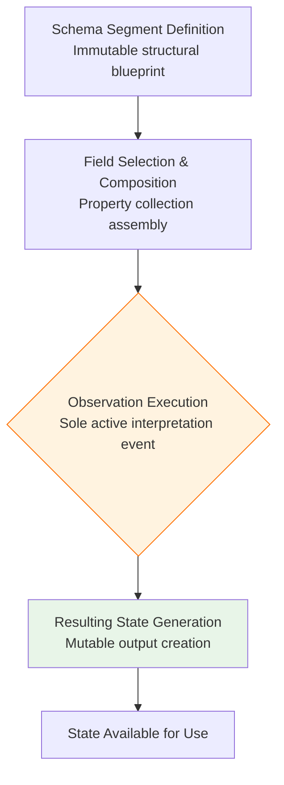
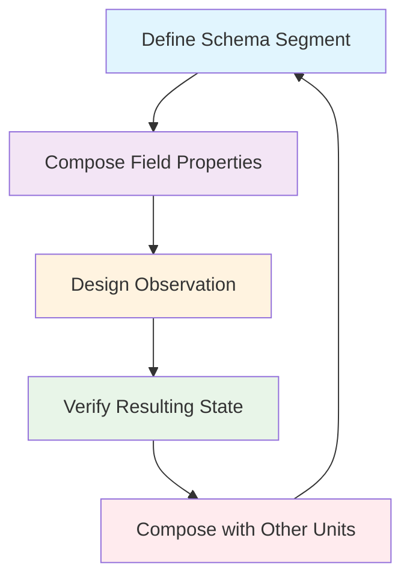
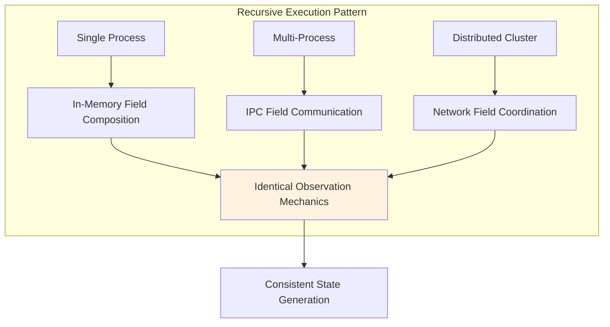

# Schema Segment Composition Computing System (SSCCS)  
## A Computational Model Based on Immutable Schema Segments and Dynamic Field Composition  

---

### 1. Project Declaration  

SSCCS (Schema Segment Composition Computing System) is a non-profit research initiative established under German legal form *gUG (gemeinnützige Unternehmensgesellschaft)*. It advances a fundamental rethinking of computation through:  

- **Energy efficiency**: Architecturally enforced minimal overhead  
- **Scalability**: Linear complexity with field composition (O(1))  
- **Unified computation**: Structural composition replaces value-based execution  
- **Deterministic reproducibility**: Identical inputs guarantee identical outputs  

---

### 2. Core Definitions  

#### 2.1 Schema Segment (SS)  
An immutable structural blueprint representing computational potential. Contains no values or state until observation.  

**Properties**:  
- `coordinates`: Structural identifiers (all dimensions equal, including time)  
- `adjacency`: Possible transitions to neighboring structural states  
- `dimensionality`: Unlimited extensibility of structural axes  
- `identity`: Cryptographic hash derived from structural properties  

**Key principle**:  
> *Schema Segments are immutable. Apparent change creates new segments.*  

#### 2.2 Field  
A concrete manifestation of composition as an **immutable property collection**, not an active entity or type.  

**Components**:  
- `ProjectionRegistry`: Interpretation mappings (coordinates → values)  
- `ConstraintSet`: Boundary conditions defining valid regions  
- `ObserverRegistry`: Semantic interpreters for validation  
- `TransitionGraph`: Permitted navigational steps (structural only)  

**Key principles**:  
> *Fields are passive property collections.  
> Fields do not know about Observations.  
> Multiple Fields may be combined for different interpretations.*  

#### 2.3 Observation  
**The sole active event** in the SSCCS computational model.  

**Mechanics**:  
- Processes Schema Segment with Field properties  
- Generates mutable Resulting State  
- Deterministic: identical inputs → identical outputs  
- Field remains unaware of Observation execution  

#### 2.4 Resulting State  
**The only mutable output** of the computational process.  
- Generated exclusively by Observation  
- May be used in subsequent operations  
- Schema Segment and Field remain immutable  

---

### 3. Computational Model  

#### 3.1 Execution Cycle  


**Phases**:  
1. **Schema Segment Definition**: Create immutable structural blueprint  
2. **Field Selection & Composition**: Assemble necessary constraint/projection properties  
3. **Observation Execution**: Actively interpret structure based on field properties  
4. **Resulting State Generation**: Produce mutable observation output  

#### 3.2 Canonical Principles  
- **Schema Segment Immutability**: Segments are invariant; apparent change creates new segments  
- **Field as Property Collection**: Fields are immutable attribute sets, not active entities  
- **Observation as Sole Active Event**: Only observation actively processes and generates states  
- **Resulting State Mutable**: Only observation outputs are mutable  
- **Deterministic Reproduction**: Identical inputs guarantee identical outputs  
- **Temporal Projection**: Time is observer-dependent, not intrinsic to computation  
- **Structural Non-Determinism**: Multiple valid outcomes emerge geometrically from superposition  
- **Natural Parallelism**: Concurrency revealed from structural independence  

---

### 4. Technical Specifications  

#### 4.1 Core Implementation Architecture  
**Current Implementation Status** (Rust-based):  
```rust
// Schema Segment: Immutable structural blueprint
pub trait SchemaSegment: Debug + Clone + Send + Sync {
    fn coordinates(&self) -> Coordinates;
    fn structural_adjacency(&self) -> Vec<Self>;
    fn from_blueprint(coords: Coordinates) -> Self;
}

// Coordinates: All dimensions equal, including time
pub struct Coordinates {
    dimensions: HashMap<String, i64>,
}

// Field Attributes: Immutable property collection
#[derive(Clone)]
pub struct FieldAttributes {
    projectors: ProjectionRegistry,
    constraints: ConstraintRegistry,
    observers: ObservationRegistry,
    transitions: TransitionGraph,
}

// File format: .ss files contain schema segment definitions
pub struct SegmentFile {
    segment: Arc<dyn SchemaSegment>,
    metadata: SegmentMetadata,
    version: u32,
}
```

#### 4.2 Composition Algebra  
- **Commutativity**: `SS₁ ⨂ SS₂ = SS₂ ⨂ SS₁`  
- **Associativity**: `(SS₁ ⨂ SS₂) ⨂ SS₃ = SS₁ ⨂ (SS₂ ⨂ SS₃)`  
- **Idempotency**: `SS ⨂ SS = SS`  
- **Dimensional Neutrality**: All axes (including time) treated equally  

#### 4.3 Execution Binding  
```rust
pub struct ExecutionBinding {
    segment: Arc<dyn SchemaSegment>,
    field: Arc<FieldAttributes>,
    binding_hash: [u8; 32],
    is_locked: bool,          // Immutable during observation
    current_observation: Option<ObservationId>,
}

impl ExecutionBinding {
    // Change triggers regeneration, not modification
    pub fn apply_field_change(&self, new_field: FieldAttributes) -> Self {
        assert!(!self.is_locked, "Cannot change field during observation");
        Self {
            segment: self.segment.clone(),
            field: Arc::new(new_field),
            binding_hash: self.calculate_new_hash(),
            is_locked: false,
            current_observation: None,
        }
    }
}
```

**Binding Rules**:  
1. Immutable during observation  
2. Change triggers regeneration (new binding instance)  
3. Deterministic preservation via binding hash  

#### 4.4 Current Capabilities  
- ✅ Implemented: SchemaSegment trait, Field attribute system, Observation mechanics  
- ✅ Verified: Immutability guarantees, deterministic reproduction, structural composition  
- ✅ File System: `.ss` files as immutable segment containers  
- ✅ Performance: O(1) field combination, zero-copy structural interpretation  
- ✅ Safety: Memory-safe implementation in Rust  

---

### 5. Unit-Driven Development (UDD) Programming Model  

UDD redefines software development around the fundamental unit of computation: the Schema Segment.  

**UDD Development Cycle**:  


**Core Principles**:  
1. **Segment-First Design**: Development begins with defining immutable computational units  
2. **Field Composition**: Program logic emerges from combining field properties  
3. **Observational Semantics**: Execution behavior specified through observation design  
4. **Structural Verification**: Correctness verified through structural properties  
5. **Recursive Composition**: Complex systems built through hierarchical composition  

**UDD Technical Workflow**:  
```rust
// 1. Define Schema Segment (immutable unit)
#[derive(SchemaSegment)]
struct DataProcessor {
    input_schema: InputCoordinates,
    output_schema: OutputCoordinates,
}

// 2. Compose Field Properties (behavior specification)
let processor_field = FieldAttributes::new()
    .with_constraint(InputValidator::new())
    .with_projector(DataTransformer::new())
    .with_observer(OutputVerifier::new());

// 3. Design Observation (execution specification)
let observation = ObservationBuilder::new()
    .with_trigger(DataArrivalTrigger)
    .with_projection(RealTimeProjection)
    .with_collapse_condition(QualityThreshold);

// 4. Verify Resulting State (structural verification)
let verification = StructuralVerifier::verify(
    &processor_segment,
    &processor_field,
    &observation
);

// 5. Recursive Composition (system building)
let system = SystemComposer::compose(
    processor_unit,
    storage_unit,
    network_unit
);
```

---

### 6. Recursive Execution Architecture  

SSCCS implements **recursive symmetry** across execution scales:  



**Key Insight**:  
> *A single SSCCS machine is a microcosm of distributed computation, differing only in scale, not fundamental operation.*  

**Recursive Composition Proof**:  
1. **Base Case**: Single schema segment with local field application  
2. **Recursive Step**: N segments compose identically to 1 segment at next abstraction level  
3. **Inductive Proof**: Composition preserves observational semantics regardless of scale  
4. **Emergent Property**: Distributed coordination emerges from local composition rules  

---

### 7. Validation Use Cases  

#### 7.1 Climate Modeling System  
- **Schema Segments**: Atmospheric and oceanic structural blueprints  
- **Fields**: Physics constraint properties, boundary conditions  
- **Observations**: Climate simulation events generating prediction states  
- **Advantage**: Fault isolation at field boundaries, energy efficiency through structural reuse  

#### 7.2 Autonomous Space Navigation  
- **Schema Segments**: Mission structural blueprints, terrain maps  
- **Fields**: Sensor interpretation properties, navigation constraints  
- **Observations**: Real-time decision events generating course corrections  
- **Advantage**: Radiation error isolation, autonomous operation without Earth contact  

#### 7.3 Biomedical Research Platform  
- **Schema Segments**: Molecular structural blueprints, protein folding patterns  
- **Fields**: Chemical interaction properties, thermodynamic constraints  
- **Observations**: Simulation events generating folding pathway predictions  
- **Advantage**: Multiple simultaneous observation pathways, consumer hardware compatibility  

---

### 8. Future Vision  

#### 8.1 Dynamic Field Generation  
- **Core layer frontend**: Data compiler produces Fields dynamically  
- **Execution model integration**: Fields applied at observation  
- **Hardware vision**: Extend to FPGA/PIM/hardware-level implementation  

#### 8.2 Structure-to-Hardware Mapping  
- Immutable SchemaSegment + dynamic Field → physical gates/memory layout  
- Observation-centric execution → energy-efficient hardware  
- Recursive/distributed execution preserved across hardware abstraction layers  

#### 8.3 Distributed Swarm Execution  
- Single process ↔ multi-process ↔ network-distributed execution  
- Field/Observation recursive application enables natural distributed scaling  
- Semantic consistency maintained across all execution scales  

---

### 9. Comparative Analysis  

| Aspect | Traditional Computing (Von Neumann) | SSCCS (Schema Segment Composition) |
|--------|-----------------------------------|--------------------------------|
| **Fundamental Unit** | Mutable memory location | Immutable Schema Segment |
| **Execution Trigger** | Instruction fetch | Observation event |
| **State Management** | In-place mutation | New state generation per observation |
| **Parallelism** | Explicit concurrency control | Inherent from structural independence |
| **Program Structure** | Sequential instruction flow | Field property composition |
| **Data Movement** | Copy-based transfers | Zero-copy structural interpretation |
| **Error Handling** | Exception propagation | Field isolation and bypass |
| **Verification** | Runtime testing | Composition-time structural verification |
| **Time Concept** | Sequential clock cycles | Observer-dependent projection |
| **Energy Efficiency** | Post-hoc optimization | Architecturally enforced |

---

### 10. Conformance Requirements  

A conforming SSCCS implementation MUST:  
- Enforce immutability of Schema Segments  
- Implement Field as immutable property collections  
- Ensure Observation is the only active execution event  
- Guarantee deterministic reproduction of results  
- Treat all coordinate dimensions as structurally equal  
- Provide O(1) field combination operations  
- Maintain zero-copy structural interpretation  
- Support recursive execution patterns  
- Preserve binding consistency during observation  
- Enable field composition without structural modification  

---

### 11. Summary  

**Core Flow**:  
`SchemaSegment + Field → Observation → Resulting State`  

**Fundamental Principles**:  
- Schema Segments are immutable structural blueprints  
- Fields are passive property collections (not active entities)  
- Observation is the sole active computational event  
- Resulting States are the only mutable outputs  
- Deterministic reproducibility is guaranteed  

**Methodology**:  
- Unit-Driven Development (UDD) as native programming model  
- Structural verification replaces runtime testing  
- Recursive composition enables scale-independent design  

**Abstraction Level**:  
- Universal framework subsuming state-space, von Neumann, quantum, and future computational models  
- Recursive execution from single process to distributed swarm with semantic consistency  

**Future Direction**:  
- Dynamic Field generation via data compilers  
- Observation-driven computation paradigm  
- Hardware-level design integration preserving structural semantics  

---

*Document Version: 3.0*  
*Research Framework: SSCCS gUG (haftungsbeschränkt)*  
*Status: Active Development - Reference Implementation Available*  

> **SSCCS**: Where computation emerges from structural composition,  
> observation creates meaning,  
> and every program is a universe of possibilities awaiting interpretation.