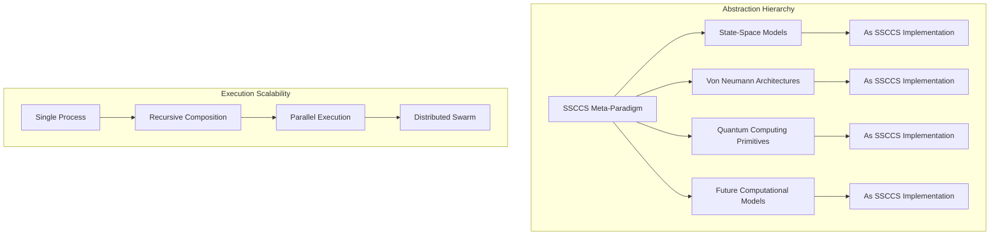
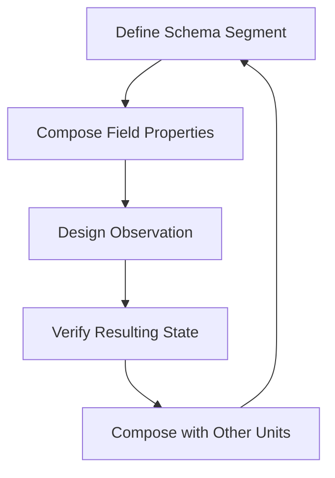
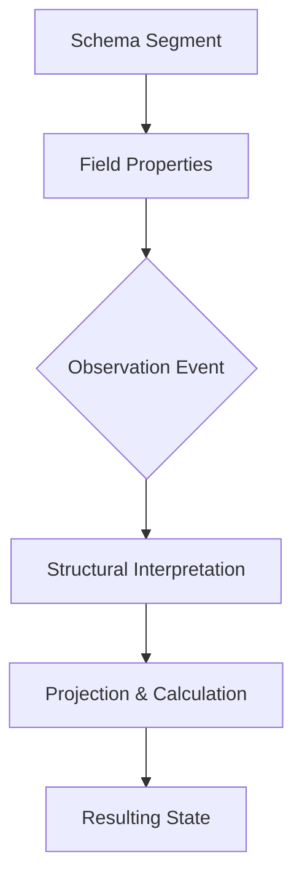
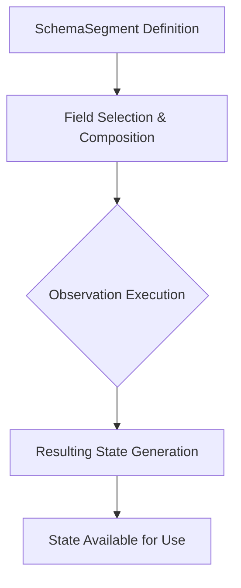
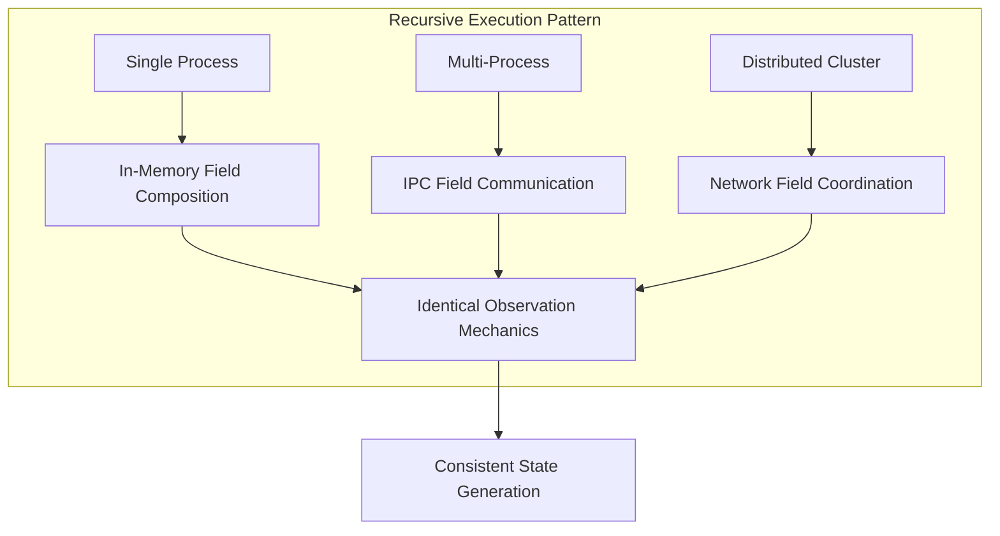

```markdown
# Schema Segment Composition Computing System (SSCCS)
## A Unified Computational Model Based on Immutable Schema Segments and Dynamic Field Composition

---

### 1. Project Declaration

SSCCS (Schema Segment Composition Computing System) is a non-profit research initiative established under German legal form *gUG (gemeinnützige Unternehmensgesellschaft)*. The project aims to fundamentally rethink computation by establishing a new computing standard suitable for modern processors and big data environments, characterized by:

- **Energy efficiency** through architectural design
- **Scalability** with minimized error and complexity growth
- **Superior data interpretation** capabilities
- **Complete unification** of data and program representations

---

### 2. Philosophical Foundation

#### 2.1 Core Tenets

The SSCCS paradigm is built upon five immutable principles:

1. **Schema Segments are immutable structural blueprints** - Containers of computational potential, not actual states
2. **Field represents compositional properties** - Dynamic attributes applied during observation, not types or categories
3. **Observation is the only active event** - The sole moment of execution and state generation
4. **Resulting States are the only mutable outputs** - Everything else remains immutable
5. **Deterministic reproducibility guaranteed** - Identical Segment + Field → identical results

#### 2.2 Computational Unification Thesis

SSCCS pursues the complete unification of data and program through an observation-centric dynamic structure. The core thesis asserts that **structural composition itself constitutes the fundamental unit of computation**, dissolving the traditional dichotomy between passive data and active programs.

**Theoretical Basis**:
- **Structural Primacy**: Computation emerges from composition and observation of immutable structures
- **Observational Semantics**: Meaning and execution are deferred until observation
- **Recursive Homogeneity**: Same compositional logic operates identically across all scales

**Technical Realization**:
```
Traditional: Data(static) + Program(dynamic) → Execution → Result
SSCCS: SchemaSegment(static) + Field(static) → Observation(dynamic) → ResultingState
```

This architectural shift enables structural patterns to serve simultaneously as data representations and execution blueprints.

#### 2.3 Universal Abstraction Framework

SSCCS implements a hierarchical abstraction framework capable of subsuming multiple computational paradigms while maintaining consistent operational semantics:



**Paradigmatic Subsumption**:
- **State-Space Models**: Implemented as specialized Schema Segments with Markovian transition fields
- **Von Neumann Architectures**: Realized as integer-based segments with sequential observation patterns
- **Quantum Primitives**: Encoded as superposition-capable segments with probabilistic observation mappings
- **Future Models**: Accommodated through extensible field attribute systems

#### 2.4 Unit-Driven Development (UDD)

SSCCS introduces Unit-Driven Development (UDD) as its native programming methodology. UDD redefines software development around the fundamental unit of computation: the Schema Segment.

**UDD Development Cycle**:


**UDD vs Traditional Methodologies**:
| Aspect | Test-Driven Development | Domain-Driven Design | Unit-Driven Development |
|--------|------------------------|----------------------|-------------------------|
| **Primary Unit** | Test case | Domain entity | Schema Segment |
| **Development Focus** | Behavior verification | Business logic modeling | Structural composition |
| **Execution Model** | Imperative procedures | Object interactions | Observational projections |
| **Correctness Criteria** | Test pass/fail | Domain consistency | Structural isomorphism |
| **Scalability Approach** | Refactoring patterns | Bounded contexts | Recursive composition |

---

### 3. Core Definitions

#### 3.1 Schema Segment (SS)

An **immutable structural blueprint** representing computational potential where **structure itself constitutes the computation unit**.

**Properties**:
- **Immutable structure**: Once created, cannot be modified
- **Compositional unit**: Designed for field application and interpretation
- **Recursive capability**: Can reference other schema segments while remaining immutable
- **Original structure preserved**: Only observation generates new states
- **Coordinates**: Structural identifiers with time as equal dimension
- **Adjacency**: Possible transitions to neighboring structural states
- **Dimensionality**: Infinite extensibility of structural axes
- **Identity**: Cryptographic hash derived from structural properties

#### 3.2 Field

**Concrete manifestation of composition** - not a type or category, but an attribute set applied during observation.

**Key characteristics**:
- **Immutable**: Fields don't change during observation
- **Compositional properties**: Represent how segments should be interpreted
- **Dynamically applicable**: Different fields can be applied for different observations
- **Combinable**: Multiple fields can be combined for complex observations
- **Contains independent components**: Projectors, constraints, and observers function as field attributes

#### 3.3 Observation

**The only active event** in the SSCCS computational model:



**Observation mechanics**:
- **Active interpretation**: Only observation actively processes structures
- **Field unaware**: Fields don't know about observations; they're passive properties
- **State generation**: Creates mutable resulting states as output
- **Deterministic**: Same Segment + Field → same observation results

#### 3.4 Resulting State

**The only mutable output** of the computational process:
- **Observation product**: Generated exclusively by observation events
- **Mutable**: Can be modified, processed, and used in subsequent operations
- **Derivative**: Exists only after observation completes

---

### 4. Computational Model

#### 4.1 Execution Cycle

Computation proceeds through four immutable phases:



**Detailed phases**:
1. **SchemaSegment Definition**: Create immutable structural blueprint
2. **Field Selection & Composition**: Assemble necessary constraint/projection properties
3. **Observation Performance**: Actively interpret structure based on field properties
4. **Resulting State Generation**: Produce mutable observation output

#### 4.2 Canonical Principles
- **Schema Segment Immutability**: Segments are invariant; apparent change creates new segments
- **Field as Property Collection**: Fields are immutable attribute sets, not active entities
- **Observation as Sole Active Event**: Only observation actively processes and generates states
- **Resulting State Mutable**: Only observation outputs are mutable
- **Deterministic Reproduction**: Identical inputs guarantee identical outputs
- **Temporal Projection**: Time is observer-dependent, not intrinsic to computation
- **Structural Non-determinism**: Multiple valid outcomes emerge geometrically
- **Natural Parallelism**: Concurrency revealed from structural independence

---

### 5. Comparative Analysis

| Aspect | Traditional Computing (Von Neumann) | SSCCS (Schema Segment Composition) |
|--------|-----------------------------------|--------------------------------|
| **Fundamental Unit** | Mutable memory location | Immutable Schema Segment |
| **Execution Trigger** | Instruction fetch | Observation event |
| **State Management** | In-place mutation | New state generation per observation |
| **Parallelism** | Explicit concurrency control | Inherent from structural independence |
| **Program Structure** | Sequential instruction flow | Field property composition |
| **Data Movement** | Copy-based transfers | Zero-copy structural interpretation |
| **Error Handling** | Exception propagation | Field isolation and bypass |
| **Verification** | Runtime testing | Composition-time structural verification |
| **Time Concept** | Sequential clock cycles | Observer-dependent projection |
| **Energy Efficiency** | Post-hoc optimization | Architecturally enforced |

---

### 6. Technical Specifications

#### 6.1 Core Implementation Architecture
**Current Implementation Status** (Rust-based):

```rust
// Schema Segment: Immutable structural blueprint
pub trait SchemaSegment: Debug + Clone + Send + Sync {
    fn coordinates(&self) -> Coordinates;
    fn structural_adjacency(&self) -> Vec<Self>;
    fn from_blueprint(coords: Coordinates) -> Self;
}

// Coordinates: All dimensions equal, including time
pub struct Coordinates {
    dimensions: HashMap<String, i64>,
}

// Field Attributes: Immutable property collection
#[derive(Clone)]
pub struct FieldAttributes {
    projectors: ProjectionRegistry,
    constraints: ConstraintRegistry,
    observers: ObservationRegistry,
    binding_id: Uuid,
}
```

#### 6.2 Composition Algebra
- **Commutativity**: Order-independent composition
- **Associativity**: Grouping-independent composition  
- **Idempotency**: Self-composition yields identical structure
- **Dimensional Neutrality**: All axes (including time) treated equally

#### 6.3 Execution Binding and Regeneration
**Binding Rules**:
1. **Immutable during observation**: Field properties cannot change during active observation
2. **Change triggers regeneration**: New field = new binding instance
3. **Deterministic preservation**: Binding hash ensures reproducibility

#### 6.4 Current Capabilities
- **Implemented**: SchemaSegment trait, Field attribute system, Observation mechanics
- **Verified**: Immutability guarantees, deterministic reproduction, structural composition
- **File System**: `.ss` files as immutable segment containers
- **Performance**: O(1) field combination, zero-copy structural interpretation
- **Safety**: Memory-safe implementation in Rust

---

### 7. Validation Use Cases

#### 7.1 Climate Modeling System
- **Schema Segments**: Atmospheric and oceanic structural blueprints
- **Fields**: Physics constraint properties, boundary conditions
- **Observations**: Climate simulation events generating prediction states
- **Advantage**: Fault isolation at field boundaries, energy efficiency through structural reuse

#### 7.2 Autonomous Space Navigation
- **Schema Segments**: Mission structural blueprints, terrain maps
- **Fields**: Sensor interpretation properties, navigation constraints
- **Observations**: Real-time decision events generating course corrections
- **Advantage**: Radiation error isolation, autonomous operation without Earth contact

#### 7.3 Biomedical Research Platform
- **Schema Segments**: Molecular structural blueprints, protein folding patterns
- **Fields**: Chemical interaction properties, thermodynamic constraints
- **Observations**: Simulation events generating folding pathway predictions
- **Advantage**: Multiple simultaneous observation pathways, consumer hardware compatibility

---

### 8. Implementation Framework

#### 8.1 Current Status
- **Language**: Rust (memory safety, zero-cost abstractions)
- **Core Components**: SchemaSegment, FieldAttributes, ObservationEngine
- **File Format**: `.ss` schema segment files
- **Validation**: Unit tests for immutability and determinism
- **License**: Open source for research collaboration

#### 8.2 Recursive Architecture
SSCCS implements **recursive symmetry** across execution scales:



**Key Insight**: A single SSCCS machine is a **microcosm of distributed computation**, differing only in scale, not fundamental operation.

#### 8.3 Future Vision
- **Dynamic Field Generation**: Core layer frontend compilers producing fields dynamically
- **Hardware Integration**: Mapping to FPGA/PIM/hardware-level implementations
- **Distributed Swarm Execution**: Seamless scaling from single process to network-wide coordination
- **Observation-Driven Hardware**: Energy-efficient hardware designs based on observation-centric execution

---

### 9. Conformance Requirements

A conforming SSCCS implementation MUST:
- Enforce immutability of Schema Segments
- Implement Field as immutable property collections
- Ensure Observation is the only active execution event
- Guarantee deterministic reproduction of results
- Treat all coordinate dimensions as structurally equal
- Provide O(1) field combination operations
- Maintain zero-copy structural interpretation
- Support recursive execution patterns
- Preserve binding consistency during observation

---

**Document Version**: 3.0  
**Core Philosophy**: `SchemaSegment + Field → Observation → Resulting State`  
**Unification Thesis**: *Structural composition itself constitutes the fundamental unit of computation*  
**Development Methodology**: Unit-Driven Development (UDD)  
**Abstraction Level**: Universal framework subsuming state-space, von Neumann, quantum, and future computational models  
**Scalability Property**: Recursive execution from single process to distributed swarm with semantic consistency  
**Research Framework**: SSCCS gUG (haftungsbeschränkt)  
**Status**: Active Development - Reference Implementation Available  

*SSCCS presents a unified computational framework where immutable structures serve simultaneously as data representations and execution blueprints, with observation as the singular interpretive act that bridges structural potential to computational actualization.*
```