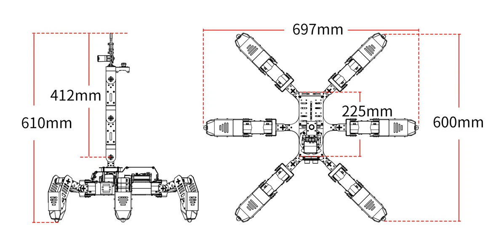

```{python}
#| include: false
#| context: local
%run ../../_include/_graphviz.py
```

## Executive Summary

HexaField is a demonstration project that validates the core concepts of the State‑Space Composition Computing System (SSCCS) using an 18‑degree‑of‑freedom hexapod walking robot. The robot’s six legs, each with three independently actuated joints, provide a naturally high‑dimensional state space that makes SSCCS abstractions – Segment, Scheme, Field, Observation, Projection – directly observable in physical motion. The project delivers a complete open‑source software stack running on affordable hardware (Raspberry Pi 5, simple LiDAR, standard servos). HexaField proves that SSCCS is not merely a theoretical construct but a practical, reproducible computing paradigm for real‑world robotic systems.

## Internal Architecture Flow

```{python}
dot("""
digraph ArchitectureFlow {
    rankdir=LR;
    node [shape=rect, style=rounded, fontname="Helvetica", fontsize=10];
    edge [arrowhead=normal, fontsize=10];

    subgraph cluster_ssccs {
        label="SSCCS Core Logic";
        style=dashed;
        color=black;
        FieldNode [label="field_to_gait_node\n(Rust / rclrs)\n[Observation Ω]", fillcolor="#E8F4F8", style=filled];
        GaitGen [label="gait_generator\n(Python)\n[Projection P]", fillcolor="#F4E8F8", style=filled];
        ServoInterface [label="hexapod_hardware_interface\n(C++ / ros2_control)", fillcolor="#F8F4E8", style=filled];
    }

    subgraph cluster_perception {
        label="Perception & Field Inputs";
        style=dashed;
        color=black;
        IMU [label="IMU Sensor\n(Slope/Accel)", fillcolor="#FFF4E6", style=filled];
        LiDAR [label="YDLIDAR X4\n(Obstacles)", fillcolor="#FFF4E6", style=filled];
        UserInput [label="User Input\n(CLI / Config)", fillcolor="#FFF4E6", style=filled];
    }

    subgraph cluster_navigation {
        label="Autonomous Navigation (Demo 3)";
        style=dashed;
        color=black;
        Nav2 [label="Nav2 Stack\n(Planner/Controller)", fillcolor="#E6F4FF", style=filled];
        LLMAdapter [label="llm_adapter\n(Python)", fillcolor="#E6F4FF", style=filled];
        STT [label="vosk (STT)", fillcolor="#E6F4FF", style=filled];
        LLMServer [label="llama-server\n(Phi-3.5-mini)", fillcolor="#E6F4FF", style=filled];
    }

    subgraph cluster_hardware {
        label="Physical Hardware";
        style=dashed;
        color=black;
        Servos [label="18 Digital Servos\n(Joints)", fillcolor="#F0F0F0", style=filled];
        RPi5 [label="Raspberry Pi 5\n(ROS 2 Master)", fillcolor="#F0F0F0", style=filled];
    }

    UserInput -> FieldNode [label="/field_params"];
    IMU -> FieldNode [label="/imu/data"];
    FieldNode -> GaitGen [label="Gait Params\n(Step H, Vel)"];
    GaitGen -> ServoInterface [label="/joint_trajectory"];
    ServoInterface -> Servos [label="Serial Commands"];
    Servos -> ServoInterface [label="Feedback"];

    LiDAR -> Nav2 [label="/scan"];
    Nav2 -> GaitGen [label="/cmd_vel"];

    UserInput -> STT [label="Audio Stream"];
    STT -> LLMAdapter [label="Text"];
    LLMAdapter -> LLMServer [label="Prompt"];
    LLMServer -> LLMAdapter [label="JSON Action"];
    LLMAdapter -> Nav2 [label="Costmap Update"];

    RPi5 -> FieldNode [style=dotted, ltail=cluster_hardware, lhead=cluster_ssccs, label="Hosts"];
    RPi5 -> IMU      [style=dotted, ltail=cluster_hardware, lhead=cluster_perception, label="Hosts"];
    RPi5 -> Nav2     [style=dotted, ltail=cluster_hardware, lhead=cluster_navigation, label="Hosts"];
}
""")
```

## Why a Hexapod

| Criterion | Hexapod Advantage |
| :--- | :--- |
| Rich state space | 18 independent joints create a complex but still understandable multi‑dimensional coordinate system. |
| Structural variety | Multiple gaits (tripod, wave, ripple) serve as natural Schemes. |
| Sensor integration | IMU, LiDAR, and optional camera provide realistic Field inputs (slope, obstacles). |
| Physical projection | Joint torques, body posture, and walking speed are unambiguous Projections. |
| Low entry barrier | Consumer‑grade hexapod kits cost <$500 and can be upgraded incrementally. |
| Visual appeal | A walking robot instantly communicates “computation in action” to any audience. |

## SSCCS Concepts ↔ Robot Mapping

| SSCCS Concept | Formal Definition | Robot Instantiation |
| :--- | :--- | :--- |
| Segment | An immutable coordinate point in a multi‑dimensional possibility space. | Each servo joint (6 legs × 3 = 18) – its angular position, velocity, and torque form a coordinate tuple. |
| Scheme | A static blueprint defining axes, relations, and memory layout. | A predefined gait pattern (tripod, wave, ripple) with fixed joint‑to‑joint adjacency (e.g., leg coordination rules). |
| Scheme Templates | Predefined topological patterns. | `HexapodTripod`, `HexapodWave`, `HexapodRipple` (as URDF + gait generator). |
| Field | A mutable constraint predicate C(s) and transition matrix T. | Dynamic parameters: payload weight, slope angle, speed priority, obstacle proximity. |
| Field Composition | Union, intersection, product of Fields. | Balancing stability and speed via two linked sliders (intersection). |
| Observation | The event Ω(Σ, F) that produces a Projection. | Real‑time sensor fusion (IMU tilt, LiDAR scan) + user input (sliders, voice). |
| Projection | The result P = Ω(Σ, F). | Resulting joint torques, body height, walking speed, or navigated path. |
| Structural Isolation | Immutability guarantees no interference. | Joints do not mutate independently; only the Field changes, and all joints recompute projections deterministically. |

## Hardware Baseline and Upgrades

### Starting Platform

SpiderPi Pro: Typical 18‑DOF Hexapod Kit with Raspberry Pi 8GB on a custom carrier board.



| Component | Specification |
| :--- | :--- |
| Degrees of freedom | 18 (6 legs × 3 joints: coxa, femur, tibia) |
| Servos | 20 kg·cm digital serial‑bus (e.g., LX‑16A, STS3215) |
| On‑board computer | Raspberry Pi 4B (4 GB) |
| Sensors | 9‑axis IMU (MPU9250), ultrasonic distance sensor |
| Power | 2‑cell Li‑Ion (7.4 V) with 5 V step‑down for Pi |
| Software | Python control scripts, inverse kinematics, no ROS2 |

### Mandatory Upgrades

| Component | Upgrade Part | Purpose |
| :--- | :--- | :--- |
| Processor | Raspberry Pi 5 (8 GB) + active cooler | Run ROS2, LLM, and control stack smoothly |
| LiDAR | YDLIDAR X4 (360°, 10 Hz, 12 m range) | SLAM and obstacle avoidance (Demo 3) |
| Servo power | 12 V 5 A step‑up regulator (MT3608) | Provide stable 12 V for high torque |
| Battery | 3‑cell Li‑Po (11.1 V, 2200 mAh) | Extended runtime, peak current |
| Communication | USB‑TTL adapter (CP2102) | Isolate servo bus from Pi |
| Cooling | 40 mm fan for Pi 5 | Prevent thermal throttling |
| Total mandatory | | |

### Optional Upgrades

| Component | Upgrade Part | Purpose |
| :--- | :--- | :--- |
| Camera | Raspberry Pi Camera Module 3 | Vision‑based field detection (future extension) |
| Mechanical | Aluminium leg linkages | Reduce flex, improve repeatability |

### Wiring Diagram

```{python}
dot("""
digraph WiringDiagram {
    rankdir=LR;
    node [shape=rect, style=rounded, fontname="Helvetica", fontsize=10];
    edge [arrowhead=normal, fontsize=9];

    // Power sources
    Battery [label="11.1V Li-Po battery", fillcolor="#FFE6E6", style=filled];
    StepUp [label="step-up regulator\n(12V)", fillcolor="#E6FFE6", style=filled];
    PDTrigger [label="USB-C PD trigger board", fillcolor="#E6FFE6", style=filled];

    // Servo system
    ServoBus [label="servo bus\n(V+ and GND)", fillcolor="#F0F0F0", style=filled];
    RegEnable [label="step-up regulator\nenable pin", fillcolor="#FFF0D0", style=filled];

    // Raspberry Pi and peripherals
    RPi5 [label="Raspberry Pi 5", fillcolor="#D0E8FF", style=filled];
    USBTTL [label="USB-TTL adapter", fillcolor="#FFF0D0", style=filled];
    LiDAR [label="YDLIDAR X4", fillcolor="#FFF0D0", style=filled];
    Camera [label="Camera\n(optional)", fillcolor="#FFF0D0", style=filled];

    // Power connections
    Battery -> StepUp [label="power"];
    Battery -> PDTrigger [label="power"];
    StepUp -> ServoBus [label="12V supply"];
    PDTrigger -> RPi5 [label="USB-C power"];

    // Signal / data connections
    RPi5 -> USBTTL [label="USB port"];
    USBTTL -> ServoBus [label="half-duplex serial"];
    RPi5 -> RegEnable [label="GPIO"];
    RegEnable -> StepUp [label="enable (switchable)"];
    RPi5 -> LiDAR [label="USB port"];
    RPi5 -> Camera [label="CSI connector"];

    // Optional grouping
    subgraph cluster_power {
        label="Power Distribution";
        style=dashed;
        color=gray;
        Battery; StepUp; PDTrigger;
    }
}
""")
```

## Software Architecture

The entire control stack runs on Ubuntu 24.04 + ROS2 Jazzy with a real‑time kernel.

### Core ROS2 Packages

```bash
sudo apt install ros-jazzy-ros2-control ros-jazzy-ros2-controllers
sudo apt install ros-jazzy-joint-state-publisher ros-jazzy-robot-state-publisher
sudo apt install ros-jazzy-moveit2 ros-jazzy-slam-toolbox ros-jazzy-navigation2
sudo apt install ros-jazzy-rosbridge-server
```

### Custom ROS2 Nodes (SSCCS Core)

| Node | Language | Responsibility |
| :--- | :--- | :--- |
| `hexapod_hardware_interface` | C++ (ros2_control) | Serial bus communication with 18 servos; joint state feedback. |
| `field_to_gait` | Rust (rclrs) | Subscribes to `/field_params` (slope, payload, speed priority). Computes gait parameters (step height, velocity, body offset). |
| `gait_generator` | Python | Inverse kinematics; publishes `/joint_trajectory` to `ros2_control`. |
| `llm_adapter` | Python | Receives `/voice_command`, prompts local LLM, publishes JSON actions to Nav2. |

### Local LLM Integration (for Demo 3)

- Model: `Phi-3.5-mini-instruct-Q4_K_M.gguf` (2.2 GB) – 3.8B parameters, 4‑bit quantised.
- Engine: `llama.cpp` compiled for ARM with BLAS.
- STT: `vosk` offline English model (50 MB).
- Prompt template (forces JSON output):

  ```text
  System: You are a hexapod navigation assistant. Output only JSON.
  User: <speech‑to‑text>
  Assistant: {"action": "modify_nav2", "params": {...}}
  ```

### URDF Model

A complete URDF defines 18 joints, each with limits, effort, and velocity. Transform tree: `base_link` → 6 coxa links → 6 femur links → 6 tibia links → foot frames. All transforms are published via `robot_state_publisher`.

## Demonstration Use Cases

### Demo 1: Segment Selection & Field Observation (CLI / config)

Goal: Show that changing a Field (payload) modifies Projection (joint torques, body height) while Segments (joint coordinates) stay fixed.

Setup: Robot on flat surface. Field parameters provided via command line or YAML config file (no GUI).

Steps:

1. Launch the SSCCS control stack with default Field: `payload = 0`.
2. Robot stands with nominal body height.
3. User changes Field: `ros2 param set /field_to_gait payload 2.0`.
4. Robot immediately lowers body by 2 cm; joint torques increase (observable via `ros2 topic echo /joint_states`).

SSCCS lesson: *Segment coordinates did not move; only the Field changed. Projection (body height, torque) changed deterministically.*

### Demo 2: Field Composition – Speed vs. Stability (CLI)

Goal: Demonstrate that composing two Fields (intersection) produces emergent gait behaviour.

Setup: Robot on a 15° wooden ramp. IMU provides slope angle.

Steps:

1. Set Field A (stability) = 0.9, Field B (speed) = 0.1 → low‑amplitude wave gait, velocity 5 cm/s.
2. Set Field A = 0.1, Field B = 0.9 → dynamic tripod gait, velocity 20 cm/s.
3. Set Field A = 0.5, Field B = 0.5 → hybrid gait emerges, velocity 10 cm/s, step height 4 cm.

SSCCS lesson: *Intersection of two Fields yields a third Field whose projection (gait) is not an average but an emergent property of the structural composition.*

### Demo 3: LLM‑Driven Autonomous Navigation (Voice / CLI)

Goal: Show that natural language acts as a Field that projects onto a navigation Scheme.

Setup: Robot on flat floor; cardboard box 3 m ahead, wall on the right. LiDAR and Nav2 active.

Steps:

1. User speaks: “There’s a box in front. Go around it but keep close to the right wall.”
2. STT produces text; LLM outputs JSON: `{"action": "modify_nav2", "params": {"costmap_weights": {"right_wall": 0.8}}}`.
3. ROS2 node adjusts Nav2 costmap.
4. Robot replans and walks around box while hugging the right wall.

SSCCS lesson: *Natural language is a Field constraint; observation (Ω) produces a new Projection (executed path) on the existing navigation Scheme.*

## Implementation Roadmap

| Week | Milestone | Deliverables |
| :--- | :--- | :--- |
| 1 | Hardware assembly | Robot upgraded with RPi5, LiDAR, 12 V power; servos calibrated. |
| 2 | OS + ROS2 setup | Ubuntu 24.04, ROS2 Jazzy, `ros2_control` hardware interface. |
| 3 | URDF + TF | Complete URDF, transforms in RViz, joint state publisher. |
| 4 | Basic gait | Tripod gait in Python; robot walks on flat surface. |
| 5 | Field parameter node (Rust) | `field_to_gait` subscribes to `/field_params`, outputs gait parameters. |
| 6 | Demo 1 (CLI) | Change payload via `ros2 param`, observe body height change. |
| 7 | LiDAR SLAM | `slam_toolbox` running, map building. |
| 8 | Nav2 integration | Basic obstacle avoidance; robot navigates to waypoints. |
| 9 | Field composition (two‑parameter) | CLI with `stability` and `speed`; hybrid gait emergence. |
| 10 | Demo 2 (ramp) | Verify gait changes on 15° slope. |
| 11 | LLM server | `llama.cpp` + Phi‑3.5‑mini running, JSON output. |
| 12 | LLM → Nav2 adapter | Voice commands modify navigation. |
| 13 | Demo 3 (voice navigation) | End‑to‑end voice‑to‑nav, no manual intervention. |
| 14 | Documentation + release | GitHub repository, demo videos, README. |

## Validation Process & Demo

## Phase 1: Preparation (Weeks 1–4)

- Hardware Upgrade (RPi5, LiDAR, power)  
- OS & ROS2 Installation (Ubuntu 24.04, Jazzy)  
- URDF & ros2_control (18‑joint interface)  
- Basic Gait Controller (tripod, wave)  

## Phase 2: Demo 1 – Segment & Field (CLI)

1. Set Field: payload via CLI  
2. Observe body height change  

## Phase 3: Demo 2 – Field Composition (CLI)

1. Place robot on 15° ramp  
2. Set stability & speed parameters  
3. Observe emergent hybrid gait  

## Phase 4: Demo 3 – LLM Navigation

1. LiDAR SLAM + Nav2  
2. Local LLM + STT integration  
3. Voice command → JSON → path replan  

## Phase 5: Finalisation (Week 14)

1. Integration testing  
2. Demo video recording  
3. Open‑source release

## Budget Summary

| Category | Item | Cost (USD) |
| :--- | :--- | :--- |
| Compute | Raspberry Pi 5 (8 GB) + active cooler | 95 |
| Sensor | YDLIDAR X4 | 80 |
| Power | 12 V step‑up regulator + 3‑cell Li‑Po | 40 |
| Communication | USB‑TTL adapter | 5 |
| Cooling | 40 mm fan | 10 |
| Mandatory total | | 230 |
| Optional | Camera module, aluminium linkages | 175 |

All other components (servos, frame, Pi 4B) are already part of the base robot.

## Risk Assessment and Mitigation

| Risk | Probability | Impact | Mitigation |
| :--- | :--- | :--- | :--- |
| RPi5 overheats under LLM + Nav2 load | Medium | High | Active cooling; throttle LLM to <10% CPU; use 4‑bit model. |
| Servo bus latency with 18 servos | Low | Medium | Use 1 Mbps serial; split legs across two USB‑TTL adapters. |
| LLM response time >5 seconds | Medium | Low | Use TinyLlama (1.1B) instead of 3.8B; preload; performance governor. |
| LiDAR drift on slopes | Low | Medium | Fuse IMU with LiDAR; run Nav2 only on flat areas for demo. |
| CLI interaction overhead | Low | Low | Provide launch scripts with parameter presets; document commands. |

## Conclusion

HexaField is a minimal but sufficient robotics‑domain demonstration project that validates SSCCS on a real physical system. The 18‑DOF hexapod provides a rich state space where every abstract SSCCS primitive has a direct, observable counterpart. The three demonstrations – segment selection, field composition, and LLM‑driven navigation – collectively prove that SSCCS can drive a complex, sensor‑feedback‑controlled robot with deterministic, verifiable behaviour. By releasing all hardware considerations, software, and documentation as open source, HexaField becomes a reusable reference project for the SSCCS.
