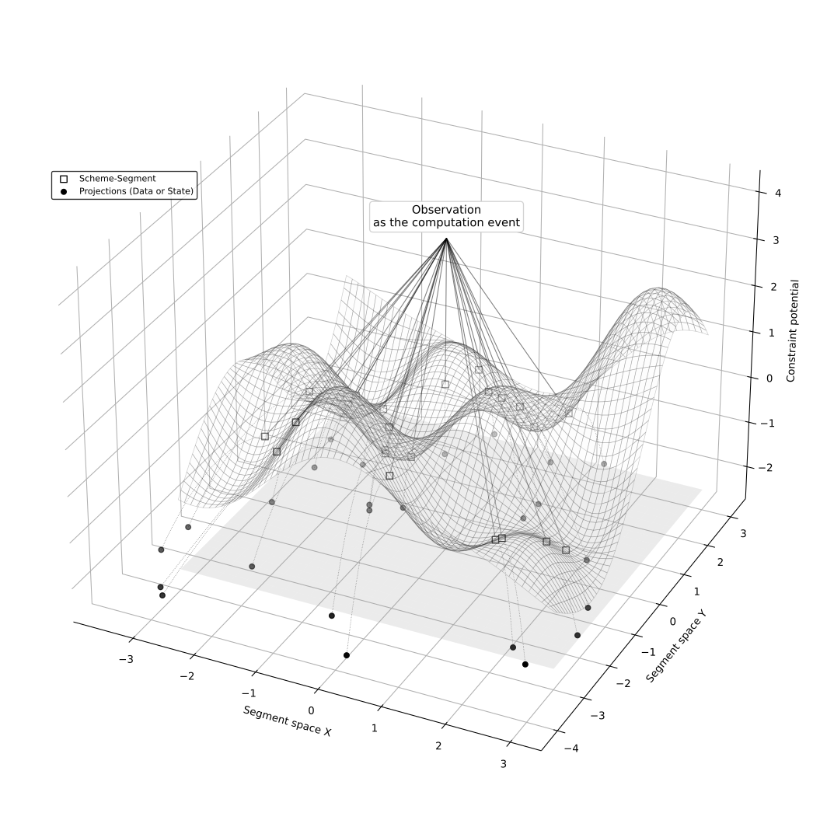

```{python}
#| echo: false
#| include: false
#| context: local
%run ../_include/_graphviz.py
```

## Introducing

**Taeho Lee, Founder & Engineering Architect** ([lee@ssccs.org](mailto:lee@ssccs.org))

- **Full proposal document**: [ssccs.org/proposal](https://docs.ssccs.org/proposal/proposal.html)
- **Comprehensive Guide of Core Concepts**: [ssccs.org/guide](https://docs.ssccs.org/guide.html)

###

### SSCCS is

A deterministic computing model and software compiler infrastructure that geometrically arranges data and observes structure under dynamic constraints – **without moving data**.

- Von Neumann: dynamic data, static logic.
- SSCCS: static geometry, dynamic constraints; data emerges as projection.

---

## Current Status

| Founder         | Solo, Berlin-based (global strategic alignment)            |
|-----------------|------------------------------------------------------------|
| Legal           | Pre‑incorporation; transitioning to open‑core model  |
| Project         | Long‑term research–implementation loop                     |
| Initial         | Whitepaper on CERN/Zenodo (DOI 10.5281/zenodo.18759106)    |
| PoC             | Rust – early primitives in progress                        |
| Research        | Topic papers (arXiv) → insights feed back to core          |
| Partners        | US, EU (Germany, France), Singapore, South Korea, any aligned public‑interest |
| Operating principle | Research + implementation + partnership in parallel      |
| Mission         | Establish presence where strategic opportunities for public‑interest alignment are strongest |

---

## The Problem: Data Movement Dominates Energy

- Moving data consumes **60–80% of AI accelerator energy** – a **200× cost** over arithmetic
- The “data movement wall” has been a known bottleneck for decades
- AI data centers could draw **68 GW by 2027** – nearly California’s entire grid
- By 2030, data centers may use **9–17% of US power**, with **3–4× server costs**

```{python}
#| echo: false
#| layout-ncol: 2
#| fig-cap: 
#|   - "Relative energy cost of various operations (normalized to arithmetic). Data from Eyeriss (ISCA 2016)."
#|   - "Share of US electricity consumption by data centers (EPRI 2026)."

import matplotlib.pyplot as plt
import numpy as np

# Energy cost graph
categories = ['Arithmetic', 'Register', 'SRAM', 'DRAM']
energy_cost = [1, 6, 20, 200]

plt.figure(figsize=(4.5, 3.5))
bars = plt.bar(categories, energy_cost)
plt.yscale('log')
plt.ylabel('Relative Energy Cost')
plt.title('Data Movement Dominates')
plt.grid(True, axis='y', alpha=0.3)

for bar, val in zip(bars, energy_cost):
    plt.text(bar.get_x() + bar.get_width()/2, bar.get_height() + 5, f'{val}x',
             ha='center', va='bottom', fontweight='bold', fontsize=8)

plt.tight_layout()
plt.show()

# EPRI forecast graph
years = ['2024', '2026', '2028', '2030']
low = [4, 6, 8, 9]
high = [4, 8, 13, 17]

plt.figure(figsize=(4.5, 3.5))
plt.plot(years, low, 'o-', label='Low-growth')
plt.plot(years, high, 's-', label='High-growth')
plt.fill_between(years, low, high, alpha=0.2)
plt.ylabel('US Electricity Share (%)')
plt.title('Power Demand Forecast')
plt.grid(True, alpha=0.3)
plt.legend(fontsize=8)
plt.tight_layout()
plt.show()
```

---

## But the Problem Goes Beyond Energy

- AI models are black boxes – **no verifiable path** from input to result
- **Unacceptable risk** in critical applications:

  - **Autonomous vehicles**: 2018 Uber fatality – system detected pedestrian 6 s before impact but never classified her; no auditable trail
  - **Healthcare**: AI diagnostic systems miss cancers; accountability impossible when errors occur
  - **Finance**: 2010 Flash Crash – single automated sell program plunged Dow 600 points; regulators could not reconstruct the decision chain

---

- Documented damage from AI incidents already exceeds **$100 billion** (RAIDS AI 2025)

```{python}
#| echo: false
#| fig-cap: "Cumulative documented damages from AI incidents (RAIDS AI 2025)."
#| label: fig-ai-damages-pt

years_damage = ['2020-2023', '2024', '2025']
cumulative_damage = [45, 70, 105]  

plt.figure(figsize=(8, 5))
bars = plt.bar(years_damage, cumulative_damage, color=['#95a5a6', '#f39c12', '#e74c3c'])

for bar, val in zip(bars, cumulative_damage):
    plt.text(bar.get_x() + bar.get_width()/2, bar.get_height() + 2, f'${val}B',
             ha='center', va='bottom', fontweight='bold', fontsize=12)

plt.ylabel('Cumulative Damages (Billion USD)', fontsize=12)
plt.title('AI-Related Incident Damages (RAIDS AI 2025)', fontsize=14)
plt.grid(True, axis='y', alpha=0.3, linestyle='--')
plt.ylim(0, 120)
plt.tight_layout()
plt.show()
```

---

## A Different Approach

**What if data never moved at all?**

SSCCS emerged from research on high‑dimensional time‑series data, where preserving structure across chaotic systems forced us to rethink computation.

Instead of fetching and storing, SSCCS treats computation as **observation of stationary structure**.

---

## Philosophical Foundation

```{=latex}
\begin{center}
```

{height=70%}

```{=latex}
\end{center}
```

**Loops disappear into layout. Data, or state, is the shadow cast by collapsed possibility.**  
A System where Structured Deployment is the Path, and Observed Synthesis is the Computation.

---

## Core Contrast

**Von Neumann:**  

- Data/state is **dynamic** and stored in memory  
- Logic/instructions are **static**  
- Computation = moving data through fixed logic over time  

**SSCCS:**  

- No intrinsic data/state – only **static geometric structure** (Segments + Scheme)  
- Constraints (Field) are **dynamic**  
- Computation = applying dynamic constraints to static geometry → **projects ephemeral data/state** as results

---

### Map & Satellite Analogy

The map never moves – only the conditions change, revealing different information.

```{python}
#| echo: false
#| fig-cap: "Map analogy: fixed structure observed under changing conditions"
#| label: fig-map-analogy
dot_svg("""
digraph MapAnalogy {
    rankdir=LR;
    node [shape=box, style=filled, fillcolor=lightgray];
    Map [label="Map (Scheme)"];
    Point [label="Coordinate Point/Identity\n(Segment)", shape=point, width=0.1];
    Conditions [label="Observation Conditions\n(Field)", shape=ellipse];
    Satellite [label="Observation", shape=ellipse];
    Image [label="Image (Projection)", shape=box];

    Map -> Point [arrowhead=none, style=dashed, label="contains"];
    Conditions -> Satellite [arrowhead=none, style=dashed];
    Satellite -> Image [label="produces"];
    {Map, Conditions} -> Satellite [arrowhead=normal, style=solid];
}
""", h="200px")
```

| SSCCS Concept | Map Analogy |
|---------------|-------------|
| **Segment** | A fixed coordinate point on a map |
| **Scheme** | The map itself (axes, roads, boundaries) |
| **Field** | Observation conditions (season, weather, filter) |
| **Observation** | Taking a satellite photo |
| **Projection** | The resulting image |

---

### Primitives

::: {tbl-colwidths="[20, 80]"}

| Concept | Role |
|---------|------|
| **Segment** | Immutable coordinate point; holds no value – only position and ID |
| **Scheme** | Blueprint defining geometry, adjacency, and layout |
| **Field** | Dynamic constraints (“add”, “max”, etc.) – the only mutable layer |
| **Observation** | The sole active event – collapses potential into a deterministic result |
| **Projection** | Transient output; not stored – if needed again, re‑observe |

:::

---

### Simply, How (1 + 1 = 2) works

```{python}
#| echo: false
#| fig-cap: "1+1=2 under SSCCS"
#| label: fig-1plus1-pt
dot_svg("""
digraph OnePlusOneMemory {
    rankdir=LR;
    node [fontsize=10];
    edge [fontsize=9];

    subgraph cluster_memory {
        label="Memory (DRAM)";
        color=blue;
        style=filled;
        fillcolor=lightgray;

        node [shape=box, style=filled, fillcolor=white];
        mem0 [label="Segment 0\nAddress: 0x1000\nCoordinates: 0"];
        mem1 [label="Segment 1\nAddress: 0x1004\nCoordinates: 1"];

        note [shape=plaintext, label="Segment has no value\nonly coordinates and address", fontsize=8];
    }

    subgraph cluster_field {
        label="Field (constraint)";
        color=green;
        style=dashed;

        node [shape=ellipse, style=filled, fillcolor=lightyellow];
        val0 [label="Binding value:\nAddress 0x1000 → 1"];
        val1 [label="Binding value:\nAddress 0x1004 → 1"];
        op [label="Operation: add"];

        val0 -> op [dir=none, style=dotted];
        val1 -> op [dir=none, style=dotted];
    }

    subgraph cluster_observation {
        label="Observation";
        color=red;
        style=filled;
        fillcolor=lightpink;

        obs [shape=ellipse, label="observation"];
        proj [shape=box, label="Projection: 2"];
        obs -> proj [label="generation"];
    }

    mem0 -> val0 [style=dashed, label="binding"];
    mem1 -> val1 [style=dashed, label="binding"];

    op -> obs [style=dotted, label="apply"];

    note -> mem0 [style=invis];
}
""", h="300px")
```

- Numbers are **never stored** in Segments – they are attached as constraints in the Field.
- The addition emerges from observing the structure under those constraints.

---

## Why This Matters

### Key benefits

- **Energy efficiency**: No data movement – only results travel.
- **Implicit parallelism**: Immutable Segments can be observed concurrently without locks or race conditions.
- **Intrinsic verifiability**: Every observation is deterministic and traceable from blueprint to result. Security follows from geometry.

### Where it applies

- **Space systems**: Each Field composition as a standalone binary unit – radiation‑resilient, verifiable execution.
- **Swarm robotics**: Fields as composable program units – emergent coordination without central control.
- **AI at scale**: Keep weights stationary, observe them in place.
- **Climate modeling**: Encode grid dependencies as geometry.
- **Autonomous systems**: Verifiable real‑time decisions.
- **Scientific computing**: I/O energy and latency dominate runtime; SSCCS eliminates redundant movement.

---

## What We Ask

- **Strategic funding**: €500k over 18 months to expand the compiler team, complete reference implementation, and establish governance.
- **Research partners**: Formal verification, compiler correctness, domain‑specific validation.
- **Technical contributors**: Compiler development and tooling.
- **Outreach**: Blog posts, talks, educational material.

All outputs remain open‑source, in the public commons.

---

## Conclusion

- **SSCCS** replaces instruction sequencing with **structural observation**.
- It eliminates data movement, enables implicit parallelism, and makes verifiability intrinsic.
- The paradigm shift is grounded in decades of recognized hardware limits.
- We invite collaboration to build a new foundation for computing.


