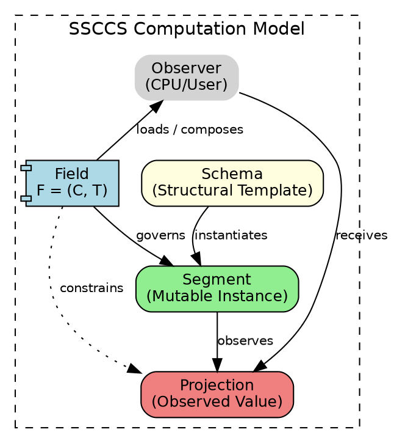
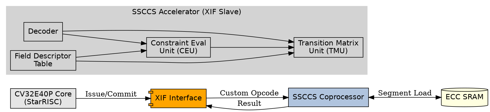
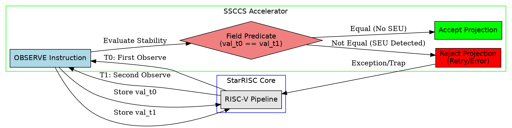
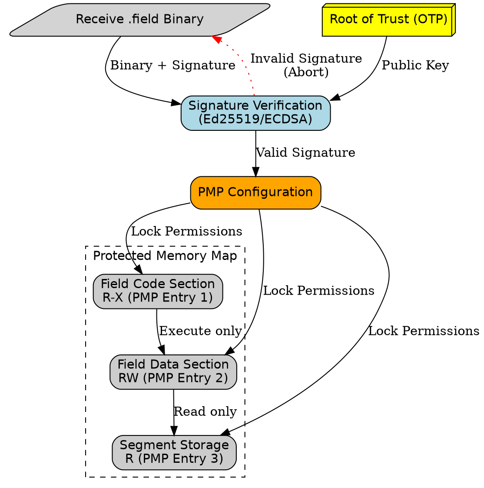

# Radiation-Hardened RISC-V and SSCCS

## SSCCS Field Composition Protocols and StarRISC's RHBD Architecture 

**Date:** April 12, 2026  
**Author:** SSCCS Foundation  


## Abstract

This report analyzes the potential synergy between the StarRISC radiation-hardened RISC-V microcontroller and the Schema–Segment Composition Computing System (SSCCS). While StarRISC provides robust hardware-level protection against radiation-induced errors through Radiation Hardening by Design (RHBD), it faces limitations regarding accumulated memory upsets and fixed hardware overhead. 

We propose leveraging the dual nature of SSCCS Fields—specifically their definition in [Section 2.3.3: Logical and Binary-Level Composition Protocols](https://docs.ssccs.org/whitepaper/whitepaper.html#logical-and-binarylevel-composition-protocols) of the SSCCS Whitepaper as both logical constraint sets and executable, cryptographically signed binary units. By treating fault tolerance policies as dynamic Field binaries that can be composed, sandboxed, and updated post-deployment, we can implement Software-Defined Fault Tolerance (SDFT). This approach complements StarRISC’s physical hardening with adaptive, observation-based redundancy (temporal and spatial voting) without the area penalty of traditional Triple Modular Redundancy (TMR). This report outlines the architectural integration via OpenHW’s XIF interface and proposes a validation roadmap.

dsds

## 1. Introduction

Spaceborne and safety-critical computing systems require high reliability under ionizing radiation. The StarRISC microcontroller, developed by STARLab at the University of Saskatchewan, represents a state-of-the-art open-source RHBD RISC-V implementation [1]. It utilizes hardened flip-flops and SECDED ECC to mitigate Single Event Upsets (SEUs). However, hardware hardening is static: once fabricated, the protection mechanism cannot adapt to new error patterns or mission phases, and it incurs significant area and power costs.

Concurrently, the SSCCS paradigm redefines computation not as instruction sequencing, but as the observation of stationary structures under dynamic constraints [2]. Central to this model is the Field, a mutable substrate that governs which states are admissible. Crucially, the SSCCS Whitepaper establishes that Fields are not merely abstract logic; they are first-class executable binaries that can be encrypted, signed, and sandboxed [2].

This report argues that the binary nature of SSCCS Fields offers a unique solution to the rigidity of traditional RHBD. By loading "Fault Tolerance Fields" onto a StarRISC-like platform, we can achieve adaptive, software-defined resilience that evolves with the mission environment, reducing hardware overhead while enhancing resilience against complex failure modes like Multi-Bit Upsets (MBUs).


## 2. StarRISC: Baseline Capabilities and Limitations

### 2.1 Device Overview
StarRISC is based on the OpenHW CV32E40P core, fabricated in 22-nm FD-SOI technology. Key features include:
*   Hardened Sequential Elements: Stacked-transistor flip-flops resistant to SEUs up to high Linear Energy Transfer (LET) values.
*   ECC Protected Memory: SECDED (Single Error Correction, Double Error Detection) on SRAM.
*   Performance: Functional after 100 kRad (proton) TID and no SEFI up to LET ~96 MeV·cm²/mg [1].

### 2.2 Residual Vulnerabilities
Despite its robustness, StarRISC exhibits two critical limitations:
1.  Accumulated/Complex Errors: SECDED ECC corrects single-bit errors but fails against Multi-Bit Upsets (MBUs) in a single word or accumulated errors over time. Hardware voters (TMR) are effective but triple the area.
2.  Static Protection: The hardening strategy is fixed at design time. If a specific mission phase requires higher reliability for certain data structures, the hardware cannot dynamically increase redundancy without pre-designed, always-on overhead.


## 3. The Core Enabler: SSCCS Fields as Executable Binaries

The synergy with StarRISC relies entirely on the properties of SSCCS Fields described in [Section 2.3.3: Logical and Binary-Level Composition Protocols](https://docs.ssccs.org/whitepaper/whitepaper.html#logical-and-binarylevel-composition-protocols) [2].

### 3.1 Dual Nature of Fields
In SSCCS, a Field $F = (C, T)$ consists of a constraint predicate $C$ and a transition matrix $T$. While logically these define admissibility, physically:
*   Fields are Executable Binaries: A Field is compiled into a platform-independent binary format (`.field`) containing the logic for constraint evaluation and transition weighting.
*   Cryptographic Integrity: Fields can be digitally signed. This ensures that only authorized fault-tolerance policies (e.g., from Mission Control) are executed on the spacecraft, preventing malicious or corrupted updates.
*   Sandboxing: Fields execute in isolated environments. A faulty or compromised Field cannot corrupt the underlying Segment data or other Fields, providing inherent structural isolation [2].

### 3.2 Dynamic Composition
Fields support algebraic composition (Union, Intersection, Product) at the binary level [2]. This allows for runtime reconfiguration of fault tolerance strategies. For example:
*   Normal Mode: Load `Field_ECC_Light` (minimal checking).
*   Solar Storm Mode: Dynamically compose `Field_ECC_Heavy` $\cap$ `Field_Temporal_Vote` (strict temporal redundancy) and load it into the runtime.

This capability transforms fault tolerance from a hardware feature into a software-defined service.


## 4. Synergy: Software-Defined Radiation Hardening (SDRH)

We propose a hybrid architecture where StarRISC provides the physical baseline resilience, and SSCCS Fields provide the adaptive, semantic resilience.

### 4.1 Temporal Redundancy via Observation Fields
Traditional TMR uses three physical cores. SSCCS enables Temporal TMR using a single core via the `OBSERVE` primitive. A "Stability Field" can be defined to require that a Segment’s value remains consistent across multiple observations within a time window.

```rust
// Conceptual Rust-like pseudocode for a Stability Field
let stability_field = Field::new()
    .with_predicate(|segment| {
        let val_t0 = observe(segment);
        let val_t1 = observe(segment); // Re-observe
        val_t0 == val_t1 // Admissible only if stable
    })
    .sign_with(mission_control_key);
```

Because the Field is a signed binary, this logic can be uploaded and verified on-orbit. If radiation causes a transient upset in the register during the first observation, the second observation will likely differ, causing the Field to reject the projection and trigger a retry or error handler. This mitigates SEUs that escape hardware ECC without tripling the hardware.

4.2 Distributed Voting with Signed Fields

In a multi-core or swarm configuration, SSCCS Fields enable Software-Defined Consensus. A "Voting Field" can be broadcast to multiple StarRISC nodes. Each node observes its local Segment and projects a value. The Field’s transition matrix $T$ aggregates these projections using a majority vote or weighted average [2].

· Advantage: No dedicated hardware voter is needed. The voting logic is contained within the Field binary.
· Security: Since the Field is signed [2], a compromised node cannot inject a malicious voting algorithm. The integrity of the consensus mechanism is cryptographically guaranteed.

4.3 Mitigating MBUs with Semantic Constraints

Hardware ECC is blind to data semantics. An SSCCS Field, however, can enforce semantic constraints. For example, a Field governing a navigation coordinate can reject values that are physically impossible (e.g., sudden velocity jumps exceeding thrust capabilities). This acts as a secondary filter for MBUs that corrupt data in ways that ECC cannot detect (if they happen to form a valid codeword) or correct.

5. Architectural Implementation on OpenHW CORE-V

To realize this synergy, we propose implementing SSCCS runtime support on the OpenHW CORE-V platform, leveraging the eXtension Interface (XIF) [3].

5.1 Custom Instructions for Field Execution

Efficient execution of Field binaries requires hardware acceleration for the OBSERVE and COLLAPSE operations. We propose two custom instructions via XIF:

Instruction Operation Description
OBSERVE rd, rs1, rs2 Project Segment Reads Segment at rs1, applies Field at rs2, stores result in rd. Handles retry logic if configured.
COLLAPSE rd, rs1, rs2 Aggregate Projections Combines multiple observations (e.g., from different cores/times) using the Field’s transition matrix $T$.

These instructions allow the StarRISC core to offload the complex constraint evaluation of the Field to a tightly coupled coprocessor or accelerator, minimizing performance overhead.

5.2 Secure Field Loading

Leveraging the Binary-Level Composition Protocols [2]:

1. Upload: New Field binaries (e.g., updated fault tolerance policies) are uploaded to StarRISC’s secure memory.
2. Verification: The SSCCS Runtime verifies the Ed25519/ECDSA signature of the Field binary against a root of trust stored in OTP.
3. Sandboxing: The Field is loaded into a protected memory region (using PMP - Physical Memory Protection). It can only access Segments explicitly granted permission, preventing side-channel attacks or fault propagation [2].

6. Proposed Validation Roadmap

We propose a joint validation effort between SSCCS Foundation and STARLab:

1. Phase 1: Simulation
   · Simulate StarRISC core with SSCCS Runtime.
   · Inject MBUs into SRAM.
   · Measure detection rate of "Semantic Fields" vs. standard SECDED ECC.
2. Phase 2: FPGA Emulation
   · Implement OBSERVE/COLLAPSE via XIF on an FPGA-emulated CV32E40P.
   · Demonstrate dynamic loading of signed Field binaries.
   · Benchmark area/power overhead compared to hardcoded TMR.
3. Phase 3: Radiation Testing
   · Expose the hybrid system to heavy-ion testing.
   · Validate that software-defined Fields can recover from errors that exceed hardware ECC capabilities.

7. Conclusion

The integration of StarRISC and SSCCS represents a paradigm shift in radiation-hardened computing. By exploiting the executable binary nature of SSCCS Fields [2], we can move beyond static hardware hardening to adaptive, software-defined resilience.

This synergy offers:

· Reduced SWaP: Lower area/power than full TMR by using temporal redundancy and smart voting.
· Adaptability: Post-launch updates to fault tolerance strategies via signed Field binaries.
· Enhanced Security: Cryptographic verification of all governance logic [2].

We recommend initiating a collaborative proof-of-concept using the OpenHW CORE-V ecosystem to validate this architecture, positioning SSCCS as the essential software substrate for next-generation resilient space computing.

References

[1] C. J. Elash et al., "Efficacy of Radiation Hardening by Design Techniques on an ASIC 32-bit RISC-V Microcontroller," 2024 IEEE Nuclear and Space Radiation Effects Conference (NSREC), 2024.
IEEE Xplore / STARLab Publication

[2] T. Lee, "Schema–Segment Composition Computing System (SSCCS) Whitepaper," SSCCS Foundation, Feb. 2026. DOI: 10.5281/zenodo.18759106.
SSCCS Whitepaper (PDF)
Section 2.3.3: Logical and Binary-Level Composition Protocols

[3] OpenHW Group, "CORE-V eXtension Interface (XIF) Specification," GitHub Repository.
OpenHW CORE-V XIF

[4] STARLab, University of Saskatchewan, "Radiation-Hardened Digital and Analog Circuits."
STARLab Research Projects

---

Appendix A: Architectural Diagrams (Graphviz DOT)

Figure A1: SSCCS Ontology (Field, Schema, Segment, Projection)



Figure A2: XIF Coprocessor Integration for OBSERVE/COLLAPSE



Figure A3: Temporal Redundancy Pipeline (Stability Field)



Figure A4: Secure Field Loading and PMP Sandboxing



---

Appendix B: Technical Deep Dive – Hardware Implementation and Sandboxing Analysis

This appendix provides a detailed technical analysis of the two core technological elements mentioned in the report: the hardware implementation of the OBSERVE/COLLAPSE instructions and the sandboxing/temporal redundancy mechanisms of SSCCS Fields within a RISC‑V pipeline. The analysis is based on the SSCCS Whitepaper [2] and the OpenHW Group Core‑V XIF (eXtension Interface) specification [3].

B1. XIF-Based Hardware Implementation of OBSERVE/COLLAPSE Instructions

B1.1 XIF Interface Structure and Instruction Offloading Flow

The Core‑V XIF is a standard interface for connecting custom coprocessors to a RISC‑V core without modifying the core's RTL. It comprises five independent channels—Issue, Register, Commit, Memory, and Result—each following a valid-ready handshake protocol.

When implementing SSCCS's OBSERVE and COLLAPSE instructions via XIF, the pipeline flow is as follows:

Stage XIF Channel Description
1. Instruction Issue Issue Interface The CPU asserts x_issue_valid after decoding and passes the 32-bit instruction via x_issue_req.instr. The SSCCS coprocessor accepts with x_issue_ready.
2. Register Read Register Interface The coprocessor asserts x_register_valid and requests source register addresses via x_register_req.rs. The CPU returns register values with x_register_resp.rdata.
3. Memory Access (optional) Memory Request/Response Interface If the OBSERVE instruction needs to read Segment data from memory, the coprocessor issues a load request via x_mem_valid and receives data via x_mem_resp.rdata.
4. Result Return Result Interface After computation, the coprocessor asserts x_result_valid and supplies the destination register address (x_result.rd) and result data (x_result.data). The CPU accepts with x_result_ready.
5. Commit/Kill Commit Interface The CPU asserts x_commit_valid upon instruction commit. If an exception occurs, x_commit.commit_kill notifies the coprocessor to abort.

This offloading architecture prevents CPU pipeline stalls and allows the SSCCS-dedicated hardware unit to accelerate constraint evaluation.

B1.2 Microarchitecture of the OBSERVE Instruction

The OBSERVE rd, rs1, rs2 instruction applies the constraints $C$ defined by the Field (rs2) to a Segment (rs1) to produce a projection. According to the SSCCS Whitepaper, "observation momentarily activates the Field, triggering a collapse of possibility and generating a projection."

From a hardware implementation perspective, the OBSERVE datapath requires the following components:

```
┌─────────────────────────────────────────────────────────────────┐
│                     OBSERVE Instruction Datapath                 │
├─────────────────────────────────────────────────────────────────┤
│                                                                 │
│  rs1 (Segment ID) ──→ [ Segment Cache ] ──→ Coordinate Vector c │
│                                                                 │
│  rs2 (Field ID)   ──→ [ Field Descriptor Table ]                │
│                              │                                  │
│                              ▼                                  │
│                      ┌───────────────────┐                      │
│                      │ Constraint        │                      │
│                      │ Evaluation Unit   │  ← Evaluates C(s)    │
│                      │ (CEU)             │                      │
│                      └───────────────────┘                      │
│                              │                                  │
│                              ▼                                  │
│                      ┌───────────────────┐                      │
│                      │ Transition Matrix │                      │
│                      │ Unit (TMU)        │  ← Computes T(s, s') │
│                      └───────────────────┘                      │
│                              │                                  │
│                              ▼                                  │
│  rd ← [ Projection Register ]  (Projection Result)              │
│                                                                 │
└─────────────────────────────────────────────────────────────────┘
```

Key Hardware Blocks:

1. Segment Cache: A small SRAM storing coordinate vectors of frequently accessed Segments. It provides first-line defense against SEUs when coupled with StarRISC's ECC-protected memory.
2. Constraint Evaluation Unit (CEU): Combinational logic that evaluates the Field's constraint predicate $C(s)$. The SSCCS Whitepaper classifies constraint types as dimensional constraints (range-check circuits), algebraic constraints (dedicated arithmetic units), and semantic constraints (state-machine-based verification).
3. Transition Matrix Unit (TMU): Computes the Field's transition matrix $T(s, s')$. The Whitepaper notes that dedicated hardware units can accelerate max/min and multiplication operations.

B1.3 Aggregation Mechanism of the COLLAPSE Instruction

The COLLAPSE rd, rs1, rs2 instruction aggregates multiple observation results according to the Field's transition matrix $T$. In SSCCS theory, "collapse" refers to the process where "observation activates the Field, triggering a collapse of possibility and generating a projection."

COLLAPSE is used in two primary scenarios:

· Temporal Aggregation: Aggregating multiple time-separated OBSERVE results of the same Segment to filter transient SEUs.
· Spatial Aggregation: Aggregating OBSERVE results from multiple nodes (cores) to implement distributed voting.

```
COLLAPSE Operation Pseudocode:
──────────────────────────────────────────────
Input:  rs1 = Base address of observation results array
        rs2 = Field ID (defines T matrix)
Output: rd = Final aggregated projection value

Algorithm:
1. Load T(s, s') matrix from Field Descriptor Table.
2. for i in 0..N-1:
3.     proj_i = Memory[rs1 + i*4]  // Load observation
4.     weight_i = T(prev_state, proj_i)
5.     accumulated_weight += weight_i
6.     weighted_sum += proj_i * weight_i
7. rd = weighted_sum / accumulated_weight  (Weighted average)
   or majority_vote(proj_0..proj_N-1)      (Majority vote)
──────────────────────────────────────────────
```

This aggregation is implemented by reading observations from memory via XIF's Memory Request/Response interface, computing weights in the TMU, and returning the result via the Result interface.

B1.4 Implementation Insights from XIF Example Coprocessor

The xif_copro from ESL‑EPFL provides a practical implementation example of a CV‑X‑IF compatible coprocessor (implementing a BITREV instruction). Its modular structure maps directly to an SSCCS implementation:

Module Role SSCCS Application Mapping
xif_copro_predecoder_pkg.sv Bit-level instruction definition Define opcode and funct fields for OBSERVE/COLLAPSE
xif_copro_decoder.sv Instruction decoding Extract rs1 (Segment), rs2 (Field), rd addresses
xif_copro_ex_stage.sv Execution stage Perform constraint evaluation and transition calculation via CEU/TMU
xif_copro.sv (Top-level) XIF signal interface Manage Issue/Register/Memory/Result channel handshakes

This modular approach is directly applicable to implementing SSCCS instructions and facilitates integration with the StarRISC CV32E40P core. Since CV‑X‑IF is designed for use with the cv32e40px core, compatibility with the StarRISC platform is assured.

---

B2. Detailed Mechanism of Temporal Redundancy

B2.1 Comparison: Hardware TMR vs. SSCCS Temporal Redundancy

Traditional TMR places three identical hardware modules in parallel with a majority voter, incurring at least a 3× increase in area and power. In contrast, SSCCS-based temporal redundancy reuses the same hardware resources across time, trading spatial redundancy for temporal redundancy.

Comparison Item Hardware TMR SSCCS Temporal Redundancy
Redundancy Type Spatial: 3 cores simultaneous Temporal: Repeated observations on single core
Area Overhead ~200% increase Minimal (only Field storage memory)
Power Overhead ~200% increase Additional consumption only during Field execution
SEU Detection Mechanism Majority voter (combinational circuit) Field stability predicate evaluation
Adaptability Fixed at design time Dynamic (changeable by swapping Field binary)

B2.2 Operational Principle of a Stability Field

Analyzing the Rust-like pseudocode example from the report at the hardware level:

```rust
let stability_field = Field::new()
    .with_predicate(|segment| {
        let val_t0 = observe(segment);
        let val_t1 = observe(segment);
        val_t0 == val_t1
    })
    .sign_with(mission_control_key);
```

The timing diagram for hardware execution is:

```
Clock Cycle:     T0    T1    T2    T3    T4    T5    T6
─────────────────────────────────────────────────────────
OBSERVE #1:     [Iss] [Reg] [Mem] [CEU] [Res]
                    ↓
                  SEU Possible Window
                    ↓
OBSERVE #2:                [Iss] [Reg] [Mem] [CEU] [Res]
                    
Comparison:                                    [CMP] [Res]
                    
Result:                                              Match → Accept Projection
                                                     Mismatch → Retry/Error
```

SEU Handling Flow:

1. If an SEU occurs during the first OBSERVE, an erroneous projection val_t0' is stored.
2. The second OBSERVE executes correctly, producing the correct val_t1.
3. The comparison val_t0' ≠ val_t1 causes the Field's predicate to evaluate as false.
4. The SSCCS runtime rejects the projection and performs one of:
   · Retry: Additional OBSERVE attempts to achieve consistency.
   · Error Handler: Transition to a predefined safe state.
   · Majority Vote Extension: Observe three or more times and decide by majority.

B2.3 Defense Against Accumulated Errors (MBU) via Semantic Constraints

Hardware ECC does not understand data semantics; an MBU that accidentally forms a valid ECC codeword may go undetected. SSCCS Fields detect such errors through semantic constraints.

Example for spacecraft navigation coordinates:

```rust
let navigation_field = Field::new()
    .with_predicate(|segment| {
        let (x, y, z, vx, vy, vz) = decode_coordinates(segment);
        let max_accel = 9.8; // m/s², maximum thruster acceleration
        
        // Detect physical impossibility
        let velocity = sqrt(vx*vx + vy*vy + vz*vz);
        let position = sqrt(x*x + y*y + z*z);
        
        velocity < MAX_VELOCITY && 
        position > MIN_ORBIT_RADIUS &&
        position < MAX_ORBIT_RADIUS
    })
    .sign_with(mission_control_key);
```

At the hardware level, this constraint is implemented by Range Checkers and Arithmetic Comparators within the CEU. A sudden coordinate jump due to an MBU immediately triggers a violation, blocking the projection.

---

B3. Logical Flow of SSCCS Field Sandboxing in a RISC‑V Pipeline

B3.1 Hardware Realization of the Dual Nature of Fields

Section 2.3.3 of the SSCCS Whitepaper states that a Field is both a logical constraint set and an executable binary. This duality is realized in hardware as follows:

```
┌─────────────────────────────────────────────────────────────────┐
│                    Field Binary Structure (.field)               │
├─────────────────────────────────────────────────────────────────┤
│                                                                 │
│  ┌─────────────────────────────────────────────────────────┐   │
│  │ Header: magic(4B) | version(2B) | flags(2B) | size(4B)  │   │
│  ├─────────────────────────────────────────────────────────┤   │
│  │ Constraint Section: Bytecode of C(s) predicate           │   │
│  │   - Dimensional: Range-check instruction sequences       │   │
│  │   - Algebraic: Arithmetic operation sequences            │   │
│  │   - Semantic: State machine transition tables            │   │
│  ├─────────────────────────────────────────────────────────┤   │
│  │ Transition Section: T(s, s') matrix data                 │   │
│  │   - Sparse matrix format (index, value) pairs           │   │
│  ├─────────────────────────────────────────────────────────┤   │
│  │ Signature Section: Ed25519/ECDSA signature               │   │
│  │   - signer_id(8B) | signature(64B)                      │   │
│  └─────────────────────────────────────────────────────────┘   │
│                                                                 │
└─────────────────────────────────────────────────────────────────┘
```

B3.2 PMP-Based Memory Isolation and Field Sandboxing

RISC‑V's Physical Memory Protection (PMP) controls access permissions to physical memory regions. SSCCS leverages PMP to isolate the Field execution environment as follows:

```
Memory Map (StarRISC 512KB ECC SRAM):
─────────────────────────────────────────────────────────────
0x0000_0000 ┌──────────────────────────┐
            │ Trusted Runtime (TEE)     │ ← PMP Entry 0: LOCK, R-X
            │ - Field Loader/Verifier   │   (Execute only, no write)
0x0001_0000 ├──────────────────────────┤
            │ Field Code Section        │ ← PMP Entry 1: LOCK, R-X
            │ - Constraint Bytecode     │   (Field execution code)
0x0002_0000 ├──────────────────────────┤
            │ Field Data Section        │ ← PMP Entry 2: RW
            │ - T matrix, temp data     │   (Field data)
0x0003_0000 ├──────────────────────────┤
            │ Segment Storage           │ ← PMP Entry 3: R (Field only)
            │ - Observed data           │   (Read-only)
0x0004_0000 ├──────────────────────────┤
            │ Application Memory        │ ← PMP Entry 4: RWX
            │                           │   (No Field access)
─────────────────────────────────────────────────────────────
```

B3.3 Step-by-Step Pipeline Flow for Field Loading and Verification

The SSCCS Whitepaper states that Fields "can be encrypted, signed, or sandboxed." The logical flow for implementing this in a RISC‑V pipeline is:

Step Hardware Action Security Property
1. Upload .field binary received via UART/SPI and stored in a temporary buffer No integrity guarantee during transit (relies on upper-layer protocols)
2. Signature Verification SSCCS runtime verifies Ed25519/ECDSA signature using public key from OTP. Field discarded on failure. Tamper Prevention: Blocks execution of unauthorized Fields
3. PMP Setup Upon verification, PMP registers configured: Field code R-X, data RW, Segment R Sandboxing: Access outside permitted memory triggers exception
4. Field Activation Field metadata registered in Field Descriptor Table (FDT). Subsequent OBSERVE instructions reference this Field via rs2. Reference Integrity: Field ID limited to FDT index
5. Execution During OBSERVE/COLLAPSE, PMP checks each memory access. Violations raise Load/Store Access Fault exceptions. Runtime Isolation: A corrupted Field cannot damage system memory

B3.4 Preventing Inter-Field Interference: Hardware Context Switching

In an environment with multiple active Fields, SSCCS isolates each Field's execution context in hardware via:

```
Field Context Switch Sequence (Inside OBSERVE Instruction):
─────────────────────────────────────────────────────────
1. Look up current Field ID (rs2) in FDT.
2. Temporarily apply that Field's PMP permission set.
   (PMP CSRs are normally software-only; a Field-specific PMP cache
    inside the coprocessor is used for hardware acceleration.)
3. CEU/TMU access the Field's dedicated memory regions.
4. Restore previous PMP context after instruction completion.
─────────────────────────────────────────────────────────
```

This design realizes the Whitepaper's specification that "Sandboxed Fields execute within isolated hardware domains."

---

B4. Conclusion and Technical Compatibility Assessment

Based on the above analysis, the technical compatibility between SSCCS Fields and StarRISC's RHBD architecture is assessed as follows:

Compatibility Element Current Design Status Feasibility Recommendation
XIF-based OBSERVE/COLLAPSE Defined at conceptual level High Prototype development based on CV32E40PX + xif_copro
CEU/TMU Hardware Units Functionality specified in Whitepaper Medium Detailed microarchitecture design per constraint type required
PMP-Based Sandboxing Leverages standard RISC‑V feature High Optimization of Field-specific PMP context caching
Temporal Redundancy Mechanism Defined at algorithmic level High Validation via SEU injection simulation
Cryptographic Signature Verification Ed25519/ECDSA specified High OTP public key storage required (exists on StarRISC)

The three-phase validation roadmap proposed in the report (Simulation → FPGA Emulation → Radiation Testing) provides an appropriate approach for systematically verifying these compatibility elements. In particular, the CV‑X‑IF compatible coprocessor example (xif_copro) offers a concrete template for actual implementation of SSCCS instructions, enabling direct use in Phase 2 FPGA emulation.
